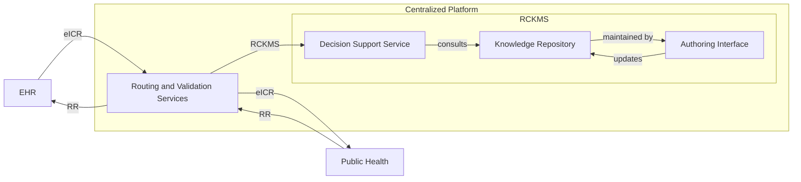
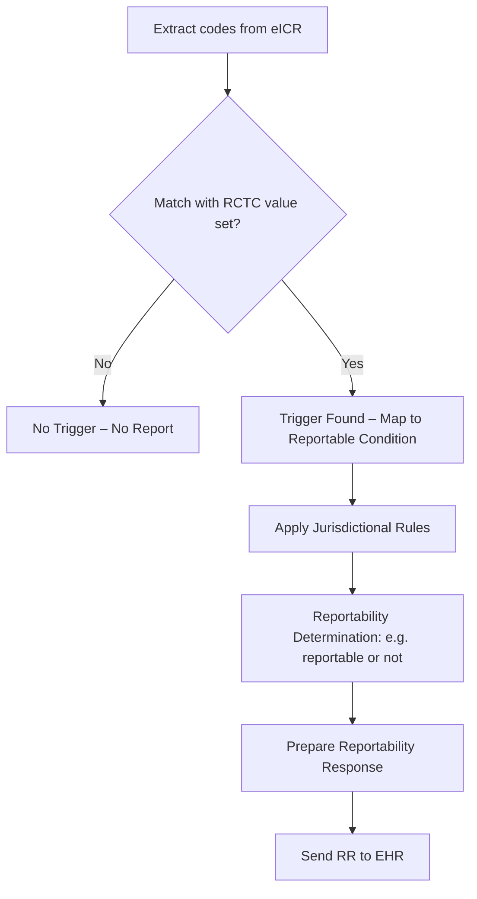
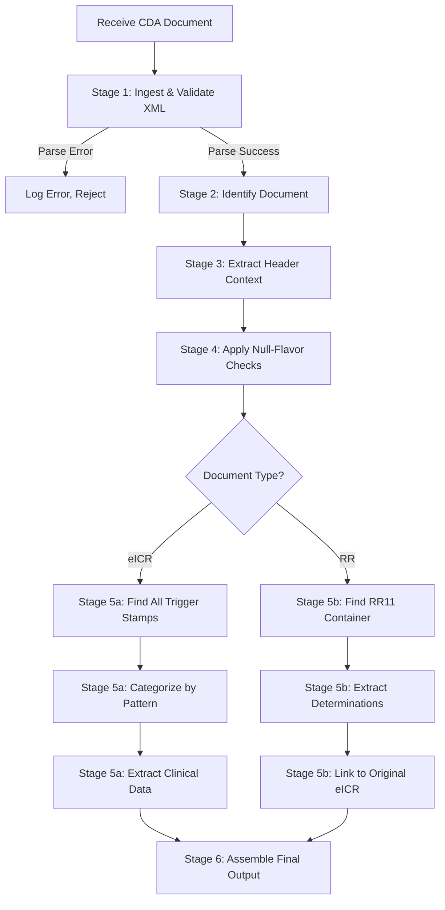

# eICR, RR & CDA Connections for DIBBs Engineers

## Table of Contents

- [Part 0: XML & XPath Fundamentals](#part-0-xml--xpath-fundamentals)
  - [0.1 XML for JSON Developers](#01-xml-for-json-developers)
  - [0.2 Namespaces Demystified](#02-namespaces-demystified)
  - [0.3 XPath: The Language of Navigation](#03-xpath-the-language-of-navigation)
  - [0.4 Tools of the Trade](#04-tools-of-the-trade)
  - [0.5 Your XPath Toolkit for eICR](#05-your-xpath-toolkit-for-eicr)
- [Part 1: The Grammar — How CDA Thinks](#part-1-the-grammar--how-cda-thinks)
  - [1.0 The Most Important Concept: The RIM Is Not a Data Model](#10-the-most-important-concept-the-rim-is-not-a-data-model)
  - [1.1 The Six Characteristics of a Clinical Document (From Boone, Chapter 2)](#11-the-six-characteristics-of-a-clinical-document-from-boone-chapter-2)
  - [1.2 The Five RIM Classes + Mood (The Parts of Speech) (From Boone, Chapter 12)](#12-the-five-rim-classes--mood-the-parts-of-speech-from-boone-chapter-12)
  - [1.3 The Seven Act Classes (The Verbs You'll Encounter) (From Boone, Chapter 16)](#13-the-seven-act-classes-the-verbs-youll-encounter-from-boone-chapter-16)
  - [1.4 Mood: When Things Happen (Or Don't)](#14-mood-when-things-happen-or-dont)
  - [1.5 `nullFlavor`: How CDA Says "I Don't Know"](#15-nullflavor-how-cda-says-i-dont-know)
  - [1.6 ActRelationship: How Statements Link Together (From Boone, Chapter 16)](#16-actrelationship-how-statements-link-together-from-boone-chapter-16)
  - [1.7 Context Propagation (The Inheritance Pattern) (From Boone, Chapter 12)](#17-context-propagation-the-inheritance-pattern-from-boone-chapter-12)
  - [Quick Reference: CDA Grammar Summary](#quick-reference-cda-grammar-summary)
- [Part 2: The Document Model — Header, Body, Sections](#part-2-the-document-model--header-body-sections)
  - [2.1 The Three Levels of CDA](#21-the-three-levels-of-cda)
  - [2.2 The eICR Header: The Journalistic Questions](#22-the-eicr-header-the-journalistic-questions)
  - [2.3 The eICR Body: Sections and Subsections](#23-the-eicr-body-sections-and-subsections)
  - [2.4 The eICR Section Map: Required and Optional](#24-the-eicr-section-map-required-and-optional)
  - [2.5 The Narrative Block vs. The Structured Body](#25-the-narrative-block-vs-the-structured-body)
  - [Quick Reference: Document-Level XPaths](#quick-reference-document-level-xpaths)
- [Part 3: The Section Map — What Lives Where](#part-3-the-section-map--what-lives-where)
  - [3.1 The Building Blocks: Entry-Level Patterns](#31-the-building-blocks-entry-level-patterns)
    - [Organizers vs Observations (The Nested Trap)](#organizers-vs-observations-the-nested-trap)
  - [3.3 A Practical Parsing Strategy: From XML to Usable Data](#33-a-practical-parsing-strategy-from-xml-to-usable-data)
  - [3.4 Code System Requirements By Section](#34-code-system-requirements-by-section)
  - [Quick Reference: Section Entry XPaths](#quick-reference-section-entry-xpaths)
- [Part 4: Trigger Codes — The Complete Pattern Catalog](#part-4-trigger-codes--the-complete-pattern-catalog)
  - [4.1 What IS a Trigger Code? (Refresher)](#41-what-is-a-trigger-code-refresher)
  - [4.2 The Six Pattern Families (All 14 Templates)](#42-the-six-pattern-families-all-14-templates)
  - [4.3 Universal Trigger Detection Strategies](#43-universal-trigger-detection-strategies)
  - [4.4 The Translation Pattern: When Local Codes Meet RCTC](#44-the-translation-pattern-when-local-codes-meet-rctc)
    - [Deep Dive: Why XPath Is Tricky Here](#deep-dive-why-xpath-is-tricky-here)
  - [Quick Reference: Trigger Template XPaths](#quick-reference-trigger-template-xpaths)
- [Part 5: The Reportability Response (RR)](#part-5-the-reportability-response-rr)
  - [5.1 What the RR Is](#51-what-the-rr-is)
  - [5.2 The RR Header](#52-the-rr-header)
  - [5.3 The RR Body: Single Section, Rich Structure](#53-the-rr-body-single-section-rich-structure)
  - [5.4 Key RR Templates](#54-key-rr-templates)
  - [5.5 The Determination of Reportability — The Core Output](#55-the-determination-of-reportability--the-core-output)
  - [5.6 Per-Jurisdiction Evaluation: The Full Structure (With Parser's Summary)](#56-per-jurisdiction-evaluation-the-full-structure-with-parsers-summary)
  - [5.7 The eCR Lifecycle: How eICR and RR Connect](#57-the-ecr-lifecycle-how-eicr-and-rr-connect)
  - [Quick Reference: RR XPaths](#quick-reference-rr-xpaths)
- [Part 6: Defensive Parsing — Handling the Unexpected](#part-6-defensive-parsing--handling-the-unexpected)
  - [6.1 The Three Golden Rules of Defensive Parsing](#61-the-three-golden-rules-of-defensive-parsing)
  - [6.2 The Defensive Parsing Pipeline](#62-the-defensive-parsing-pipeline)
  - [6.3 When to Reject vs. When to Warn](#63-when-to-reject-vs-when-to-warn)
  - [6.4 Testing Defensive Parsing](#64-testing-defensive-parsing)
  - [6.5 Schematron Validation (A Practical Shortcut)](#65-schematron-validation-a-practical-shortcut)
- [Appendix A: Namespaces You'll Encounter](#appendix-a-namespaces-youll-encounter)
- [Appendix B: Conformance Verbs (How to Read an IG)](#appendix-b-conformance-verbs-how-to-read-an-ig)
- [Appendix C: Common OIDs at a Glance](#appendix-c-common-oids-at-a-glance)

---

## Part 0: XML & XPath Fundamentals

> **What you'll learn:** Everything a modern developer (who lives in JSON-land) needs to know to read, navigate, and extract data from CDA XML documents.

### 0.1 XML for JSON Developers

#### The Basics: Elements vs. Attributes

> [!NOTE]
> **for CDA specifically:** Required elements must always have content or, if information is missing, a `nullFlavor` attribute. An empty required element isn't valid CDA.

**JSON:**

```json
{
  "patient": {
    "id": "12345",
    "name": "John Doe",
    "birthDate": "1975-05-01"
  }
}
```

**XML:**

```xml
<patient>
  <id>12345</id>
  <name>John Doe</name>
  <birthDate value="1975-05-01" />  <!-- Attribute! -->
</patient>
```

**Key differences:**

| Concept             | JSON                          | XML                             |
| ------------------- | ----------------------------- | ------------------------------- |
| **Objects**         | `{ }`                         | Elements (`<tag></tag>`)        |
| **Arrays**          | `[ ]`                         | Repeated elements               |
| **Key-value pairs** | `"key": value`                | Child elements OR attributes    |
| **Data types**      | String, number, boolean, null | Everything is text until parsed |

> [!TIP]
> **Mental model**: Think of XML elements as containers. They can contain other containers (nested elements) or just text. Attributes are like metadata—extra information _about_ the container.

#### Empty Elements and `nullFlavor`: A Critical Distinction

> [!NOTE]
> **for CDA specifically**, missing or unknown data **MUST** be represented using the `nullFlavor` attribute on the element (e.g., `<name nullFlavor="UNK"/>`), per [Boone, CDA Book, Chapter 5]. Do not use blank or self-closing tags for required fields.

In JSON, you might have `"middleName": null`. In XML, there are several ways to represent "nothing":

```xml
<!-- Wrong: This actually means you're sending an empty string! -->
<middleName></middleName>

<!-- Correct: This says "we don't know this value" -->
<middleName nullFlavor="UNK"/>
```

> [!WARNING]
> **Critical for eICR**: As the eICR Implementation Guide emphasizes, a `nullFlavor` explicitly indicates that information isn't known or available. [eICR IG §1.1.2]. Sending `<value></value>` is **not** the same as `<value nullFlavor="UNK"/>`. Public health systems need to know the difference!

#### Timezone Offsets: Critical for Clinical Time

CDA dates and times follow the ISO 8601 format, with a critical requirement: **if a time is included, it SHOULD include a timezone offset** [eICR IG §4.10].

```xml
<!-- Date only (acceptable for birth dates) -->
<birthTime value="19750501"/>

<!-- Date with time and timezone (required for most clinical events) -->
<effectiveTime value="20201107094421-0500"/>
```

The format is: `YYYYMMDDHHMMSS±ZZzz`

- `20201107` = date
- `094421` = time (09:44:21)
- `-0500` = timezone offset (5 hours behind UTC)

> [!WARNING]
> When parsing timestamps, always account for the timezone offset. Converting to UTC for storage is recommended to enable consistent temporal comparisons across documents from different timezones.

### 0.2 Namespaces Demystified

Namespaces are the #1 source of confusion for XML newcomers. Here's the simple truth:

**Namespaces solve the "John Smith" problem.** If two people named John Smith are in the same room, you need a way to distinguish them—maybe "John Smith from Accounting" vs. "John Smith from Engineering."

XML elements have the same problem. The eICR uses elements like `<id>` and `<code>`, but so do dozens of other XML formats. Namespaces tell you _which definition_ of `<id>` we're using.

#### The Declaration

Every CDA document starts with a namespace declaration:

```xml
<ClinicalDocument xmlns="urn:hl7-org:v3">
  <!-- All elements without a prefix are in this namespace -->
  <id root="..."/>
  <code code="..."/>
</ClinicalDocument>
```

This says: "Any element without a prefix (like `<id>` and `<code>`) comes from the HL7 v3 namespace."

#### What This Means for Your XPath

If you try this in your code:

```xpath
//code   ❌ This won't find anything!
```

It fails because in XPath 1.0 (the most common version), `code` means "elements named code in _no namespace_." But your `<code>` elements are in the `urn:hl7-org:v3` namespace.

**You must register the namespace with your XPath engine:**

```xpath
//hl7:code   ✅ This works if you've bound 'hl7' to the namespace
```

> [!TIP]
> **The prefix doesn't matter!** The document might use `cda:`, `hl7:`, or no prefix at all. What matters is the URI (`urn:hl7-org:v3`). Always bind your preferred prefix to that URI.

### 0.3 XPath: The Language of Navigation

XPath is to XML what JSONPath is to JSON—a way to write expressions that navigate to specific parts of the document.

#### The Slash: Your Navigation Key

| Expression | What it finds                        | Example             |
| ---------- | ------------------------------------ | ------------------- |
| `/`        | The root (like filesystem root)      | `/ClinicalDocument` |
| `//`       | Anywhere in the document (recursive) | `//hl7:observation` |
| `.`        | The current node                     | `.`                 |
| `..`       | The parent node                      | `../hl7:code`       |

#### Predicates: Your Filter

The real power comes from filtering with `[ ]`:

```xpath
//hl7:observation[hl7:code/@code='27836007']
//hl7:section[hl7:code/@code='11450-4']/hl7:entry
//hl7:*[@sdtc:valueSet]
```

> [!TIP]
> Read `[ ]` as "such that." The first example reads: "Find me all observations such that they have a code child with an attribute code equal to '27836007'."

### 0.4 Tools of the Trade

#### Python

- **Primary Libraries:**
  - [`lxml`](https://lxml.de/): Excellent for basic XML parsing and XPath 1.0 querying. Widely used, robust, and easy to install.
  - [`xml.etree.ElementTree`](https://docs.python.org/3/library/xml.etree.elementtree.html): Built-in, limited compared to lxml.

- **Advanced XML, XSLT, XQuery, XPath, etc:**
  - [`SaxonC-HE`](https://www.saxonica.com/saxon-c/index.xml) / [`saxonche`](https://pypi.org/project/saxonche/):
    - **What is SaxonC?**
      SaxonC is a high-performance, standards-compliant XML processor. It exposes Python APIs for:
      - **XSLT 3.0 transformations** (transform XML documents)
      - **XQuery 3.1 queries** (advanced XML database queries)
      - **XPath 3.1** (powerful querying language for navigating XML)
      - **XML Schema 1.1 validation** (conformance checking)

> [!TIP]
> You'll have to use SaxonC (HE or commercial editions) whenever you need XSLT 3.0, XQuery 3.1, and XPath 3.1. Not all XML libraries are compliant with the different standards.

#### **Understanding XML Technologies: What's the Difference?**

- **XPath:**
  - A querying language for selecting nodes and content from an XML document.
  - XPath 1.0 is standard in most libraries; XPath 2.0 and 3.1 include sequences, regex, better functions, but require advanced engines like SaxonC.

- **XQuery:**
  - A language for querying XML data, like SQL for XML databases.
  - Supports complex joins, transformations, and value extraction—rarely used directly in CDA/eICR processing, but powerful for batch and reporting.

- **XSLT:**
  - Stands for "XML Stylesheet Language for Transformations."
  - Used to convert XML into other formats (XML, HTML, text), restructure documents, or generate reports.
  - XSLT 3.0 adds advanced features for streaming and transformation; supported in SaxonC.

- **XML Schema:**
  - Defines the allowed structure, data types, and constraints for an XML document.
  - XML Schema 1.1 extends validation capabilities and is critical for full CDA conformance checking.

- **Schematron:**
  - A rule-based validation language for XML.
  - Uses XPath assertions to check complex business and clinical rules—essential for CDA, eICR, and RR document conformance.
  - **Python support:** Only available via Saxon/SaxonC after converting `.sch` to XSLT.

> [!NOTE]
> **XPath 1.0** is the universal denominator—supported everywhere and easiest to integrate.
> **XPath 2.0/3.0** offer greater expressive power (better filtering, grouping, string handling), but fewer toolkits support it natively in Python or JavaScript.

> [!IMPORTANT]
> Examples in this guide use Python and `lxml` for basic parsing and extraction. The code is meant to just give you an idea of how things work and are not meant as "production" ready.

### 0.5 Your XPath Toolkit for eICR

| What You Need                               | XPath                                                                                                        |
| ------------------------------------------- | ------------------------------------------------------------------------------------------------------------ |
| **The patient's name**                      | `/hl7:ClinicalDocument/hl7:recordTarget/hl7:patientRole/hl7:patient/hl7:name`                                |
| **All observations**                        | `//hl7:observation`                                                                                          |
| **Any RCTC-stamped element**                | `.//*[@sdtc:valueSet='2.16.840.1.114222.4.11.7508']`                                                         |
| **The Problems section**                    | `//hl7:section[hl7:code/@code='11450-4']`                                                                    |
| **The effective author**                    | `ancestor-or-self::*[hl7:author][1]/hl7:author`                                                              |
| **Trigger codes in a section**              | `.//hl7:*[@sdtc:valueSet='2.16.840.1.114222.4.11.7508']`                                                     |
| **Document template ID (is this an eICR?)** | `/hl7:ClinicalDocument/hl7:templateId[@root='2.16.840.1.113883.10.20.15.2' and @extension='2022-05-01']`     |
| **Is this an RR document?**                 | `/hl7:ClinicalDocument/hl7:templateId[@root='2.16.840.1.113883.10.20.15.2.1.2' and @extension='2017-04-01']` |

---

## Part 1: The Grammar — How CDA Thinks

> [!IMPORTANT]
> **What you'll learn:** Before you parse a single XML element, you need to understand that CDA is not a database dump. It's a **document standard** built on a formal information model called the **RIM** (Reference Information Model). The RIM is like the grammar of a language—every piece of data in a CDA document is a "sentence" constructed from a small set of building blocks.

As Keith Boone explains in _The CDA Book_, "The six base classes of the RIM can be connected in a very small number of controlled ways, providing a basic syntax for the creation of sentences or _clinical statements_. The six base classes are effectively the _parts of speech_ of the HL7 RIM." [Boone §12.1]

If you understand this grammar, you can read _any_ CDA document, not just the eICR. If you skip the grammar, you'll end up writing brittle, pattern-matched code that breaks whenever it encounters a structural variation the spec allows.

### 1.0 The Most Important Concept: The RIM Is Not a Data Model

> [!IMPORTANT]
> **The RIM is an information model, not a database schema.** If you come from a world of relational databases and ER diagrams, this distinction is the single most important thing to internalize before reading another line of CDA XML.

**What a data model does:** It tells you how to _store_ things. "Here is a `patients` table, here is an `observations` table, here is a foreign key between them." A data model is concrete, physical, and maps directly to storage.

**What an information model does:** It tells you how to _express meaning_. The RIM says: _things happen_ (Act), _to or by someone playing a role_ (Role ➡️ Entity), _connected in specific ways_ (Participation, ActRelationship). It defines the **categories of meaning** that any clinical statement can express, not how those statements are stored.

**The RIM is closer in spirit to the [Resource Description Framework (RDF)](https://en.wikipedia.org/wiki/Resource_Description_Framework) or the [Web Ontology Language (OWL)](https://en.wikipedia.org/wiki/Web_Ontology_Language) than to SQL.** Think of it as a framework for building sentences:

- **RDF** has triples (subject–predicate–object). The RIM has Acts–Participations–Roles–Entities.
- **OWL** has classes and properties that define relationships. The RIM has class codes, mood codes, and type codes that give each element its semantic meaning.

This matters practically because it explains three things that otherwise seem bizarre:

1. **Why the same patient appears in so many places.** In a relational model, you'd have one `patient_id` foreign key. In the RIM, the same person (Entity) can appear as a `recordTarget` (the document is _about_ them), a `subject` (an entry is _about_ them), a `participant` (they _participated_ in something), or an `informant` (they _provided information_). Each appearance carries different _meaning in context_ — it's not duplication, it's different sentences about the same noun.

2. **Why the XML nesting is so deep.** The nesting isn't an organizational choice someone made; it's the grammar being spoken. A `<substanceAdministration>` (verb: "was given") contains a `<consumable>` (participation: "what was consumed") which contains a `<manufacturedProduct>` (role: "the product") which contains a `<manufacturedMaterial>` (entity: "the physical substance") which has a `<code>` (what substance). Each layer carries a distinct semantic category. Flattening this would be like removing words from a sentence — you'd lose meaning, not just structure.

3. **Why you can't just "map CDA to JSON."** A naïve field-by-field mapping produces something that looks like data but has lost the grammar. You end up with a JSON blob where you can't tell whether a medication was _administered_ or _planned_, whether a lab test was _ordered_ or _resulted_, or whether a diagnosis is what the _patient_ has or what the _patient's mother_ had. The mood, participation types, and relationship types carry the meaning — strip them away and you have codes without context.

> [!TIP]
> **The mental model shift:** Don't think "what table does this go in?" Think "what sentence is being said?" The XML reads: _"An observation (Act) of Pertussis (value) was performed (Participation) by a clinician (Role) who is Dr. Smith (Entity) because of (ActRelationship) a presenting symptom."_ Every element has a grammatical role. Once you hear the sentence, the nesting makes sense.

### 1.1 The Six Characteristics of a Clinical Document (From Boone, Chapter 2)

These six characteristics aren't academic—they're design constraints that explain every major decision in the standard.

| Characteristic        | What It Means                             | Why It Matters for eICR                                                                                                                                                                                                   |
| --------------------- | ----------------------------------------- | ------------------------------------------------------------------------------------------------------------------------------------------------------------------------------------------------------------------------- |
| **Persistence**       | The document remains unchanged over time  | The eICR you send today can be retrieved in 10 years and still mean the same thing. This is why we don't use relative links or external references for clinical content.                                                  |
| **Stewardship**       | Someone is responsible for maintaining it | The `<custodian>` element identifies who keeps the authoritative copy. As Boone notes, "the custodian is always an organization because individuals come and go, but the institution persists." [Boone §14.3]             |
| **Authentication**    | It can be signed/verified                 | `<legalAuthenticator>` matters when this is used in legal proceedings. The eICR may not always be signed, but it _could_ be.                                                                                              |
| **Context**           | The full picture is included              | You can't just send "Pertussis"—you need WHO (the patient), WHEN (the encounter), and WHERE (the facility). All of this is in the header so every clinical statement inherits it.                                         |
| **Wholeness**         | It's complete on its own                  | This principle explains why, as Boone notes, "a clinical document is legally authenticated as a complete unit of information." [Boone §2.2.5]. All relevant data for the initial report is inside, not linked externally. |
| **Human Readability** | A person can understand it                | The `<text>` block in every section must make sense even if structured entries are stripped. This is why we have both narrative and coded data.                                                                           |

> [!NOTE]
> **Stewardship** in CDA means records management, provenance, and trust, not just document authorship. For a deeper dive, see Keith Boone’s CDA Book, Chapter 2.2.

> [!TIP]
> **Why this matters to you as a programmer:** These aren't aspirational qualities—they're _design constraints_ that explain structural decisions you'll encounter. The reason the eICR repeats narrative text alongside structured entries (which feels redundant) is **wholeness** and **human readability**. The reason each document carries full patient demographics instead of referencing an external system is **context**. The reason there's a `<custodian>` you might want to ignore is **stewardship**.

### 1.2 The Five RIM Classes + Mood (The Parts of Speech) (From Boone, Chapter 12)

> [!IMPORTANT]
> **The single most important thing to understand about the RIM:** The RIM is _not_ a data model. It is not an entity-relationship diagram. It does not describe database tables or JSON schemas. It is an **information model** — an abstraction layer, closer in spirit to RDF or OWL than to a relational schema.

Technically, the HL7 Reference Information Model (RIM) is composed of **six backbone classes**: Act, Entity, Role, Participation, ActRelationship, and **RoleLink** [Boone §12.1]. **Mood** is an attribute (`@moodCode`) of the Act class, not a standalone class.

However, in the entire history of CDA implementations, and specifically within eICR and RR documents, you will almost never encounter the **RoleLink** class. It is used for very specific relationships (e.g., "supervisor of") that are not needed for clinical document exchange. For the practical purpose of an engineer parsing eICR documents, we can safely focus on the five classes that appear + Mood, which are the "parts of speech" you will see in every document.

To revisit the most important concept: **The RIM is an information model, not a data model.** A relational data model says "there is a `patients` table with columns `id`, `name`, `dob`." The RIM says something more general: "there are **Entities** that play **Roles**, and through those Roles they **Participate** in **Acts**." A patient isn't a table — it's an Entity (a person) playing a Role (patientRole) participating in an Act (the clinical document) through a Participation (recordTarget). This abstraction is _why_ CDA can represent any clinical document — from a discharge summary to an eICR to a pathology report — using the same small set of classes. It is also why the XML is deeply nested: the nesting isn't arbitrary, it's the grammar being spoken.

Think of CDA as a language. Every XML element in the document maps to one of these RIM backbone classes. They are the **parts of speech** in a grammar for expressing clinical information.

| RIM Class           | Part of Speech  | What It Represents                                     | CDA Elements You'll See                                | eICR Example                                               |
| ------------------- | --------------- | ------------------------------------------------------ | ------------------------------------------------------ | ---------------------------------------------------------- |
| **Act**             | Verb            | Actions, events, observations                          | `<observation>`, `<procedure>`, `<act>`, `<encounter>` | "Lab result positive for _Bordetella pertussis_"           |
| **Entity**          | Noun (physical) | The actual person, device, place                       | `<patient>`, `<assignedPerson>`, `<device>`            | The actual patient Jane Doe                                |
| **Role**            | Noun (function) | What something _is_ in a given context                 | `<patientRole>`, `<assignedAuthor>`                    | "The patient" vs. "Jane Doe" — same person, different role |
| **Participation**   | Adverb          | How someone participated                               | `<author>`, `<performer>`, `<recordTarget>`            | "Authored by," "Performed by"                              |
| **ActRelationship** | Conjunction     | How acts connect                                       | `<entryRelationship>`, `<component>`                   | "Has reason," "Has component"                              |
| **Mood**            | Tense           | Whether something happened, is planned, or was ordered | `@moodCode` on Acts                                    | "Happened" (EVN), "Ordered" (RQO)                          |

> [!IMPORTANT]
> **This is why nesting exists.** When you see deeply nested XML in the eICR, it's not arbitrary complexity. It's sentences built from this grammar:
>
> ```
> "A Person (Entity)
>    playing the role of Patient (Role)
>       who is the subject of (Participation: recordTarget)
>          a Clinical Document (Act)
>             that contains (ActRelationship: component)
>                an Observation (Act, mood: EVN)
>                   performed by (Participation: performer)
>                      a Person (Entity)
>                         playing the role of Provider (Role)"
> ```
>
> Every level of XML nesting maps to a step in that sentence. Once you see this pattern, the structure stops being confusing and starts being predictable.

#### Why This Matters When You're Debugging

When you're staring at a 50-line deep XML tree and wondering "why is this so nested?", trace it back to the RIM:

```xml
<ClinicalDocument>                          <!-- Act (the document itself) -->
  <recordTarget>                            <!-- Participation (subject-of) -->
    <patientRole>                           <!-- Role (function in context) -->
      <patient>                             <!-- Entity (the actual person) -->
        <name>Jane Doe</name>
      </patient>
    </patientRole>
  </recordTarget>
</ClinicalDocument>
```

Each XML element maps to exactly one RIM class. The nesting order is always: **Act ➡️ Participation ➡️ Role ➡️ Entity**. You will never see an Entity directly inside an Act — there's always a Role and Participation in between, because the information model requires you to say _how_ the entity is involved, not just _that_ it's involved.

This is the difference between a data model ("patient has name") and an information model ("a person, in the role of patient, is the record target of a clinical document, and that person has the name Jane Doe"). The information model captures _meaning_, not just _data_.

### 1.3 The Seven Act Classes (The Verbs You'll Encounter) (From Boone, Chapter 16)

All clinical data in CDA is carried by Act subclasses. There are seven, and the eICR uses all of them:

| Act Class                       | Plain English                      | Rule of Thumb                          | `moodCode` Examples                          | eICR Location                       |
| ------------------------------- | ---------------------------------- | -------------------------------------- | -------------------------------------------- | ----------------------------------- |
| **`<observation>`**             | "I observed/measured X"            | Has a `<value>` element                | EVN = happened, RQO = ordered, INT = planned | Lab results, diagnoses, vital signs |
| **`<procedure>`**               | "I physically altered the patient" | Patient is different afterward         | EVN = performed                              | Surgeries, biopsies                 |
| **`<substanceAdministration>`** | "I gave the patient a substance"   | Always has a `<consumable>`            | EVN = administered, INT = planned            | Medications, immunizations          |
| **`<encounter>`**               | "Patient and provider interacted"  | Visit/episode documentation            | EVN = occurred                               | Encounter section                   |
| **`<organizer>`**               | "These things go together"         | Container only—no clinical data itself | EVN (just groups)                            | Lab panels, vital sign groups       |
| **`<act>`**                     | "Something happened (generic)"     | Used when nothing more specific fits   | EVN = happened                               | Concern wrapper, generic actions    |
| **`<supply>`**                  | "I gave them something for later"  | Prescriptions, device provision        | RQO = ordered                                | Prescriptions                       |

> [!TIP]
> **Boone's Decision Tree**: "If the patient is physically different afterward ➡️ `<procedure>`. If you just know something new ➡️ `<observation>`. If a substance was involved ➡️ `<substanceAdministration>`. If it's a container ➡️ `<organizer>`."

### 1.4 Mood: When Things Happen (Or Don't)

Every Act in CDA carries a `@moodCode` attribute that tells you the **temporal and intentional status** of that act. This is one of the most important attributes in the entire document — the same observation can mean completely different things depending on its mood.

> [!WARNING]
> **This is a critical parsing distinction.** A lab test with `moodCode="EVN"` means "this test was performed and here's the result." The same lab test with `moodCode="RQO"` means "this test was ordered but we don't have a result yet." If your code doesn't check `moodCode`, you might treat an _order_ as a _result_ — a serious error in public health reporting.

#### The Mood Codes You'll See in eICR

| Mood Code | Name        | Meaning                           | eICR Example                                                | Where You'll Find It                      |
| --------- | ----------- | --------------------------------- | ----------------------------------------------------------- | ----------------------------------------- |
| **EVN**   | Event       | This **happened**                 | A completed Pertussis PCR result                            | Results, Problems, Encounters, Procedures |
| **RQO**   | Request     | This was **ordered**              | A lab order for _Bordetella pertussis_ culture              | Plan of Treatment (lab orders)            |
| **INT**   | Intent      | There is an **intent** to do this | A planned immunization for DTaP                             | Plan of Treatment (planned immunizations) |
| **GOL**   | Goal        | This is a desired **outcome**     | "Patient will complete full course of antibiotics"          | Plan of Treatment (goals)                 |
| **APT**   | Appointment | This is **scheduled**             | A follow-up appointment for specimen collection             | Plan of Treatment (scheduled acts)        |
| **PRMS**  | Promise     | A **commitment** to perform       | Provider commits to notifying public health within 24 hours | Plan of Treatment (commitments)           |
| **PRP**   | Proposal    | A **suggestion** to consider      | "Consider isolating patient pending culture results"        | Plan of Treatment (proposals)             |

> [!NOTE]
> Mood codes don’t just signal time—they distinguish clinical fact (EVN), intention (INT), order (ORD), goal (GOL), and proposal (PRP). See CDA Book, Chapters 12 and 16 for the full taxonomy.

> [!TIP]
> **For eICR trigger code processing, the critical distinction is between EVN and everything else.** EVN mood codes mean "this clinical fact exists" — a diagnosis was made, a test was resulted, a medication was given. All other mood codes mean "this is planned, ordered, or intended but hasn't happened yet."
>
> Both can carry RCTC trigger stamps! A _completed_ Pertussis PCR result triggers reporting, but so does an _ordered_ Pertussis culture — the order itself indicates clinical suspicion.

#### How Mood Interacts with Trigger Templates

The eICR IG defines different trigger templates for different moods:

| Clinical Scenario                      | Mood | Trigger Template                    | Section                  |
| -------------------------------------- | ---- | ----------------------------------- | ------------------------ |
| Pertussis diagnosis on problem list    | EVN  | Trigger Code Problem Observation    | Problem                  |
| Pertussis PCR result received          | EVN  | Trigger Code Result Observation     | Results                  |
| Azithromycin administered              | EVN  | Trigger Code Medication Information | Medications Administered |
| _Bordetella pertussis_ culture ordered | RQO  | Trigger Code Lab Test Order         | Plan of Treatment        |
| DTaP vaccine planned                   | INT  | Planned Immunization Activity       | Plan of Treatment        |
| Procedure to collect NP swab ordered   | RQO  | Trigger Code Planned Procedure      | Plan of Treatment        |

#### Reading Mood in XML

```xml
<!-- EVN: This observation HAPPENED — the test was performed and resulted -->
<observation classCode="OBS" moodCode="EVN">
  <code code="23826-1" displayName="B. pertussis DNA [Presence] in Specimen by NAA"/>
  <statusCode code="completed"/>
  <value xsi:type="CD" code="260373001" displayName="Detected"/>
</observation>

<!-- RQO: This observation was ORDERED — no result yet -->
<observation classCode="OBS" moodCode="RQO">
  <code code="23826-1" displayName="B. pertussis DNA [Presence] in Specimen by NAA"
        sdtc:valueSet="2.16.840.1.114222.4.11.7508"/>
  <!-- No <value> element — the test hasn't been performed yet -->
</observation>
```

Notice: the `RQO` observation has the RCTC stamp on its `<code>` (because the _test being ordered_ is the trigger) and has no `<value>` (because there's no result yet). The `EVN` observation has a `<value>` with the actual result.

> [!TIP]
> **Defensive parsing tip:** If you see `moodCode="RQO"` and the element has a `<value>`, something is likely wrong with the source document. An order shouldn't have a result value. Log a warning but don't crash — real-world EHR data is messy.

### 1.5 `nullFlavor`: How CDA Says "I Don't Know"

In JSON, when you don't have a value, you use `null`. In CDA, absence of information is much more nuanced — the _reason_ the data is missing matters clinically. The `@nullFlavor` attribute replaces a value with a coded explanation of why it's absent.

> [!IMPORTANT]
> **nullFlavor is not optional knowledge.** Real-world eICRs are full of nullFlavors. If your parser treats them as errors or skips elements with nullFlavors, you'll lose important information and break on production data.

#### The nullFlavor Hierarchy

nullFlavors form a hierarchy. The top-level codes are broad; the nested ones are more specific:

| Code     | Name              | Meaning                                                   | eICR Example                                              |
| -------- | ----------------- | --------------------------------------------------------- | --------------------------------------------------------- |
| **NI**   | No Information    | No information whatsoever — we know nothing               | Patient race is completely unknown                        |
| **UNK**  | Unknown           | There is a value, but we don't know what it is            | Patient has a phone number but it wasn't captured         |
| **ASKU** | Asked But Unknown | We asked, but the person didn't know or refused to answer | "What is your ethnicity?" ➡️ patient declined             |
| **NAV**  | Not Available     | The value exists but is temporarily not available         | Lab result pending                                        |
| **NASK** | Not Asked         | We never asked the question                               | Marital status wasn't collected during a triage encounter |
| **MSK**  | Masked            | The value is hidden for security/privacy reasons          | SSN masked in a cross-jurisdictional report               |
| **NA**   | Not Applicable    | There is no meaningful value in this context              | "Maiden name" for a patient who has never married         |
| **OTH**  | Other             | The value doesn't fit any coded option                    | Race reported as a value not in the standard value set    |
| **NP**   | Not Present       | Value was not present in the source system                | EHR field was blank                                       |

> [!NOTE]
> The CDA nullFlavor hierarchy defines how "unknown" or "not present" concepts are interpreted defensively. `NI` (No Information) is the root, branching to `UNK`, `OTH`, etc. See CDA Book §5.1 and Table 5.1 for the official hierarchy.

#### How nullFlavor Appears in XML

A nullFlavor **replaces** the normal value attributes. You won't see both `@nullFlavor` and `@code`/`@value` on the same element:

```xml
<!-- Normal: patient's race is known -->
<raceCode code="2106-3" displayName="White"
          codeSystem="2.16.840.1.113883.6.238"/>

<!-- nullFlavor: patient declined to answer -->
<raceCode nullFlavor="ASKU"/>

<!-- nullFlavor: race was never asked (triage scenario) -->
<raceCode nullFlavor="NASK"/>

<!-- Normal: author has an NPI -->
<id root="2.16.840.1.113883.4.6" extension="1234567890"/>

<!-- nullFlavor: author NPI is unknown -->
<id root="2.16.840.1.113883.4.6" nullFlavor="UNK"/>
```

#### The Defensive Parsing Pattern

Every time you extract a coded or valued element, check for nullFlavor first:

```python
def extract_code(element):
    """Extract a code value, handling nullFlavor."""
    if element is None:
        return None

    null_flavor = element.get("nullFlavor")
    if null_flavor:
        return {
            "null_flavor": null_flavor,
            "code": None,
            "display_name": None,
            "code_system": None,
        }

    return {
        "null_flavor": None,
        "code": element.get("code"),
        "display_name": element.get("displayName"),
        "code_system": element.get("codeSystem"),
    }
```

> [!IMPORTANT]
> Always check for nullFlavor attributes, as required CDA fields may legally be absent and replaced with nullFlavor. Handling this correctly is critical for IG conformance. See Boone, Chapter 5.1.

> [!TIP]
> **Where you'll see nullFlavors most often in eICRs:**
>
> - `raceCode` and `ethnicGroupCode` (ASKU, UNK — very common)
> - `addr` elements when the patient's address is unknown (UNK)
> - `author/assignedAuthor/id` when the NPI isn't available (NP, UNK)
> - `birthTime` with partial precision (month known, day unknown)
> - Lab result `<value>` when the result is pending (NAV)
>
> **In the RR:** The Responsible Agency's `addr` or `telecom` may carry nullFlavor if the agency's contact information isn't fully populated in the system.

#### IG-Specific `nullFlavor` Rules

> [!NOTE]
> **Different IGs allow different nullFlavors in different contexts.** For example, in the RR, patient data may be masked with `nullFlavor="MSK"` to protect sensitive information. [RR IG §1.1.3.1]. Always check the IG for which nullFlavors are permitted where.

### 1.6 ActRelationship: How Statements Link Together (From Boone, Chapter 16)

When you see `<entryRelationship>` in the XML, the `@typeCode` tells you the _semantic relationship_ between the parent and child acts. This is how CDA builds complex statements from simple ones.

| `typeCode` | Meaning          | Direction                      | Plain English                                  | eICR Usage                                          |
| ---------- | ---------------- | ------------------------------ | ---------------------------------------------- | --------------------------------------------------- |
| **`COMP`** | Has component    | Parent contains child          | "This panel HAS this result"                   | Lab panel ➡️ individual results                     |
| **`SUBJ`** | Has subject      | Child is what parent is about  | "This concern is ABOUT this problem"           | Concern Act ➡️ Problem Observation                  |
| **`RSON`** | Has reason       | Child is the reason for parent | "This encounter happened BECAUSE OF this"      | Encounter ➡️ Encounter Diagnosis, Manual initiation |
| **`CAUS`** | Causes           | Parent caused child            | "This exposure CAUSED this illness"            | Exposure/Contact Information                        |
| **`MFST`** | Manifestation of | Child manifests parent         | "This allergy MANIFESTS AS this reaction"      | Rare in eICR                                        |
| **`SPRT`** | Has support      | Child supports parent          | "This diagnosis is SUPPORTED BY this evidence" | Rare in eICR                                        |
| **`REFR`** | Refers to        | Parent refers to child         | "See this related thing"                       | References to external documents, status references |

And for `<organizer>`, the children always come through `<component>`, never `<entryRelationship>`:

```xml
<organizer classCode="BATTERY">
  <component>      ← NOT entryRelationship!
    <observation>
      ...
    </observation>
  </component>
</organizer>
```

> [!WARNING]
> **Organizers are different!** If you see an `<organizer>`, look for `<component>`, not `<entryRelationship>`. This is a common parsing mistake.

### 1.7 Context Propagation (The Inheritance Pattern) (From Boone, Chapter 12)

CDA has a built-in inheritance mechanism: information flows **down** the XML tree unless explicitly overridden. Boone calls this "context conduction"—it's one of CDA's most powerful (and most overlooked) features.

As Boone explains, "Information asserted at one level of the model is able to _propagate_ or be inherited through these associations with other acts... Context propagation is a simplifying feature of the HL7 RIM and the Implementation Technology Specification. It allows you to specify that certain properties of an Act can be inherited from other acts that are related to it." [Boone §12.2]

In XML terms, this means context (like the author) flows _down_ the document tree. Therefore, to find the effective author for any clinical statement, you need to walk _up_ the tree from your current node until you find the nearest ancestor that defines one.

#### What Propagates

| Context                   | Propagates?                           | Can be overridden?                     | eICR Implication                                                                     |
| ------------------------- | ------------------------------------- | -------------------------------------- | ------------------------------------------------------------------------------------ |
| **`author`**              | Yes                                   | Yes, at section or entry level         | EHR device as document author; clinician as section-level author for specific notes  |
| **`recordTarget`**        | Does not propagate—always the patient | Via `<subject>` on an entry            | Family history entries use `<subject>` to indicate a relative instead of the patient |
| **`confidentialityCode`** | Yes                                   | Yes, can be tightened (never loosened) | HIV-related entries may carry a higher confidentiality code than the document        |
| **`languageCode`**        | Yes                                   | Yes                                    | Section can override document language                                               |
| **`effectiveTime`**       | No—each level has its own             | N/A                                    | Document time ≠ encounter time ≠ observation time                                    |

> [!IMPORTANT]
> When `contextConductionInd="false"` on an `entryRelationship`, context propagation (like patient or encounter context) may break, and this impacts downstream parsing. See CDA Book, Chapter 12 for detailed rules.

#### The XPath for Context Propagation

This is the single most useful XPath expression for eICR processing:

```xpath
ancestor-or-self::*[cda:author][1]/cda:author
```

**What it does:** Starting at the current node, walk up the tree (including yourself) until you find an element that contains an `<author>`. Return that author.

**Why it works:** Because of context propagation, the nearest author in the tree is the effective author for any clinical statement.

Let's break it down step-by-step:

1. `ancestor-or-self::*` : Start at the current node and look at it and all its parent elements.
2. `[cda:author]` : Filter that list, keeping only elements that themselves have an `<author>` child.
3. `[1]` : From that filtered list, take the very first one (which will be the closest to the starting point).
4. `/cda:author` : Finally, select that element's `<author>` child.

#### When Context Breaks

Context conduction can be turned off with `@contextConductionInd="false"` on an `<entryRelationship>`:

```xml
<entryRelationship typeCode="COMP" contextConductionInd="false">
  <!-- Nothing from above propagates into here -->
</entryRelationship>
```

This is rare in eICR, but if you see it, the `ancestor-or-self` XPath above will stop at that boundary. You'd need a more complex search that checks for `@contextConductionInd`.

> [!TIP]
> **Most eICRs use the defaults.** In practice, you can rely on the simple `ancestor-or-self` XPath. The eICR IG doesn't change the default conduction rules.

### Quick Reference: CDA Grammar Summary

| What You Need                 | The Pattern                                                                                                    |
| ----------------------------- | -------------------------------------------------------------------------------------------------------------- |
| **An act (verb)**             | `<observation>`, `<procedure>`, `<substanceAdministration>`, `<encounter>`, `<act>`, `<organizer>`, `<supply>` |
| **When it happened**          | `@moodCode="EVN"` (happened), `@moodCode="RQO"` (ordered), `@moodCode="INT"` (planned)                         |
| **What was observed**         | `<value>` with appropriate `xsi:type`                                                                          |
| **How acts relate**           | `<entryRelationship typeCode="...">` or `<component>` for organizers                                           |
| **Who participated**          | `<author>`, `<performer>`, `<participant>` with nested role/entity                                             |
| **What template rules apply** | `<templateId>`—always check for these!                                                                         |
| **The effective author**      | `ancestor-or-self::*[cda:author][1]/cda:author`                                                                |

---

## Part 2: The Document Model — Header, Body, Sections

> **What you'll learn:** How a CDA document is organized from the outside in — the three levels of CDA maturity, what the header carries, how the body is divided into sections, and which sections the eICR requires. This is where the RIM grammar from Part 1 becomes a concrete document you can parse.

### 2.1 The Three Levels of CDA

CDA documents exist on a spectrum of machine-processability. Understanding these levels explains why the eICR has so much seemingly "duplicate" content.

| Level       | What's Present                                 | Machine Processability      | Example                                        |
| ----------- | ---------------------------------------------- | --------------------------- | ---------------------------------------------- |
| **Level 1** | Header + unstructured body (PDF, image, text)  | Humans can read it          | A scanned discharge summary as a PDF           |
| **Level 2** | Header + LOINC-coded sections + narrative text | Computers can find sections | A pathology report with coded section headings |
| **Level 3** | Header + coded sections + coded entries        | Computers can use the data  | The eICR — full structured data                |

**The eICR is Level 3.** It requires both human-readable narrative (`<text>` blocks) _and_ machine-processable structured entries (`<entry>` elements) in every mandatory section. This is why, when you look at an eICR, every section has what appears to be duplicate information: the `<text>` block for humans, and the `<entry>` blocks for code.

> [!TIP]
> **Key insight:** Level 3 doesn't mean _only_ entries. The narrative `<text>` block is still required and must be clinically equivalent to the entries. When you see `<entry typeCode="DRIV">` on an entry, it means the narrative was _generated from_ the structured data — the entries are the source from which the narrative was derived [Boone §15]. **Importantly, this describes the _direction of generation_, not legal authority: the narrative remains the legally authoritative representation per CDA's human readability principle, even when `typeCode="DRIV"`.** Renderers must always be capable of displaying the narrative `<text>` block; it is the complete, attested content of the section.

### 2.2 The eICR Header: The Journalistic Questions

The header answers: **WHO**, **WHAT**, **WHEN**, **WHERE** about the _document itself_ (not about the patient's care — that's the body's job).

#### The Three Required Participants

Every eICR document **MUST** have three participants. These come from the US Realm Header constraints, and they map directly to the RIM grammar: each is a **Participation** (connecting the document **Act** to a **Role** played by an **Entity**).

| Participant      | CDA Element                                     | RIM Sentence                            | What You'll Find                                                                     |
| ---------------- | ----------------------------------------------- | --------------------------------------- | ------------------------------------------------------------------------------------ |
| **recordTarget** | `/ClinicalDocument/recordTarget/patientRole`    | The document is _about_ this person     | Patient demographics, identifiers, race, ethnicity, address, telecom                 |
| **author**       | `/ClinicalDocument/author/assignedAuthor`       | This person/thing _created_ this report | Provider info OR device info (EHR system). If NPI is available, it SHALL be provided |
| **custodian**    | `/ClinicalDocument/custodian/assignedCustodian` | This organization _maintains_ the copy  | Organization (hospital, HIE). Always an org, never a person                          |

> [!TIP]
> **Why the custodian is always an organization:** As Boone notes, "the custodian is always an organization because individuals come and go, but the institution persists." This directly implements the **stewardship** characteristic from §1.1. [Boone §14.3]

#### eICR-Specific Header Elements

Beyond the US Realm Header requirements, the eICR IG adds several important header elements:

| Element                                 | Purpose                               | What It Contains                                                                              |
| --------------------------------------- | ------------------------------------- | --------------------------------------------------------------------------------------------- |
| **`documentationOf/serviceEvent`**      | The clinical service being documented | Typically the encounter itself, with `effectiveTime` covering the encounter period            |
| **`componentOf/encompassingEncounter`** | The specific encounter                | Encounter type (from `ActEncounterCode` value set), location, facility, and responsible party |
| **`relatedDocument`**                   | Document replacement chain            | If this eICR replaces a previous version (`typeCode="RPLC"`)                                  |
| **`setId` + `versionNumber`**           | Document versioning                   | Tracks document versions within the same "family" of eICRs for an encounter                   |

#### Document Template Identification

Every eICR and RR document declares its conformance through `<templateId>` elements. These are critical for determining what kind of document you're processing:

```xml
<ClinicalDocument>
  <!-- This document is an eICR, version 3.1.1 -->
  <templateId root="2.16.840.1.113883.10.20.15.2" extension="2022-05-01"/>

  <!-- This document is an RR, version 1.1 -->
  <templateId root="2.16.840.1.113883.10.20.15.2.1.2" extension="2017-04-01"/>
</ClinicalDocument>
```

> [!IMPORTANT]
> The `@root` attribute contains the permanent template identifier. The `@extension` contains the version date. Both must be checked for full conformance.

#### Initiation Type

The eICR 3.1.1 IG explicitly declares _how_ the report was initiated. This is important for public health processing — a manually initiated report from a clinician who suspects a reportable condition is handled differently than one triggered by a code match:

| Code        | Display Name                 | Meaning                                                                                               |
| ----------- | ---------------------------- | ----------------------------------------------------------------------------------------------------- |
| `PHC1464`   | Manually Initiated eICR      | A provider explicitly decided to report                                                               |
| `PHC2235`   | Alternately Initiated eICR   | Initiated by automated process for a specific purpose (e.g., force reporting to jurisdiction of care) |
| _(omitted)_ | Automatically Initiated eICR | No `documentationOf` element present; triggered by a code match                                       |

> [!IMPORTANT]
> **Where to find it:** The initiation type lives in the `documentationOf/serviceEvent/code` element. For an automatically initiated eICR (triggered by a code match), this `documentationOf` element is often omitted entirely. [eICR IG §1.1.3.3]

### 2.3 The eICR Body: Sections and Subsections

The `<structuredBody>` contains `<section>` elements, each identified by a LOINC code. Each section has a consistent internal structure:

```xml
<section>
  <templateId root="..." extension="..."/>           <!-- 1. What template this section conforms to -->
  <code code="..." codeSystem="2.16.840.1.113883.6.1"/>  <!-- 2. LOINC code: what KIND of section -->
  <title>PROBLEMS</title>                            <!-- 3. Human label (for display) -->
  <text>...</text>                                    <!-- 4. Narrative block (required) -->
  <entry typeCode="DRIV">...</entry>                 <!-- 5. Structured data (Level 3) -->
</section>
```

> [!WARNING]
> **The `<title>` is for humans — the `<code>` is for computers.** They can be different! One EHR might use `<title>Active Problems</title>` while another uses `<title>PROBLEMS - ACTIVE</title>`. Both are valid. **Always use `<code>` for programmatic identification**, never rely on the title text.

#### How to Find a Section Programmatically

```xpath
<!-- Find the Problem Section -->
//hl7:section[hl7:code/@code='11450-4']

<!-- Find the Results Section -->
//hl7:section[hl7:code/@code='30954-2']

<!-- Find ANY section, then read its LOINC code to determine what it is -->
//hl7:section/hl7:code/@code
```

> [!NOTE]
> Sections are identified by their LOINC `@code`, but the `templateId` is the primary mechanism for asserting conformance to specific business rules. Always check both.

#### The `<entry>` Relationship to `<text>`

The `typeCode` attribute on `<entry>` tells you the relationship between the structured entry and the narrative:

| `typeCode` | Meaning                                   | Implication                                                                                                                                                                                                                                            |
| ---------- | ----------------------------------------- | ------------------------------------------------------------------------------------------------------------------------------------------------------------------------------------------------------------------------------------------------------ |
| **`DRIV`** | The entry _drives_ the narrative          | The structured entry is the source from which the narrative was generated. The two are clinically equivalent. This is the **only** case where a receiving system can assume all clinical content in the entry is also in the narrative. [eICR IG §2.0] |
| **`COMP`** | The entry is a _component_ of the section | The narrative may contain additional human-only detail not present in the structured entry. The narrative remains the complete, authenticated content.                                                                                                 |

> [!WARNING]
> **Critical Clarification:** In the eICR, `DRIV` is **not the default**. It is a specific assertion about the derivation of the narrative. Most entries in the main clinical sections (Problems, Results, Medications) use `COMP`. **Always treat the narrative block (`<text>`) as the complete, authoritative human-readable content, regardless of the `typeCode`.** [eICR IG §2.0]

### 2.4 The eICR Section Map: Required and Optional

Here's where the grammar meets the IG. Volume 2, Table 1 of the eICR IG defines which sections must be present. [eICR IG §1.1.2]

#### Required Sections (SHALL be present)

These sections **must** appear in every eICR:

| Section                        | LOINC Code | Template Name in IG (Version 3.1.1)        | Template OID                                   | Contains Triggers?            | Key Content                                                                                                     |
| ------------------------------ | ---------- | ------------------------------------------ | ---------------------------------------------- | ----------------------------- | --------------------------------------------------------------------------------------------------------------- |
| **Encounters**                 | `46240-8`  | Encounters Section (entries required) (V3) | `2.16.840.1.113883.10.20.22.2.22.1:2015-08-01` | Manual initiation reason      | Encounter details, diagnoses, manual trigger reason                                                             |
| **Social History**             | `29762-2`  | Social History Section (V3)                | `2.16.840.1.113883.10.20.22.2.17:2015-08-01`   | No                            | Travel history, occupation, smoking, pregnancy, gender identity, tribal affiliation, disability status, housing |
| **Problem**                    | `11450-4`  | Problem Section (entries required) (V3)    | `2.16.840.1.113883.10.20.22.2.5.1:2015-08-01`  | **Yes** — diagnosis triggers  | Active problem list                                                                                             |
| **Medications Administered**   | `29549-3`  | Medications Administered Section (V2)      | `2.16.840.1.113883.10.20.22.2.38:2014-06-09`   | **Yes** — medication triggers | Medications given during the encounter                                                                          |
| **Results**                    | `30954-2`  | Results Section (entries required) (V3)    | `2.16.840.1.113883.10.20.22.2.3.1:2015-08-01`  | **Yes** — result triggers     | Lab results, panel results                                                                                      |
| **History of Present Illness** | `10164-2`  | History of Present Illness Section         | `urn:oid:1.3.6.1.4.1.19376.1.5.3.1.3.4`        | No                            | Free-text clinical narrative                                                                                    |
| **Chief Complaint**            | `10154-3`  | Chief Complaint Section                    | `urn:oid:1.3.6.1.4.1.19376.1.5.3.1.1.13.2.1`   | No                            | Patient's presenting complaint                                                                                  |
| **Reason for Visit**           | `29299-5`  | Reason for Visit Section                   | `urn:oid:2.16.840.1.113883.10.20.22.2.12`      | No                            | Why the patient came in                                                                                         |

> [!TIP]
> **For public health parsing, the three trigger-carrying sections are the most important: Problem, Results, and Medications Administered.** These are where the RCTC-matched codes live. The narrative-only sections (HPI, Chief Complaint, Reason for Visit) carry valuable clinical context but no structured trigger data.

#### Optional Sections (SHOULD/MAY be present)

These sections appear when relevant:

| Section                         | LOINC Code | Template Name in IG (Version 3.1.1)                                                     | Template OID                                  | Contains Triggers?                                                                | Key Content                                      |
| ------------------------------- | ---------- | --------------------------------------------------------------------------------------- | --------------------------------------------- | --------------------------------------------------------------------------------- | ------------------------------------------------ |
| **Immunizations**               | `11369-6`  | Immunizations Section (entries required) (V3)                                           | `2.16.840.1.113883.10.20.22.2.2.1:2015-08-01` | **Yes** — immunization triggers                                                   | Vaccination history                              |
| **Plan of Treatment**           | `18776-5`  | Plan of Treatment Section (V2)                                                          | `2.16.840.1.113883.10.20.22.2.10:2014-06-09`  | **Yes** — lab order, planned procedure, planned act, planned observation triggers | Orders, planned procedures, planned medications  |
| **Vital Signs**                 | `8716-3`   | Vital Signs Section (entries required) (V3)                                             | `2.16.840.1.113883.10.20.22.2.4.1:2015-08-01` | No                                                                                | BP, temp, HR, etc.                               |
| **Pregnancy**                   | `90767-5`  | Pregnancy Section                                                                       | `2.16.840.1.113883.10.20.22.2.80:2018-04-01`  | No                                                                                | Pregnancy status, gestational age, EDD, outcomes |
| **Procedures**                  | `47519-4`  | Procedures Section (entries required) (V2)                                              | `2.16.840.1.113883.10.20.22.2.7.1:2014-06-09` | **Yes** — procedure triggers                                                      | Procedures performed or planned                  |
| **Occupational Data**           | `29762-2`  | Occupational Data for Health Template Requirements Section (V2) (within Social History) | `2.16.840.1.113883.10.20.22.2.17:2020-09-01`  | No                                                                                | Employment status, occupation, industry          |
| **Past Medical History**        | `11348-0`  | Past Medical History (V3)                                                               | `2.16.840.1.113883.10.20.22.2.20:2015-08-01`  | No                                                                                | Prior conditions                                 |
| **Admission Diagnosis**         | `46241-6`  | Admission Diagnosis Section (V3)                                                        | `2.16.840.1.113883.10.20.22.2.43:2015-08-01`  | No                                                                                | Diagnosis at admission                           |
| **Discharge Diagnosis**         | `11535-2`  | Discharge Diagnosis Section (V3)                                                        | `2.16.840.1.113883.10.20.22.2.24:2015-08-01`  | No                                                                                | Diagnosis at discharge                           |
| **Review of Systems**           | `10187-3`  | Review of Systems Section                                                               | `urn:oid:1.3.6.1.4.1.19376.1.5.3.1.3.18`      | No                                                                                | Systematic review                                |
| **Emergency Outbreak**          | `83910-0`  | Emergency Outbreak Information Section                                                  | `2.16.840.1.113883.10.20.15.2.2.4:2021-01-01` | No                                                                                | Outbreak context info                            |
| **Reportability Response Info** | `88085-6`  | Reportability Response Information Section                                              | `2.16.840.1.113883.10.20.15.2.2.5:2021-01-01` | No                                                                                | RR data embedded back in eICR                    |
| **Admission Medications**       | `42346-7`  | Admission Medications Section (entries optional) (V3)                                   | `2.16.840.1.113883.10.20.22.2.44:2015-08-01`  | No                                                                                | Meds at admission                                |
| **Medications (active list)**   | `10160-0`  | Medications Section (entries required) (V2)                                             | `2.16.840.1.113883.10.20.22.2.1.1:2014-06-09` | No                                                                                | Active medications                               |

> [!IMPORTANT]
> **The optional sections can still carry triggers!** Immunizations, Plan of Treatment, and Procedures all have trigger code templates. Just because a section is optional doesn't mean it's unimportant for public health — it means the EHR may not always have data for it.

### 2.5 The Narrative Block vs. The Structured Body

#### The Two Faces of a CDA Section

Every eICR section has two representations of the same clinical information. This isn't a design flaw — it's the **human readability** and **wholeness** characteristics from §1.1 working together.

**The Narrative Block** (`<text>`): Human-readable XHTML-like content. Supports tables, lists, paragraphs, and style codes. This is what gets displayed when a clinician or public health worker opens the document.

```xml
<text>
  <table>
    <thead><tr><th>Problem</th><th>Status</th><th>Date</th></tr></thead>
    <tbody>
      <tr>
        <td ID="problem1">Pertussis (whooping cough)</td>
        <td>Active</td>
        <td>March 1, 2026</td>
      </tr>
    </tbody>
  </table>
</text>
```

**The Structured Entries** (`<entry>`): Machine-processable RIM-modeled clinical statements. These carry the codes, OIDs, and relationships that software can use.

```xml
<entry typeCode="COMP">  <!-- Note: typically COMP, not DRIV -->
  <act classCode="ACT" moodCode="EVN">
    <!-- Problem Concern Act -->
    <entryRelationship typeCode="SUBJ">
      <observation classCode="OBS" moodCode="EVN">
        <value xsi:type="CD" code="27836007" codeSystem="2.16.840.1.113883.6.96"
               displayName="Pertussis"/>
      </observation>
    </entryRelationship>
  </act>
</entry>
```

#### The Link Between Them

The narrative can reference specific entries (and vice versa) using the `ID` attribute:

```xml
<!-- In the narrative -->
<td ID="problem1">Pertussis (whooping cough)</td>

<!-- In the entry -->
<observation>
  <text><reference value="#problem1"/></text>
  <!-- This observation corresponds to the narrative element with ID="problem1" -->
</observation>
```

This cross-reference mechanism lets you trace from structured data to its human-readable representation and back.

> [!WARNING]
> **Common bug:** The `<reference value="#problem1"/>` attribute uses a `#` prefix (like an HTML fragment identifier), but the target `ID` attribute in the narrative (`ID="problem1"`) does **not** include the `#`. When resolving a reference programmatically, strip the leading `#` from the `@value` before looking up the matching `ID` in the narrative block. Failing to do this is a frequent source of null-lookup bugs.

#### Why This Matters for Our Work

When processing eICRs for public health:

1. **Extract from entries, not narrative.** The `<entry>` elements have the structured codes you need. The narrative is for display.
2. **But preserve the narrative.** If you're building a viewer or returning data to a clinician, the `<text>` block is the authoritative human-readable form.
3. **Don't assume the narrative matches the entries perfectly.** While the spec says they should be clinically equivalent, in practice some EHRs generate narrative that includes extra context or formats things differently.

### Quick Reference: Document-Level XPaths

| What You Need                               | XPath                                                                                                        |
| ------------------------------------------- | ------------------------------------------------------------------------------------------------------------ |
| **Document template ID (is this an eICR?)** | `/hl7:ClinicalDocument/hl7:templateId[@root='2.16.840.1.113883.10.20.15.2' and @extension='2022-05-01']`     |
| **Is this an RR document?**                 | `/hl7:ClinicalDocument/hl7:templateId[@root='2.16.840.1.113883.10.20.15.2.1.2' and @extension='2017-04-01']` |
| **Patient name**                            | `/hl7:ClinicalDocument/hl7:recordTarget/hl7:patientRole/hl7:patient/hl7:name`                                |
| **Patient address**                         | `/hl7:ClinicalDocument/hl7:recordTarget/hl7:patientRole/hl7:addr`                                            |
| **Patient race**                            | `/hl7:ClinicalDocument/hl7:recordTarget/hl7:patientRole/hl7:patient/hl7:raceCode`                            |
| **Patient ethnicity**                       | `/hl7:ClinicalDocument/hl7:recordTarget/hl7:patientRole/hl7:patient/hl7:ethnicGroupCode`                     |
| **Author (person or device)**               | `/hl7:ClinicalDocument/hl7:author/hl7:assignedAuthor`                                                        |
| **Custodian org**                           | `/hl7:ClinicalDocument/hl7:custodian/hl7:assignedCustodian/hl7:representedCustodianOrganization`             |
| **Encounter type**                          | `/hl7:ClinicalDocument/hl7:componentOf/hl7:encompassingEncounter/hl7:code`                                   |
| **Encounter location**                      | `/hl7:ClinicalDocument/hl7:componentOf/hl7:encompassingEncounter/hl7:location`                               |
| **Document version**                        | `/hl7:ClinicalDocument/hl7:versionNumber/@value`                                                             |
| **Replaces previous eICR?**                 | `/hl7:ClinicalDocument/hl7:relatedDocument[@typeCode='RPLC']`                                                |
| **Initiation type**                         | `/hl7:ClinicalDocument/hl7:documentationOf/hl7:serviceEvent/hl7:code/@code`                                  |
| **Find a section by LOINC**                 | `//hl7:section[hl7:code/@code='LOINC_CODE_HERE']`                                                            |
| **All trigger stamps**                      | `//*[@sdtc:valueSet='2.16.840.1.114222.4.11.7508']`                                                          |

---

## Part 3: The Section Map — What Lives Where

### 3.1 The Building Blocks: Entry-Level Patterns

Before we tour each section, we need to understand the fundamental patterns that appear **across multiple sections**. These are the recurring "shapes" that clinical data takes.

#### Pattern A: The Concern ➡️ Subject ➡️ Observation (Problems, Family History)

This pattern wraps a clinical finding in a "concern" wrapper. The wrapper tracks that a provider is paying attention to this issue.

```xml
<act classCode="ACT" moodCode="EVN">                    ← The Concern
  <templateId root="2.16.840.1.113883.10.20.22.4.3"/>   ← Problem Concern Act
  <code code="CONC" codeSystem="2.16.840.1.113883.5.6"/>
  <statusCode code="active"/>
  <effectiveTime>                                        ← When concern started
    <low value="20230115"/>
  </effectiveTime>
  <entryRelationship typeCode="SUBJ">                    ← "This concern is ABOUT..."
    <observation classCode="OBS" moodCode="EVN">          ← The actual problem
      <templateId root="2.16.840.1.113883.10.20.22.4.4"/> ← Problem Observation
      <code code="64572001" .../>                         ← Type: Disease
      <value xsi:type="CD" code="27836007"                ← WHAT: Pertussis
             displayName="Pertussis"/>
      <effectiveTime>                                     ← When problem active
        <low value="20230110"/>                            ← Onset
        <high value="20230120"/>                            ← Resolution (if known)
      </effectiveTime>
    </observation>
  </entryRelationship>
</act>
```

**Why this structure?** (From Boone):

- The outer `<act>` represents the _concern_—the fact that the provider is tracking this
- The inner `<observation>` is the actual clinical finding
- A single concern can contain multiple observations over time as the diagnosis is refined
- The most recent observation represents the current understanding

> [!TIP]
> **Extraction strategy**: Always look for the most recent observation within a concern by comparing `author/time` or `effectiveTime/low`. The outer concern's status (`active` vs. `completed`) tells you if this is still being tracked.

#### Organizers vs Observations (The Nested Trap)

> **What you'll learn:** Lab panels introduce a second nesting layer that catches many developers off-guard. Understanding the Organizer/Observation distinction prevents you from silently breaking clinical context when you extract or refine results data.

##### The Panel Analogy

Think of a **Complete Blood Count (CBC)** ordered at the clinic. It is a single clinical order, but it produces many results: white blood cell count, red blood cell count, hemoglobin, hematocrit, platelet count, and more. In CDA, this is modeled as:

- **Organizer** ➡️ the Panel (e.g., "CBC")
- **Component Observations** ➡️ the individual results within the panel

```xml
<organizer classCode="BATTERY" moodCode="EVN">           ← The CBC Panel
  <templateId root="2.16.840.1.113883.10.20.22.4.1"/>    ← Result Organizer
  <code code="58410-2"                                    ← LOINC: CBC panel
        displayName="CBC panel - Blood by Automated count"/>
  <statusCode code="completed"/>

  <component>
    <observation classCode="OBS" moodCode="EVN">          ← WBC result
      <templateId root="2.16.840.1.113883.10.20.22.4.2"/>
      <code code="6690-2" displayName="WBC [#/volume] in Blood"/>
      <value xsi:type="PQ" value="8.5" unit="10*3/uL"/>
    </observation>
  </component>

  <component>
    <observation classCode="OBS" moodCode="EVN">          ← Hemoglobin result
      <templateId root="2.16.840.1.113883.10.20.22.4.2"/>
      <code code="718-7" displayName="Hemoglobin [Mass/volume] in Blood"/>
      <value xsi:type="PQ" value="14.2" unit="g/dL"/>
    </observation>
  </component>
</organizer>
```

##### Why Naïve XPath Queries Break Panels

A common mistake is to search for all `<observation>` elements in the Results section using a query like:

```xpath
.//hl7:observation
```

**This query finds every component observation but has no idea they belong to a CBC panel.** You get a flat list of results stripped of their grouping context. This is the Nested Trap:

- You lose the panel name ("CBC") that gives the individual results their clinical meaning
- You lose the ability to tell a reviewer "these six values were ordered together as one panel"
- You may inadvertently keep only some components of a panel (e.g., just WBC) while dropping others, producing a medically misleading picture
- Trigger code stamps can live on the **organizer's `<code>`** (Panel Family B in §4.2), so a flat observation search will miss panel-level triggers entirely

##### The Correct Strategy: Anchor on the Organizer

Always start your Results-section traversal at the **organizer** level, then descend to components:

```python
ns = {"hl7": "urn:hl7-org:v3"}

# Step 1: find organizers, not observations
organizers = section.xpath(".//hl7:organizer", namespaces=ns)

for organizer in organizers:
    panel_code = organizer.xpath("hl7:code/@code", namespaces=ns)
    panel_name = organizer.xpath("hl7:code/@displayName", namespaces=ns)

    # Step 2: descend into components, preserving panel context
    components = organizer.xpath("hl7:component/hl7:observation", namespaces=ns)
    for obs in components:
        # Each obs is now understood in the context of its panel
        process_result_observation(obs, panel_context=panel_name)
```

> [!WARNING]
> When refining a Results section, keep the **ancestor Organizer** whenever you keep any of its component Observations. Dropping the organizer wrapper and retaining only individual observations is clinically equivalent to reporting isolated numbers without a test name. Always preserve the panel structure.

> [!IMPORTANT]
> Always anchor panel-derived parsing on the Organizer, not on nested Observations, to avoid losing grouping context. See CDA Book, Chapter 16 (“Organizer”) for the canonical pattern and parsing guidance.

> [!NOTE]
> **The `statusCode` of a Result Observation is clinically significant.** It tells a public health agency how to treat the data [eICR IG §3.23]:
>
> - `completed` — final, verified result
> - `active` — preliminary or in-progress result; treat as tentative
> - `aborted` — cancelled; do not use for case reporting
>
> Always check `statusCode` before acting on a result observation. A preliminary (`active`) lab result may change, and reporting a case based solely on an unfinished result can cause harm.

### 3.3 A Practical Parsing Strategy: From XML to Usable Data

> **What you'll learn:** A step-by-step algorithm for processing an incoming eICR or RR document. By the end, you'll have a mental model and a set of reusable strategies that work together to extract everything you need.

#### The Core Insight: Process in Layers

Think of parsing an eICR like peeling an onion. Each layer reveals more structure, and you handle each layer with a different strategy:

- **Layer 1:** Identify the document (eICR or RR)
- **Layer 2:** Extract header context (patient, encounter, author)
- **Layer 3:** Find all trigger stamps (the reason this document exists)
- **Layer 4:** Process each section according to its pattern
- **Layer 5:** Link everything together

#### Layer 1: Document Identification

Every eICR and RR document declares its type in the same place. This should be the first thing you check:

```python
from lxml import etree

def identify_document(xml_root):
    """
    Return 'eicr', 'rr', or 'unknown' based on the document code.

    Args:
        xml_root: The root element of a parsed CDA document

    Returns:
        One of 'eicr', 'rr', or 'unknown'
    """
    ns = {"hl7": "urn:hl7-org:v3"}

    # Find the code element
    code_elems = xml_root.xpath("/hl7:ClinicalDocument/hl7:code", namespaces=ns)

    if not code_elems:
        return "unknown"

    code = code_elems[0].get("code")

    if code == "55751-2":
        return "eicr"
    elif code == "88085-6":
        return "rr"
    else:
        return "unknown"
```

**What to do with the result:**

- **eICR:** Route to your trigger processing pipeline.
- **RR:** Route to your determination display/update pipeline.
- **Unknown:** Log a warning and either reject or attempt generic C-CDA parsing.

#### Layer 2: Extract Header Context (The Shared Foundation)

Both eICR and RR share the same header structure. Extract this first—it's needed for both document types.

**Key defensive techniques to apply (see Part 6):**

- Use `safe_get_text()` and `safe_get_attribute()` to handle `nullFlavor`
- Log warnings for missing data rather than failing
- Always check that elements exist before accessing their properties

#### Layer 3 (eICR): Find All Trigger Stamps

This is the single most important XPath for eICR processing. It finds every element that carries the RCTC stamp, regardless of whether it's a `<code>`, `<value>`, or `<translation>`.

```python
def find_all_trigger_stamps(xml_root):
    """
    Return a list of all elements that carry the RCTC stamp.

    Args:
        xml_root: The root element of a parsed CDA document

    Returns:
        List of elements with sdtc:valueSet attribute
    """
    ns = {"sdtc": "urn:hl7-org:sdtc"}

    # Find any element with the valueSet attribute for the RCTC master OID
    return xml_root.xpath(
        ".//*[@sdtc:valueSet='2.16.840.1.114222.4.11.7508']",
        namespaces=ns
    )
```

Once you have a stamped element, you need to determine which pattern family it belongs to. The best way is to walk up the tree and look for template IDs defined in the eICR IG:

```python
def categorize_stamped_element(stamped_elem):
    """
    Given a stamped element, walk up to find its containing template
    and determine which pattern family it belongs to.

    Args:
        stamped_elem: An element that has an RCTC stamp

    Returns:
        Pattern family name as a string
    """
    ns = {"hl7": "urn:hl7-org:v3"}

    # Template IDs by pattern family (from eICR IG, Part 4)
    pattern_map = {
        "2.16.840.1.113883.10.20.15.2.3.3": "problem_observation",
        "2.16.840.1.113883.10.20.15.2.3.2": "result_observation",
        "2.16.840.1.113883.10.20.15.2.3.36": "medication",
        "2.16.840.1.113883.10.20.15.2.3.38": "immunization",
        "2.16.840.1.113883.10.20.15.2.3.4": "lab_order",
        "2.16.840.1.113883.10.20.15.2.3.41": "planned_act",
        "2.16.840.1.113883.10.20.15.2.3.42": "planned_procedure",
        "2.16.840.1.113883.10.20.15.2.3.43": "planned_observation",
        "2.16.840.1.113883.10.20.15.2.3.44": "procedure_activity_procedure",
        "2.16.840.1.113883.10.20.15.2.3.45": "procedure_activity_act",
        "2.16.840.1.113883.10.20.15.2.3.46": "procedure_activity_observation",
        "2.16.840.1.113883.10.20.15.2.3.35": "result_organizer",
    }

    # Walk up the tree looking for template IDs
    ancestor = stamped_elem
    while ancestor is not None:
        templates = ancestor.xpath("hl7:templateId/@root", namespaces=ns)
        for tmpl in templates:
            if tmpl in pattern_map:
                return pattern_map[tmpl]
        ancestor = ancestor.getparent()

    return "unknown_pattern"
```

#### Layer 3 (RR): Find the RR11 Container

For RR documents, everything flows from the RR11 organizer, as defined in the RR IG [§3.16]:

```python
def extract_rr_determinations(xml_root):
    """
    Extract all reportability determinations from an RR document.

    Args:
        xml_root: The root element of a parsed RR document

    Returns:
        List of condition determinations with jurisdiction data
    """
    ns = {"hl7": "urn:hl7-org:v3"}
    results = []

    # Find the RR11 container (template 2.16.840.1.113883.10.20.15.2.3.34)
    rr11_nodes = xml_root.xpath(
        "//hl7:organizer[hl7:templateId/@root='2.16.840.1.113883.10.20.15.2.3.34']",
        namespaces=ns
    )

    if not rr11_nodes:
        return results

    rr11 = rr11_nodes[0]

    # For each condition component — filter by template ID for defensive parsing
    # Template 2.16.840.1.113883.10.20.15.2.3.12 = Relevant Reportable Condition Observation [RR IG §3.14]
    # Note: elements may carry multiple <templateId> children; XPath predicates match if ANY child matches,
    # so this filter correctly finds any observation that asserts this template ID.
    conditions = rr11.xpath(
        "hl7:component/hl7:observation[hl7:templateId/@root='2.16.840.1.113883.10.20.15.2.3.12']",
        namespaces=ns
    )

    for condition in conditions:
        cond_data = {}

        # Extract condition code (SNOMED CT)
        code_nodes = condition.xpath("hl7:value/@code", namespaces=ns)
        cond_data["condition_code"] = code_nodes[0] if code_nodes else None

        # For each jurisdiction organizer under this condition
        jurisdiction_nodes = condition.xpath(
            "hl7:entryRelationship/hl7:organizer",
            namespaces=ns
        )

        cond_data["jurisdictions"] = []

        for juris in jurisdiction_nodes:
            juris_data = {}

            # Note: Before processing the determinations within a jurisdiction organizer,
            # you SHOULD check the organizer's <statusCode>. According to the RR IG §3.15,
            # the statusCode MUST be "completed" for the determinations to be considered final.
            # In practice, this is almost always the case, but defensive code should log a warning
            # if it encounters a jurisdiction organizer with a statusCode other than "completed".
            status_nodes = juris.xpath("hl7:statusCode/@code", namespaces=ns)
            if status_nodes and status_nodes[0] != "completed":
                # Log a warning but continue processing
                pass

            # Location relevance (RRVS5: patient home, RRVS6: provider, RRVS7: both)
            loc_nodes = juris.xpath("hl7:code/@code", namespaces=ns)
            juris_data["location_relevance"] = loc_nodes[0] if loc_nodes else None

            # Responsible Agency — who should receive the report (RR IG §4.1)
            resp_nodes = juris.xpath(
                "hl7:participant[hl7:participantRole/hl7:code/@code='RR8']/"
                "hl7:participantRole/hl7:playingEntity/hl7:name/text()",
                namespaces=ns
            )
            juris_data["responsible_agency"] = resp_nodes[0] if resp_nodes else None

            # Routing Entity — who transmits the report (RR IG §4.2)
            route_nodes = juris.xpath(
                "hl7:participant[hl7:participantRole/hl7:code/@code='RR7']/"
                "hl7:participantRole/hl7:playingEntity/hl7:name/text()",
                namespaces=ns
            )
            juris_data["routing_entity"] = route_nodes[0] if route_nodes else None

            # Rules Authoring Agency — who wrote the reporting rules (RR IG §4.3)
            rules_nodes = juris.xpath(
                "hl7:participant[hl7:participantRole/hl7:code/@code='RR12']/"
                "hl7:participantRole/hl7:playingEntity/hl7:name/text()",
                namespaces=ns
            )
            juris_data["rules_authoring_agency"] = rules_nodes[0] if rules_nodes else None

            # Determination of reportability (RRVS1: reportable, RRVS2: maybe, RRVS3: not, RRVS4: no rule)
            det_nodes = juris.xpath(
                "hl7:component/hl7:observation[hl7:templateId/@root='2.16.840.1.113883.10.20.15.2.3.19']/"
                "hl7:value/@code",
                namespaces=ns
            )
            juris_data["determination"] = det_nodes[0] if det_nodes else None

            cond_data["jurisdictions"].append(juris_data)

        results.append(cond_data)

    return results
```

### 3.4 Code System Requirements By Section

> **What you'll learn:** This section serves **two purposes**:
>
> 1. **Trigger detection:** Find codes stamped with the RCTC OID (`2.16.840.1.114222.4.11.7508`) for reportable condition matching
> 2. **Clinical context extraction:** Find **all** codes that could provide supporting information, regardless of whether they're stamped
>
> The matrix below shows **every code system** that may appear in each eICR 3.1.1 section, where to find it, and what kind of clinical information it represents. Use this to build comprehensive extraction logic that captures both trigger codes and relevant context.

---

#### Understanding the Columns

| Column                        | Purpose                                                                                |
| ----------------------------- | -------------------------------------------------------------------------------------- |
| **Section**                   | The LOINC-coded section you're processing (ordered as in eICR IG §1.1.2)               |
| **Clinical Information Type** | What kind of data this represents (e.g., "Diagnosis", "Lab Test Name", "Result Value") |
| **Code System(s)**            | Which vocabularies may appear here                                                     |
| **Where to Find It**          | XPath location within the section                                                      |
| **Element Type**              | Whether this is typically a `<code>`, `<value>`, etc.                                  |
| **Notes**                     | Special considerations for extraction                                                  |

---

#### **Complete Code System Matrix (eICR 3.1.1 Sections Only)**

| Section (LOINC)                                  | Clinical Information Type        | Code System(s)                                                   | Where to Find It                                                                                               | Element Type      | Notes                                                                                   |
| ------------------------------------------------ | -------------------------------- | ---------------------------------------------------------------- | -------------------------------------------------------------------------------------------------------------- | ----------------- | --------------------------------------------------------------------------------------- |
| **Encounters** (46240-8)                         | **Encounter type**               | ActEncounterCode (`2.16.840.1.113883.5.4`)                       | `encounter/code/@code`                                                                                         | `<code>`          | AMB (ambulatory), EMER (emergency), IMP (inpatient), etc. [eICR IG §1.1.3.5]            |
|                                                  | **Encounter diagnosis**          | SNOMED CT (`2.16.840.1.113883.6.96`)                             | `encounter/entryRelationship[@typeCode='RSON']/observation/value/@code`                                        | `<value>`         | Diagnosis associated with encounter [eICR IG §3.11]                                     |
|                                                  | **Encounter ID**                 | Local system OID                                                 | `encounter/id/@root` and `@extension`                                                                          | `<id>`            | Visit/encounter identifier                                                              |
|                                                  | **Encounter dates**              | N/A (dates)                                                      | `encounter/effectiveTime`                                                                                      | `<effectiveTime>` | Start/end of encounter                                                                  |
|                                                  | **Admission date**               | N/A (date)                                                       | `encounter/effectiveTime/low/@value`                                                                           | `@value`          | When encounter began                                                                    |
|                                                  | **Discharge date**               | N/A (date)                                                       | `encounter/effectiveTime/high/@value`                                                                          | `@value`          | When encounter ended (if discharged)                                                    |
|                                                  | **Discharge disposition**        | NUBC UB-04 FL17 (`2.16.840.1.113883.6.301.5`)                    | `encounter/sdtc:dischargeDispositionCode/@code`                                                                | `<code>`          | Where patient went after discharge                                                      |
|                                                  | **Responsible provider**         | NPI (`2.16.840.1.113883.4.6`)                                    | `responsibleParty/assignedEntity/id/@extension`                                                                | `<id>`            | Provider in charge (NPI if available) [eICR IG §1.1.3.5]                                |
|                                                  | **Provider address**             | N/A (address)                                                    | `responsibleParty/assignedEntity/addr`                                                                         | `<addr>`          | Provider's address                                                                      |
|                                                  | **Provider telecom**             | N/A (telecom)                                                    | `responsibleParty/assignedEntity/telecom/@value`                                                               | `@value`          | Phone, email, fax                                                                       |
|                                                  | **Facility type**                | ServiceDeliveryLocationRoleType (`2.16.840.1.113883.1.11.17660`) | `location/healthCareFacility/code/@code`                                                                       | `<code>`          | Hospital, clinic, ER, etc. [eICR IG §1.1.3.5]                                           |
|                                                  | **Facility location**            | N/A (address)                                                    | `location/healthCareFacility/location/addr`                                                                    | `<addr>`          | Physical location of facility                                                           |
|                                                  | **Facility name**                | N/A (text)                                                       | `location/healthCareFacility/location/name`                                                                    | `<name>`          | Name of facility                                                                        |
|                                                  | **Healthcare organization**      | NPI (`2.16.840.1.113883.4.6`)                                    | `location/healthCareFacility/serviceProviderOrganization/id/@extension`                                        | `<id>`            | Umbrella organization                                                                   |
|                                                  | **Manual initiation reason**     | N/A (free text or coded)                                         | `entryRelationship/observation/value`                                                                          | `<value>`         | Reason for manual eICR initiation [eICR IG §3.41.1]                                     |
|                                                  |                                  |                                                                  |                                                                                                                |                   |                                                                                         |
| **History of Present Illness** (10164-2)         | **HPI narrative**                | N/A (free text)                                                  | `section/text`                                                                                                 | `<text>`          | Clinical narrative [eICR IG §2.7]                                                       |
|                                                  |                                  |                                                                  |                                                                                                                |                   |                                                                                         |
| **Chief Complaint** (10154-3)                    | **Chief complaint**              | N/A (free text)                                                  | `section/text`                                                                                                 | `<text>`          | Patient's own description [eICR IG §2.3]                                                |
|                                                  |                                  |                                                                  |                                                                                                                |                   |                                                                                         |
| **Reason for Visit** (29299-5)                   | **Reason for visit**             | N/A (free text)                                                  | `section/text`                                                                                                 | `<text>`          | Provider-documented reason [eICR IG §2.16]                                              |
|                                                  |                                  |                                                                  |                                                                                                                |                   |                                                                                         |
| **Social History** (29762-2)                     | **Birth sex**                    | Administrative Gender (`2.16.840.1.113883.5.1`)                  | `observation[templateId/@root='2.16.840.1.113883.10.20.22.4.200']/value/@code`                                 | `<code>`          | M, F [eICR IG §3.2]                                                                     |
|                                                  | **Gender identity**              | SNOMED CT (`2.16.840.1.113883.6.96`)                             | `observation[templateId/@root='2.16.840.1.113883.10.20.34.3.45']/value/@code`                                  | `<code>`          | Identifies as male, female, non-binary [eICR IG §3.55.1]                                |
|                                                  | **Travel history location**      | ISO 3166-1 country codes (`1.0.3166.1`)                          | `act[templateId/@root='2.16.840.1.113883.10.20.15.2.3.1']/participant/participantRole/code/@code`              | `<code>`          | Country visited [eICR IG §3.61]                                                         |
|                                                  | **Travel history (address)**     | N/A (text)                                                       | `act/participant/participantRole/addr`                                                                         | `<addr>`          | Full address if known                                                                   |
|                                                  | **Travel dates**                 | N/A (dates)                                                      | `act/effectiveTime`                                                                                            | `<effectiveTime>` | When travel occurred                                                                    |
|                                                  | **Purpose of travel**            | Travel Purpose (CDC) (`2.16.840.1.114222.4.11.8064`)             | `entryRelationship/observation/value/@code`                                                                    | `<code>`          | Business, tourism, military, etc. [eICR IG §3.47]                                       |
|                                                  | **Country of residence**         | ISO 3166-1 (`1.0.3166.1`)                                        | `observation[templateId/@root='2.16.840.1.113883.10.20.15.2.3.53']/value/@code`                                | `<code>`          | Usual country of residence [eICR IG §3.5]                                               |
|                                                  | **Country of nationality**       | ISO 3166-1 (`1.0.3166.1`)                                        | `observation[templateId/@root='2.16.840.1.113883.10.20.15.2.3.54']/value/@code`                                | `<code>`          | Country of nationality [eICR IG §3.4]                                                   |
|                                                  | **Disability status question**   | LOINC (`2.16.840.1.113883.6.1`)                                  | `observation[templateId/@root='2.16.840.1.113883.10.20.15.2.3.47']/code/@code`                                 | `<code>`          | 69856-3 (hearing), 69857-1 (vision), etc. [eICR IG §3.9]                                |
|                                                  | **Disability answer**            | Boolean                                                          | `observation/value/@value`                                                                                     | `@value`          | true/false response                                                                     |
|                                                  | **Tribal affiliation**           | TribalEntityUS (`2.16.840.1.113883.5.140`)                       | `observation[templateId/@root='2.16.840.1.113883.10.20.15.2.3.48']/code/@code`                                 | `<code>`          | Federally recognized tribe [eICR IG §3.62]                                              |
|                                                  | **Tribal enrollment**            | Boolean                                                          | `observation/value/@value`                                                                                     | `@value`          | true = enrolled member                                                                  |
|                                                  | **Exposure/contact type**        | Multiple value sets (Exposure Setting, Exposure Location)        | `observation[templateId/@root='2.16.840.1.113883.10.20.15.2.3.52']/code/@code`                                 | `<code>`          | Type of exposure [eICR IG §3.17]                                                        |
|                                                  | **Exposure date**                | N/A (dates)                                                      | `observation/effectiveTime`                                                                                    | `<effectiveTime>` | When exposure occurred                                                                  |
|                                                  | **Exposure location**            | N/A (address)                                                    | `participant/participantRole/addr`                                                                             | `<addr>`          | Where exposure occurred                                                                 |
|                                                  | **Exposure animal**              | Animal (`2.16.840.1.114222.4.11.1074`)                           | `participant/participantRole/playingEntity/code/@code`                                                         | `<code>`          | Animal involved in exposure                                                             |
|                                                  | **Exposure person**              | N/A (name)                                                       | `participant/participantRole/playingEntity/name`                                                               | `<name>`          | Person involved in exposure                                                             |
|                                                  | **Possible agent**               | SNOMED CT (`2.16.840.1.113883.6.96`)                             | `participant[@typeCode='CSM']/participantRole/playingEntity/code/@code`                                        | `<code>`          | Agent of concern in exposure                                                            |
|                                                  | **Home environment**             | SNOMED CT (`2.16.840.1.113883.6.96`)                             | `observation[templateId/@root='2.16.840.1.113883.10.20.22.4.109']/value/@code`                                 | `<code>`          | Homeless, congregate living, etc. [eICR IG §3.3]                                        |
|                                                  | **Occupation**                   | CDC Census Occupation (`2.16.840.1.114222.4.5.314`)              | `observation[templateId/@root='2.16.840.1.113883.10.20.22.4.217']/value/@code`                                 | `<code>`          | Current or past occupation [eICR IG §3.31]                                              |
|                                                  | **Occupation (detailed)**        | ODH detailed codes (`2.16.840.1.114222.4.5.327`)                 | `observation/value/translation/@code`                                                                          | `<translation>`   | More granular occupation                                                                |
|                                                  | **Usual occupation**             | CDC Census Occupation (`2.16.840.1.114222.4.5.314`)              | `observation[templateId/@root='2.16.840.1.113883.10.20.22.4.221']/value/@code`                                 | `<code>`          | Occupation held longest [eICR IG §3.64]                                                 |
|                                                  | **Industry**                     | CDC Census Industry (`2.16.840.1.114222.4.5.315`)                | `observation[templateId/@root='2.16.840.1.113883.10.20.22.4.216']/value/@code`                                 | `<code>`          | Industry of employment [eICR IG §3.30]                                                  |
|                                                  | **Usual industry**               | CDC Census Industry (`2.16.840.1.114222.4.5.315`)                | `observation[templateId/@root='2.16.840.1.113883.10.20.22.4.219']/value/@code`                                 | `<code>`          | Industry for usual occupation [eICR IG §3.63]                                           |
|                                                  | **Employment status**            | HL7 ObservationValue (`2.16.840.1.113883.5.1063`)                | `observation[templateId/@root='2.16.840.1.113883.10.20.22.4.212']/value/@code`                                 | `<code>`          | Employed, unemployed, etc. [eICR IG §3.18]                                              |
|                                                  | **Occupational hazard**          | N/A (free text)                                                  | `observation[templateId/@root='2.16.840.1.113883.10.20.22.4.215']/value`                                       | `<value>`         | Description of hazard [eICR IG §3.29]                                                   |
|                                                  | **Employer name**                | N/A (text)                                                       | `participant/participantRole/playingEntity/name`                                                               | `<name>`          | Employer name                                                                           |
|                                                  | **Employer address**             | N/A (address)                                                    | `participant/participantRole/addr`                                                                             | `<addr>`          | Employer address                                                                        |
|                                                  |                                  |                                                                  |                                                                                                                |                   |                                                                                         |
| **Problem** (11450-4)                            | **Diagnosis / Condition**        | SNOMED CT (`2.16.840.1.113883.6.96`)                             | `act/entryRelationship/observation/value/@code`                                                                | `<value>`         | **Primary source for problem codes.** RCTC stamps appear here. [eICR IG §3.41.2]        |
|                                                  | **Diagnosis (alternate)**        | ICD-10-CM (`2.16.840.1.113883.6.90`)                             | `act/entryRelationship/observation/value/translation/@code`                                                    | `<translation>`   | For billing/mapping; may appear alongside SNOMED CT                                     |
|                                                  | **Problem type**                 | HL7 ActCode (`2.16.840.1.113883.5.4`)                            | `act/entryRelationship/observation/code/@code`                                                                 | `<code>`          | Usually "CONC" or "ASSERTION" - identifies the observation as a problem                 |
|                                                  | **Onset date**                   | N/A (date)                                                       | `act/entryRelationship/observation/effectiveTime/low/@value`                                                   | `@value`          | When condition began                                                                    |
|                                                  | **Resolution date**              | N/A (date)                                                       | `act/entryRelationship/observation/effectiveTime/high/@value`                                                  | `@value`          | If resolved                                                                             |
|                                                  | **Problem status**               | SNOMED CT (`2.16.840.1.113883.6.96`)                             | `act/entryRelationship/observation/entryRelationship/observation/value/@code`                                  | `<value>`         | Active, resolved, recurring, etc. [eICR IG §3.42]                                       |
|                                                  | **Concern status**               | HL7 ActStatus (`2.16.840.1.113883.5.14`)                         | `act/statusCode/@code`                                                                                         | `@code`           | active, completed - whether provider is still tracking                                  |
|                                                  | **Date concern tracked**         | N/A (dates)                                                      | `act/effectiveTime`                                                                                            | `<effectiveTime>` | When provider started/stopped tracking this concern                                     |
|                                                  | **Author (who recorded)**        | NPI, local IDs                                                   | `act/author/assignedAuthor/id`                                                                                 | `<id>`            | Provider who entered the problem                                                        |
|                                                  | **Date recorded**                | N/A (date)                                                       | `act/author/time/@value`                                                                                       | `@value`          | When the problem was entered                                                            |
|                                                  | **Negation**                     | Boolean (true/false)                                             | `observation/@negationInd`                                                                                     | `@negationInd`    | true = "no known problems" [eICR IG §3.41]                                              |
|                                                  |                                  |                                                                  |                                                                                                                |                   |                                                                                         |
| **Medications Administered** (29549-3)           | **Medication product**           | RxNorm (`2.16.840.1.113883.6.88`)                                | `substanceAdministration/consumable/manufacturedProduct/manufacturedMaterial/code/@code`                       | `<code>`          | **Primary source for medication codes.** RCTC stamps appear here. [eICR IG §3.28.1]     |
|                                                  | **Medication (alternate)**       | NDC (`2.16.840.1.113883.6.69`)                                   | `manufacturedMaterial/code/translation/@code`                                                                  | `<translation>`   | National Drug Code (trading partner use)                                                |
|                                                  | **Dose**                         | UCUM (`2.16.840.1.113883.6.8`)                                   | `substanceAdministration/doseQuantity/@value` and `@unit`                                                      | `@value`, `@unit` | Physical quantity (e.g., "500", "mg")                                                   |
|                                                  | **Route**                        | NCI Thesaurus (`2.16.840.1.113883.3.26.1.1`) or SNOMED CT        | `substanceAdministration/routeCode/@code`                                                                      | `<code>`          | IM, PO, IV, etc.                                                                        |
|                                                  | **Frequency**                    | N/A (structured)                                                 | `substanceAdministration/effectiveTime[@operator='A']`                                                         | `<effectiveTime>` | e.g., "every 8 hours" as PIVL_TS                                                        |
|                                                  | **Administration period**        | N/A (dates)                                                      | `substanceAdministration/effectiveTime` (first occurrence)                                                     | `<effectiveTime>` | Start/stop dates for the medication                                                     |
|                                                  | **Status**                       | HL7 ActStatus (`2.16.840.1.113883.5.14`)                         | `substanceAdministration/statusCode/@code`                                                                     | `@code`           | active, completed, aborted, etc.                                                        |
|                                                  | **Indication**                   | SNOMED CT (`2.16.840.1.113883.6.96`)                             | `entryRelationship[@typeCode='RSON']/observation/value/@code`                                                  | `<value>`         | Why the medication was given                                                            |
|                                                  | **Reaction**                     | SNOMED CT (`2.16.840.1.113883.6.96`)                             | `entryRelationship[@typeCode='CAUS']/observation/value/@code`                                                  | `<value>`         | Adverse reaction to medication                                                          |
|                                                  | **Therapeutic response**         | SNOMED CT (`2.16.840.1.113883.6.96`)                             | `entryRelationship/observation/value/@code`                                                                    | `<value>`         | Improved, worsened, unchanged [eICR IG §3.58]                                           |
|                                                  | **Performer**                    | NPI, local IDs                                                   | `substanceAdministration/performer/assignedEntity/id`                                                          | `<id>`            | Who administered it                                                                     |
|                                                  | **Lot number**                   | N/A (text)                                                       | `manufacturedProduct/lotNumberText`                                                                            | `<lotNumberText>` | For vaccines, biologics                                                                 |
|                                                  | **Manufacturer**                 | N/A (text)                                                       | `manufacturedProduct/manufacturerOrganization/name`                                                            | `<name>`          | Drug manufacturer                                                                       |
|                                                  | **Author**                       | NPI, local IDs                                                   | `substanceAdministration/author/assignedAuthor/id`                                                             | `<id>`            | Who ordered/recorded it                                                                 |
|                                                  |                                  |                                                                  |                                                                                                                |                   |                                                                                         |
| **Results** (30954-2)                            | **Panel name (organizer)**       | LOINC (`2.16.840.1.113883.6.1`)                                  | `organizer/code/@code`                                                                                         | `<code>`          | Groups related tests (e.g., "CBC Panel") [eICR IG §3.53.1]                              |
|                                                  | **Individual test name**         | LOINC (`2.16.840.1.113883.6.1`)                                  | `organizer/component/observation/code/@code`                                                                   | `<code>`          | **Primary source for test names.** RCTC stamps may appear here. [eICR IG §3.52.1]       |
|                                                  | **Result value (numeric)**       | UCUM (`2.16.840.1.113883.6.8`) for units                         | `organizer/component/observation/value/@value` and `@unit`                                                     | `@value`, `@unit` | Physical quantity (e.g., "8.5", "10\*3/uL")                                             |
|                                                  | **Result value (coded)**         | SNOMED CT (`2.16.840.1.113883.6.96`)                             | `organizer/component/observation/value/@code`                                                                  | `<code>`          | **Primary source for result values.** RCTC stamps appear here for organisms, substances |
|                                                  | **Result value (text)**          | N/A (text)                                                       | `organizer/component/observation/value`                                                                        | `<value>`         | When result is free text (rare)                                                         |
|                                                  | **Result status**                | HL7 ActStatus (`2.16.840.1.113883.5.14`)                         | `observation/statusCode/@code`                                                                                 | `@code`           | completed (final), active (preliminary), aborted (cancelled) [eICR IG §3.52]            |
|                                                  | **Abnormal flag**                | HL7 ObservationInterpretation (`2.16.840.1.113883.5.83`)         | `observation/interpretationCode/@code`                                                                         | `<code>`          | H (high), L (low), A (abnormal), N (normal), etc.                                       |
|                                                  | **Reference range**              | N/A (structured)                                                 | `observation/referenceRange/observationRange/value`                                                            | `<value>`         | Normal range as IVL_PQ                                                                  |
|                                                  | **Specimen type**                | SNOMED CT (`2.16.840.1.113883.6.96`) or HL7 SpecimenType         | `participant/participantRole/playingEntity/code/@code`                                                         | `<code>`          | Blood, urine, tissue, etc. [eICR IG §4.8]                                               |
|                                                  | **Specimen collection date**     | N/A (date)                                                       | `procedure/effectiveTime` (in Specimen Collection template)                                                    | `<effectiveTime>` | When specimen was collected [eICR IG §3.56]                                             |
|                                                  | **Specimen condition**           | HL7 SpecimenCondition (`2.16.840.1.113883.21.333`)               | `entryRelationship/observation/value/@code`                                                                    | `<code>`          | Hemolyzed, clotted, etc. [eICR IG §3.57.1]                                              |
|                                                  | **Specimen reject reason**       | HL7 SpecimenRejectReason (`2.16.840.1.113883.21.330`)            | `entryRelationship/observation/value/@code`                                                                    | `<code>`          | If specimen was rejected [eICR IG §3.57.2]                                              |
|                                                  | **Method**                       | SNOMED CT (`2.16.840.1.113883.6.96`)                             | `observation/methodCode/@code`                                                                                 | `<code>`          | Test method (e.g., "PCR", "Culture")                                                    |
|                                                  | **Author**                       | NPI, local IDs                                                   | `observation/author/assignedAuthor/id`                                                                         | `<id>`            | Who performed/resulted the test                                                         |
|                                                  | **Effective time**               | N/A (date)                                                       | `observation/effectiveTime/@value`                                                                             | `@value`          | Clinically relevant time (usually collection time)                                      |
|                                                  |                                  |                                                                  |                                                                                                                |                   |                                                                                         |
| **Immunizations** (11369-6)                      | **Vaccine administered**         | CVX (`2.16.840.1.113883.6.59`)                                   | `substanceAdministration/consumable/manufacturedProduct/manufacturedMaterial/code/@code`                       | `<code>`          | **Primary source.** RCTC stamps appear here. [eICR IG §3.22.1]                          |
|                                                  | **Vaccine (alternate)**          | RxNorm (`2.16.840.1.113883.6.88`)                                | `manufacturedMaterial/code/translation/@code`                                                                  | `<translation>`   | For mapping only                                                                        |
|                                                  | **Vaccine credential assertion** | Yes/No/Unknown (`2.16.840.1.114222.4.11.888`)                    | `observation[templateId/@root='2.16.840.1.113883.10.20.15.2.3.55']/value/@code`                                | `<code>`          | Y, N, UNK - patient has verifiable credentials [eICR IG §3.65]                          |
|                                                  | **Dose**                         | UCUM (`2.16.840.1.113883.6.8`)                                   | `substanceAdministration/doseQuantity/@value` and `@unit`                                                      | `@value`, `@unit` | Usually just "1" with no unit                                                           |
|                                                  | **Route**                        | Same as Medications                                              | `substanceAdministration/routeCode/@code`                                                                      | `<code>`          | IM, SC, etc.                                                                            |
|                                                  | **Administration date**          | N/A (date)                                                       | `substanceAdministration/effectiveTime/@value`                                                                 | `@value`          | When given                                                                              |
|                                                  | **Status**                       | HL7 ActStatus (`2.16.840.1.113883.5.14`)                         | `substanceAdministration/statusCode/@code`                                                                     | `@code`           | completed, etc.                                                                         |
|                                                  | **Lot number**                   | N/A (text)                                                       | `manufacturedProduct/lotNumberText`                                                                            | `<lotNumberText>` | Critical for vaccine tracking                                                           |
|                                                  | **Manufacturer**                 | N/A (text)                                                       | `manufacturedProduct/manufacturerOrganization/name`                                                            | `<name>`          | Vaccine manufacturer                                                                    |
|                                                  | **Refusal reason**               | N/A (text/code)                                                  | `entryRelationship[@typeCode='RSON']/observation/value`                                                        | `<value>`         | If `negationInd="true"`                                                                 |
|                                                  | **Reaction**                     | SNOMED CT (`2.16.840.1.113883.6.96`)                             | `entryRelationship[@typeCode='CAUS']/observation/value/@code`                                                  | `<value>`         | Adverse reaction                                                                        |
|                                                  |                                  |                                                                  |                                                                                                                |                   |                                                                                         |
| **Plan of Treatment** (18776-5)                  | **Planned lab test**             | LOINC (`2.16.840.1.113883.6.1`)                                  | `observation[@moodCode='RQO']/code/@code`                                                                      | `<code>`          | For lab orders [eICR IG §3.35.1]                                                        |
|                                                  | **Planned procedure**            | SNOMED CT (`2.16.840.1.113883.6.96`)                             | `procedure/code/@code`                                                                                         | `<code>`          | For planned procedures [eICR IG §3.36.1]                                                |
|                                                  | **Planned act**                  | SNOMED CT (`2.16.840.1.113883.6.96`)                             | `act/code/@code`                                                                                               | `<code>`          | Generic planned activity [eICR IG §3.32.1]                                              |
|                                                  | **Planned observation**          | LOINC (`2.16.840.1.113883.6.1`)                                  | `observation[@moodCode='INT']/code/@code`                                                                      | `<code>`          | For planned observations [eICR IG §3.35.2]                                              |
|                                                  | **Planned medication**           | RxNorm (`2.16.840.1.113883.6.88`)                                | `substanceAdministration/consumable/manufacturedProduct/manufacturedMaterial/code/@code`                       | `<code>`          | For medication orders [eICR IG §3.34]                                                   |
|                                                  | **Planned immunization**         | CVX (`2.16.840.1.113883.6.59`)                                   | `substanceAdministration/consumable/manufacturedProduct/manufacturedMaterial/code/@code`                       | `<code>`          | For vaccine orders [eICR IG §3.33]                                                      |
|                                                  | **Planned date**                 | N/A (date)                                                       | `entry/effectiveTime/@value`                                                                                   | `@value`          | When planned to occur                                                                   |
|                                                  | **Priority**                     | HL7 ActPriority (`2.16.840.1.113883.5.7`)                        | `entry/priorityCode/@code`                                                                                     | `<code>`          | Routine, urgent, ASAP, etc.                                                             |
|                                                  | **Indication**                   | SNOMED CT (`2.16.840.1.113883.6.96`)                             | `entryRelationship[@typeCode='RSON']/observation/value/@code`                                                  | `<value>`         | Why this is planned                                                                     |
|                                                  | **Instruction**                  | N/A (text)                                                       | `entryRelationship[@typeCode='SUBJ']/act/text`                                                                 | `<text>`          | Free-text instructions                                                                  |
|                                                  | **Author**                       | NPI, local IDs                                                   | `entry/author/assignedAuthor/id`                                                                               | `<id>`            | Who ordered/planned it                                                                  |
|                                                  |                                  |                                                                  |                                                                                                                |                   |                                                                                         |
| **Vital Signs** (8716-3)                         | **Blood pressure (systolic)**    | LOINC (`2.16.840.1.113883.6.1`)                                  | `organizer/component/observation[code/@code='8480-6']/value/@value`                                            | `@value`          | mmHg [eICR IG §3.66]                                                                    |
|                                                  | **Blood pressure (diastolic)**   | LOINC (`2.16.840.1.113883.6.1`)                                  | `organizer/component/observation[code/@code='8462-4']/value/@value`                                            | `@value`          | mmHg                                                                                    |
|                                                  | **Heart rate**                   | LOINC (`2.16.840.1.113883.6.1`)                                  | `organizer/component/observation[code/@code='8867-4']/value/@value`                                            | `@value`          | beats/min                                                                               |
|                                                  | **Respiratory rate**             | LOINC (`2.16.840.1.113883.6.1`)                                  | `organizer/component/observation[code/@code='9279-1']/value/@value`                                            | `@value`          | breaths/min                                                                             |
|                                                  | **Temperature**                  | LOINC (`2.16.840.1.113883.6.1`)                                  | `organizer/component/observation[code/@code='8310-5']/value/@value`                                            | `@value`          | Cel, degF                                                                               |
|                                                  | **Oxygen saturation**            | LOINC (`2.16.840.1.113883.6.1`)                                  | `organizer/component/observation[code/@code='59408-5']/value/@value`                                           | `@value`          | %                                                                                       |
|                                                  | **Height**                       | LOINC (`2.16.840.1.113883.6.1`)                                  | `organizer/component/observation[code/@code='8302-2']/value/@value`                                            | `@value`          | cm, in                                                                                  |
|                                                  | **Weight**                       | LOINC (`2.16.840.1.113883.6.1`)                                  | `organizer/component/observation[code/@code='29463-7']/value/@value`                                           | `@value`          | kg, lb                                                                                  |
|                                                  | **BMI**                          | LOINC (`2.16.840.1.113883.6.1`)                                  | `organizer/component/observation[code/@code='39156-5']/value/@value`                                           | `@value`          | kg/m2                                                                                   |
|                                                  | **Head circumference**           | LOINC (`2.16.840.1.113883.6.1`)                                  | `organizer/component/observation[code/@code='8287-5']/value/@value`                                            | `@value`          | cm                                                                                      |
|                                                  | **Method**                       | SNOMED CT (`2.16.840.1.113883.6.96`)                             | `observation/methodCode/@code`                                                                                 | `<code>`          | How measured (e.g., "Pulse oximetry")                                                   |
|                                                  | **Date measured**                | N/A (date)                                                       | `observation/effectiveTime/@value`                                                                             | `@value`          | When vital signs were taken                                                             |
|                                                  | **Author**                       | NPI, local IDs                                                   | `observation/author/assignedAuthor/id`                                                                         | `<id>`            | Who took the measurement                                                                |
|                                                  |                                  |                                                                  |                                                                                                                |                   |                                                                                         |
| **Pregnancy** (90767-5)                          | **Pregnancy status**             | SNOMED CT (`2.16.840.1.113883.6.96`)                             | `observation/value/@code`                                                                                      | `<code>`          | Pregnant, not pregnant, possibly pregnant [eICR IG §3.38.1]                             |
|                                                  | **Status determination method**  | SNOMED CT (`2.16.840.1.113883.6.96`)                             | `observation/methodCode/@code`                                                                                 | `<code>`          | Ultrasound, LMP, patient report, etc.                                                   |
|                                                  | **Status determination date**    | N/A (date)                                                       | `observation/performer/time/@value`                                                                            | `@value`          | When pregnancy was determined                                                           |
|                                                  | **Status recorded date**         | N/A (date)                                                       | `observation/author/time/@value`                                                                               | `@value`          | When entered in EHR                                                                     |
|                                                  | **Estimated delivery date**      | N/A (date)                                                       | `entryRelationship/observation/value/@value`                                                                   | `@value`          | EDD [eICR IG §3.15]                                                                     |
|                                                  | **EDD determination method**     | LOINC (`2.16.840.1.113883.6.1`)                                  | `entryRelationship/observation/code/@code`                                                                     | `<code>`          | 11778-8 (LMP), 11780-4 (ovulation), etc.                                                |
|                                                  | **Gestational age**              | UCUM (`2.16.840.1.113883.6.8`)                                   | `entryRelationship/observation/value/@value` and `@unit`                                                       | `@value`, `@unit` | In days (must convert from weeks+days) [eICR IG §3.16]                                  |
|                                                  | **Gestational age method**       | LOINC (`2.16.840.1.113883.6.1`)                                  | `entryRelationship/observation/code/@code`                                                                     | `<code>`          | 11884-4 (LMP), 11888-5 (ultrasound), etc.                                               |
|                                                  | **Last menstrual period**        | N/A (date)                                                       | `entryRelationship/observation/value/@value`                                                                   | `@value`          | LMP date [eICR IG §3.25]                                                                |
|                                                  | **Pregnancy outcome**            | SNOMED CT (`2.16.840.1.113883.6.96`)                             | `entryRelationship/observation/value/@code`                                                                    | `<code>`          | Live birth, stillbirth, miscarriage, etc. [eICR IG §3.39]                               |
|                                                  | **Outcome date**                 | N/A (date)                                                       | `entryRelationship/observation/effectiveTime/@value`                                                           | `@value`          | When outcome occurred                                                                   |
|                                                  | **Birth order**                  | N/A (integer)                                                    | `entryRelationship/@sequenceNumber`                                                                            | `@sequenceNumber` | For multiple gestations                                                                 |
|                                                  | **Postpartum status**            | SNOMED CT (`2.16.840.1.113883.6.96`)                             | `entryRelationship/observation/value/@code`                                                                    | `<code>`          | Postpartum state, weeks postpartum [eICR IG §3.37]                                      |
|                                                  |                                  |                                                                  |                                                                                                                |                   |                                                                                         |
| **Procedures** (47519-4)                         | **Procedure performed**          | SNOMED CT (`2.16.840.1.113883.6.96`)                             | `procedure/code/@code`                                                                                         | `<code>`          | **Primary source.** RCTC stamps appear here. [eICR IG §3.45.1]                          |
|                                                  | **Procedure (alternate)**        | CPT (`2.16.840.1.113883.6.12`)                                   | `procedure/code/translation/@code`                                                                             | `<translation>`   | For billing/mapping                                                                     |
|                                                  | **Procedure date**               | N/A (date)                                                       | `procedure/effectiveTime/@value`                                                                               | `@value`          | When performed                                                                          |
|                                                  | **Status**                       | HL7 ActStatus (`2.16.840.1.113883.5.14`)                         | `procedure/statusCode/@code`                                                                                   | `@code`           | completed, aborted, etc.                                                                |
|                                                  | **Target site**                  | SNOMED CT (`2.16.840.1.113883.6.96`)                             | `procedure/targetSiteCode/@code`                                                                               | `<code>`          | Body site where procedure was performed                                                 |
|                                                  | **Specimen obtained**            | SNOMED CT (`2.16.840.1.113883.6.96`)                             | `procedure/specimen/specimenRole/specimenPlayingEntity/code/@code`                                             | `<code>`          | If procedure collected a specimen                                                       |
|                                                  | **Device used**                  | FDA UDI (`2.16.840.1.113883.3.3719`)                             | `procedure/participant[@typeCode='DEV']/participantRole/id/@extension`                                         | `<id>`            | Unique Device Identifier for implants [eICR IG §3.46]                                   |
|                                                  | **Indication**                   | SNOMED CT (`2.16.840.1.113883.6.96`)                             | `entryRelationship[@typeCode='RSON']/observation/value/@code`                                                  | `<value>`         | Why procedure was done                                                                  |
|                                                  | **Performer**                    | NPI, local IDs                                                   | `procedure/performer/assignedEntity/id`                                                                        | `<id>`            | Who performed it                                                                        |
|                                                  | **Author**                       | NPI, local IDs                                                   | `procedure/author/assignedAuthor/id`                                                                           | `<id>`            | Who ordered/recorded it                                                                 |
|                                                  |                                  |                                                                  |                                                                                                                |                   |                                                                                         |
| **Past Medical History** (11348-0)               | **Prior condition**              | SNOMED CT (`2.16.840.1.113883.6.96`)                             | `observation/value/@code`                                                                                      | `<code>`          | Same pattern as Problems section [eICR IG §2.11]                                        |
|                                                  | **Onset date**                   | N/A (date)                                                       | `observation/effectiveTime/low/@value`                                                                         | `@value`          | When condition began                                                                    |
|                                                  | **Resolution date**              | N/A (date)                                                       | `observation/effectiveTime/high/@value`                                                                        | `@value`          | If resolved                                                                             |
|                                                  |                                  |                                                                  |                                                                                                                |                   |                                                                                         |
| **Discharge Diagnosis** (11535-2)                | **Discharge diagnosis**          | SNOMED CT (`2.16.840.1.113883.6.96`)                             | `act/entryRelationship/observation/value/@code`                                                                | `<code>`          | Same as Problems section [eICR IG §2.4]                                                 |
|                                                  |                                  |                                                                  |                                                                                                                |                   |                                                                                         |
| **Admission Diagnosis** (46241-6)                | **Admission diagnosis**          | SNOMED CT (`2.16.840.1.113883.6.96`)                             | `act/entryRelationship/observation/value/@code`                                                                | `<code>`          | Same as Problems section [eICR IG §2.1]                                                 |
|                                                  |                                  |                                                                  |                                                                                                                |                   |                                                                                         |
| **Admission Medications** (42346-7)              | **Medication at admission**      | RxNorm (`2.16.840.1.113883.6.88`)                                | `act/entryRelationship/substanceAdministration/consumable/manufacturedProduct/manufacturedMaterial/code/@code` | `<code>`          | Same as Medications Administered [eICR IG §2.2]                                         |
|                                                  | **Dose**                         | UCUM (`2.16.840.1.113883.6.8`)                                   | `substanceAdministration/doseQuantity/@value` and `@unit`                                                      | `@value`, `@unit` | As recorded at admission                                                                |
|                                                  | **Route**                        | NCI Thesaurus or SNOMED CT                                       | `substanceAdministration/routeCode/@code`                                                                      | `<code>`          | As recorded at admission                                                                |
|                                                  |                                  |                                                                  |                                                                                                                |                   |                                                                                         |
| **Medications (active list)** (10160-0)          | **Current medication**           | RxNorm (`2.16.840.1.113883.6.88`)                                | `substanceAdministration/consumable/manufacturedProduct/manufacturedMaterial/code/@code`                       | `<code>`          | Same as Medications Administered [eICR IG §2.10.1]                                      |
|                                                  | **Dose**                         | UCUM (`2.16.840.1.113883.6.8`)                                   | `substanceAdministration/doseQuantity/@value` and `@unit`                                                      | `@value`, `@unit` | Current dose                                                                            |
|                                                  | **Frequency**                    | N/A (structured)                                                 | `substanceAdministration/effectiveTime[@operator='A']`                                                         | `<effectiveTime>` | Current dosing schedule                                                                 |
|                                                  | **Status**                       | HL7 ActStatus (`2.16.840.1.113883.5.14`)                         | `substanceAdministration/statusCode/@code`                                                                     | `@code`           | active, completed, etc.                                                                 |
|                                                  |                                  |                                                                  |                                                                                                                |                   |                                                                                         |
| **Review of Systems** (10187-3)                  | **Systems review**               | N/A (free text)                                                  | `section/text`                                                                                                 | `<text>`          | Narrative review [eICR IG §2.19]                                                        |
|                                                  |                                  |                                                                  |                                                                                                                |                   |                                                                                         |
| **Emergency Outbreak Information** (83910-0)     | **Outbreak context**             | N/A (free text or coded)                                         | `observation[templateId/@root='2.16.840.1.113883.10.20.15.2.3.40']/value`                                      | `<value>`         | Free-text or coded outbreak information [eICR IG §2.5]                                  |
|                                                  | **Observation date**             | N/A (date)                                                       | `observation/effectiveTime`                                                                                    | `<effectiveTime>` | When information was recorded                                                           |
|                                                  |                                  |                                                                  |                                                                                                                |                   |                                                                                         |
| **Reportability Response Information** (88085-6) | **RR data embedded**             | See Part 5 of this guide                                         | `organizer[templateId/@root='2.16.840.1.113883.10.20.15.2.3.34']`                                              | `<organizer>`     | Full RR structure embedded [eICR IG §2.17]                                              |

---

#### **Implementation Guidance**

> [!TIP]
> **For trigger detection:** Use the RCTC stamp + code system to find explicit triggers:
>
> ```python
> # Find all SNOMED CT codes in Problems section that are RCTC-stamped
> stamped_problems = root.xpath(
>     "//hl7:section[hl7:code/@code='11450-4']//hl7:*[@sdtc:valueSet='2.16.840.1.114222.4.11.7508'][@codeSystem='2.16.840.1.113883.6.96']",
>     namespaces=ns
> )
> ```

> [!TIP]
> **For context extraction:** Extract all relevant codes from a section, regardless of stamp:
>
> ```python
> def extract_all_problem_codes(section):
>     """Extract all problem codes and related context."""
>     results = []
>
>     # Find all problem observations
>     problems = section.xpath(".//hl7:observation[hl7:code/@code='64572001' or hl7:code/@code='75323-6']", namespaces=ns)
>
>     for prob in problems:
>         problem_data = {}
>
>         # Primary SNOMED code
>         code_elem = prob.xpath("hl7:value", namespaces=ns)
>         if code_elem:
>             problem_data["code"] = code_elem[0].get("code")
>             problem_data["codeSystem"] = code_elem[0].get("codeSystem")
>             problem_data["is_trigger"] = bool(code_elem[0].xpath("@sdtc:valueSet", namespaces=ns))
>
>         # Translation (ICD-10)
>         trans = prob.xpath("hl7:value/hl7:translation", namespaces=ns)
>         if trans:
>             problem_data["translation_code"] = trans[0].get("code")
>             problem_data["translation_system"] = trans[0].get("codeSystem")
>
>         # Dates
>         eff_time = prob.xpath("hl7:effectiveTime", namespaces=ns)
>         if eff_time:
>             problem_data["onset"] = eff_time[0].xpath("hl7:low/@value", namespaces=ns)[0] if eff_time[0].xpath("hl7:low") else None
>             problem_data["resolution"] = eff_time[0].xpath("hl7:high/@value", namespaces=ns)[0] if eff_time[0].xpath("hl7:high") else None
>
>         # Status
>         status = prob.xpath("hl7:entryRelationship/hl7:observation/hl7:value/@code", namespaces=ns)
>         if status:
>             problem_data["status"] = status[0]
>
>         results.append(problem_data)
>
>     return results
> ```

> [!IMPORTANT]
> **Section Ordering:** This matrix follows the order of sections as they appear in eICR IG §1.1.2, Table 1. When processing an eICR, always identify sections by their LOINC code, not their position.

---

##### **See the eICR IG 3.1.1 Volume 2, section-level and entry-level templates for full official specifications.**

## Part 4: Trigger Codes — The Complete Pattern Catalog

> **What you'll learn:** The 14 trigger code templates in eICR 3.1.1, organized by structural pattern. Rather than memorizing every template, you'll learn to recognize patterns and know where to look in the official Implementation Guide for the exhaustive details.

### 4.1 What IS a Trigger Code? (Refresher)

A trigger code is a clinical code—a diagnosis, a lab result, a test order, a medication, a procedure—that matches a value set maintained by public health. This value set is called the **RCTC** (Reportable Condition Trigger Codes), and it lives inside the **eRSD** (electronic Reporting and Surveillance Distribution) system.

**The master value set OID is `2.16.840.1.114222.4.11.7508`.**

When a code in the patient's record matches the RCTC, the EHR system "stamps" it with two SDTC extension attributes:

```xml
sdtc:valueSet="2.16.840.1.114222.4.11.7508"
sdtc:valueSetVersion="2020-11-13"
```

#### Why SDTC Extensions? (From Boone, Chapter 19)

The base CDA standard doesn't have a place to say "this code came from a specific value set." The HL7 Structured Documents Technical Committee (SDTC) namespace provides extension attributes for exactly this purpose.

> [!TIP]
> **Boone's Rule**: "Extensions should be OPTIONAL, use one namespace per IG, and appear where they WOULD appear if they were in the standard." [Boone §19.2] The eICR follows this perfectly—`valueSet` would be on `CD` if the standard had it.

### 4.2 The Six Pattern Families (All 14 Templates)

I've organized the 14 templates into **six pattern families** based on their underlying CDA structure. Learn the family, and you'll recognize any member. For the complete set of rules, vocabularies, and cardinalities, refer to the eICR Implementation Guide, Volume 2.

> [!NOTE]
> **Multiple `<templateId>` elements:** A single CDA element commonly carries _more than one_ `<templateId>` — one asserting conformance to the base C-CDA template and a second asserting the eICR trigger-code extension. For example:
>
> ```xml
> <templateId root="2.16.840.1.113883.10.20.22.4.4"/>   <!-- C-CDA Problem Observation -->
> <templateId root="2.16.840.1.113883.10.20.15.2.3.3"/>  <!-- eICR Trigger Code Problem Observation -->
> ```
>
> When searching for a specific template, use an XPath predicate on a single `<templateId>` child — do **not** assume there is only one. Both template IDs must be present for the element to be a valid trigger observation.

#### Pattern Family A: The Concern ➡️ Subject ➡️ Observation (Diagnosis Triggers)

**What triggers it:** A diagnosis or problem on the patient's list matches the RCTC.

**Where the stamp lives:** On the `<value>` of the observation (or on a `<translation>` within the `<value>`).

| Template Name                                             | OID                                | Found In        |
| --------------------------------------------------------- | ---------------------------------- | --------------- |
| Initial Case Report Trigger Code Problem Observation (V3) | `2.16.840.1.113883.10.20.15.2.3.3` | Problem Section |

**Structure (from eICR IG §3.41.2):**

```
Problem Section (LOINC 11450-4)
  └── entry
        └── act [Problem Concern Act] (2.16.840.1.113883.10.20.22.4.3)
              └── entryRelationship typeCode="SUBJ"
                    └── observation [Trigger Problem Observation]
                          ├── templateId root="2.16.840.1.113883.10.20.15.2.3.3"
                          └── value xsi:type="CD"
                                ├── @code="27836007" (Pertussis)
                                ├── @sdtc:valueSet="2.16.840.1.114222.4.11.7508"
                                └── @sdtc:valueSetVersion="2020-11-13"
```

**Parser's Summary:**

- Find the observation with the trigger template ID
- Extract the problem code from `value/@code`
- The onset date is in `effectiveTime/low`
- The concern status (`active`/`completed`) is on the parent `act`

#### Pattern Family B: The Organizer ➡️ Component ➡️ Observation (Result Triggers)

**What triggers it:** A lab result (the test name, the result value, or the entire panel) matches the RCTC.

**Where the stamp lives:** On the `<code>` of the observation (test name), on the `<value>` (result), or on the organizer's `<code>` (panel).

| Template Name                                            | OID                                 | Stamp Location        |
| -------------------------------------------------------- | ----------------------------------- | --------------------- |
| Initial Case Report Trigger Code Result Observation (V2) | `2.16.840.1.113883.10.20.15.2.3.2`  | `<code>` or `<value>` |
| Initial Case Report Trigger Code Result Organizer (V2)   | `2.16.840.1.113883.10.20.15.2.3.35` | organizer's `<code>`  |

**Structure (from eICR IG §3.52.1 and §3.53.1):**

```
Results Section (LOINC 30954-2)
  └── entry
        └── organizer [Result Organizer]
              ├── templateId root="2.16.840.1.113883.10.20.15.2.3.35:2022-05-01" (if panel trigger)
              └── component
                    └── observation [Trigger Result Observation]
                          ├── templateId root="2.16.840.1.113883.10.20.15.2.3.2"
                          ├── code @sdtc:valueSet (if test name is trigger)
                          └── value @sdtc:valueSet (if result is trigger)
```

**Parser's Summary for Result Triggers:**

For a result observation stamp:

- If the stamp is on `<code>`, the test name itself is the trigger
- If the stamp is on `<value>`, the result value (organism, substance) is the trigger
- The statusCode (`active` for preliminary, `completed` for final) tells you the result's completion state [eICR IG §3.52.1]

For a panel-level stamp:

- The entire panel is flagged as a trigger
- You should still examine individual results within the panel

#### Pattern Family C: The Substance Administration (Medication Triggers)

**What triggers it:** A medication (administered or planned) matches the RCTC.

**Where the stamp lives:** On the `<code>` of the `manufacturedMaterial` (or on a `<translation>` within it).

| Template Name                                                        | OID                                 | Found In                         |
| -------------------------------------------------------------------- | ----------------------------------- | -------------------------------- |
| Initial Case Report Trigger Code Medication Information              | `2.16.840.1.113883.10.20.15.2.3.36` | Medications Administered Section |
| Initial Case Report Trigger Code Immunization Medication Information | `2.16.840.1.113883.10.20.15.2.3.38` | Immunizations Section            |

**Structure (from eICR IG §3.28.1):**

```
Medications Administered Section (LOINC 29549-3)
  └── entry
        └── substanceAdministration
              └── consumable
                    └── manufacturedProduct
                          ├── templateId root="2.16.840.1.113883.10.20.15.2.3.36"
                          └── manufacturedMaterial
                                └── code
                                      ├── @code="832679" (Anthrax vaccine)
                                      ├── @sdtc:valueSet="2.16.840.1.114222.4.11.7508"
                                      └── @sdtc:valueSetVersion="2020-11-13"
```

**Parser's Summary:**

- Find the manufacturedProduct with the trigger template ID
- The trigger code is on the `manufacturedMaterial/code` element
- If a `<translation>` has the stamp, use that code instead of the primary

#### Pattern Family D: The Plan of Treatment (Order/Intent Triggers)

**What triggers it:** A planned or ordered activity (lab order, procedure, observation) matches the RCTC.

**Where the stamp lives:** On the `<code>` of the activity (or on a `<translation>` within it).

| Template Name                                        | OID                                 | Found In                  |
| ---------------------------------------------------- | ----------------------------------- | ------------------------- |
| Initial Case Report Trigger Code Lab Test Order (V2) | `2.16.840.1.113883.10.20.15.2.3.4`  | Plan of Treatment Section |
| Initial Case Report Trigger Code Planned Act         | `2.16.840.1.113883.10.20.15.2.3.41` | Plan of Treatment Section |
| Initial Case Report Trigger Code Planned Procedure   | `2.16.840.1.113883.10.20.15.2.3.42` | Plan of Treatment Section |
| Initial Case Report Trigger Code Planned Observation | `2.16.840.1.113883.10.20.15.2.3.43` | Plan of Treatment Section |

**Structure (from eICR IG §3.35.1):**

```
Plan of Treatment Section (LOINC 18776-5)
  └── entry
        └── observation [Trigger Lab Test Order]
              ├── moodCode="RQO"  ← indicates this is an ORDER, not a result
              ├── templateId root="2.16.840.1.113883.10.20.15.2.3.4"
              └── code
                    ├── @code="80825-3" (Zika virus test)
                    ├── @sdtc:valueSet="2.16.840.1.114222.4.11.7508"
                    └── @sdtc:valueSetVersion="2020-11-13"
```

**Parser's Summary:**

- The `moodCode` tells you this is an order (`RQO`) or intent (`INT`), not a performed act
- There is no `<value>` element (no result yet)
- The trigger is the fact that the test was ordered or planned, which itself indicates clinical suspicion

#### Pattern Family E: The Procedure Activity Family (Three Distinct Templates)

**What triggers it:** A performed or planned procedure matches the RCTC.

**Where the stamp lives:** On the `<code>` of the procedure activity (or on a `<translation>` within the `<code>`).

**Important Distinction:** The eICR IG defines **three separate templates** for different kinds of procedures, based on their RIM class. While the stamp is on the `<code>` in all cases, the parent element differs:

| Template Name                                                       | OID                                 | RIM Class       | What It Represents                                            | Example                                                             |
| ------------------------------------------------------------------- | ----------------------------------- | --------------- | ------------------------------------------------------------- | ------------------------------------------------------------------- |
| **Initial Case Report Trigger Code Procedure Activity Act**         | `2.16.840.1.113883.10.20.15.2.3.45` | `<act>`         | Procedures that don't fit observation or physical alteration  | Dressing change, patient teaching, comfort measures [eICR IG §3.43] |
| **Initial Case Report Trigger Code Procedure Activity Observation** | `2.16.840.1.113883.10.20.15.2.3.46` | `<observation>` | Procedures that yield information without physical alteration | EEG, EKG, diagnostic imaging [eICR IG §3.44]                        |
| **Initial Case Report Trigger Code Procedure Activity Procedure**   | `2.16.840.1.113883.10.20.15.2.3.44` | `<procedure>`   | Procedures that physically alter the patient                  | Splenectomy, hip replacement, biopsy [eICR IG §3.45]                |

**Structure (from eICR IG §3.43.1, §3.44.1, §3.45.1):**

```
Procedures Section (LOINC 47519-4)
  └── entry
        └── act OR observation OR procedure [Trigger Procedure Activity]
              ├── templateId root="2.16.840.1.113883.10.20.15.2.3.4X" (X = 4,5,6)
              └── code
                    ├── @code="233573008" (ECMO procedure)
                    ├── @sdtc:valueSet="2.16.840.1.114222.4.11.7508"
                    └── @sdtc:valueSetVersion="2020-11-13"
```

**Parser's Summary for Procedure Triggers:**

- First, identify the template ID to know which RIM class you're dealing with (`act`, `observation`, or `procedure`).
- The trigger code is on the `<code>` element of the act/observation/procedure.
- The distinction matters because it tells you what _kind_ of clinical event occurred—was it informational, physical, or something else?

### 4.3 Universal Trigger Detection Strategies

#### Strategy 1: Find by Stamp (Most Reliable)

```xpath
.//*[@sdtc:valueSet='2.16.840.1.114222.4.11.7508']
```

This finds every element (whether it's a `<code>`, `<value>`, or `<translation>`) that carries the RCTC stamp. From there, walk up the tree to find the containing template and extract the contextual data you need.

#### Strategy 2: Find by Template ID

```xpath
.//*[hl7:templateId/@root='2.16.840.1.113883.10.20.15.2.3.3']
```

This finds every element that asserts conformance to a specific trigger template. Use this when you need template-specific handling.

#### Strategy 3: Check Document Initiation Type and Required Content

If you find no trigger stamps, check the document initiation type. The initiation type lives in `documentationOf/serviceEvent/code`, using codes from the "eICR Initiation" value set [eICR IG §1.1.3.3]:

| Code        | Display Name                 | Meaning                                                       |
| ----------- | ---------------------------- | ------------------------------------------------------------- |
| `PHC1464`   | Manually Initiated eICR      | A provider explicitly decided to report                       |
| `PHC2235`   | Alternately Initiated eICR   | Initiated by automated process for a specific purpose         |
| _(omitted)_ | Automatically Initiated eICR | No `documentationOf` element present; triggered by code match |

**The IG's Hard Rules:** [eICR IG §1.1.3.27]

1. **If the document is manually or alternately initiated** (`PHC1464` or `PHC2235` present in `documentationOf/serviceEvent/code`), it **SHALL** contain at least one `Initial Case Report Initiation Reason Observation` template.
2. **If the document is automatically initiated** (no `documentationOf` element), it **SHALL** contain at least one trigger code template from the 14 defined in the IG.

```python
def validate_initiation_rules(xml_root):
    """Check that the document follows IG initiation rules."""
    ns = {"hl7": "urn:hl7-org:v3"}

    # Find initiation type
    init_code = xml_root.xpath(
        "/hl7:ClinicalDocument/hl7:documentationOf/hl7:serviceEvent/hl7:code/@code",
        namespaces=ns
    )

    # Find trigger stamps
    trigger_stamps = xml_root.xpath(
        ".//*[@sdtc:valueSet='2.16.840.1.114222.4.11.7508']",
        namespaces={"sdtc": "urn:hl7-org:sdtc"}
    )

    # Find manual initiation reason
    manual_reason = xml_root.xpath(
        ".//hl7:observation[hl7:templateId/@root='2.16.840.1.113883.10.20.15.2.3.5']",
        namespaces=ns
    )

    if init_code and init_code[0] in ["PHC1464", "PHC2235"]:
        # Manual or alternate initiation
        if not manual_reason:
            raise ValueError("Manually/alternately initiated eICR MUST contain "
                           "an Initial Case Report Initiation Reason Observation")
    else:
        # Auto-initiated (or no initiation specified)
        if not trigger_stamps:
            raise ValueError("Automatically initiated eICR MUST contain at least one "
                           "trigger code template")
```

### 4.4 The Translation Pattern: When Local Codes Meet RCTC

> **What you'll learn:** Most EHRs don't use standard codes (SNOMED CT, LOINC, RxNorm) internally. They use local code systems. This section shows how to map local codes to RCTC trigger codes using the `<translation>` element.

#### The Problem: Two Code Systems, One Document

In an ideal world, every EHR would store clinical data using the same standard code systems that public health uses. In reality, EHRs often use:

- **Local problem lists** with proprietary codes
- **Vendor-specific medication catalogs** that don't match RxNorm
- **Legacy lab interfaces** that send LOINC-like codes but aren't actually LOINC

The RCTC value sets, however, are built from standard code systems:

- SNOMED CT for problems and organisms
- LOINC for lab tests
- RxNorm for medications
- CVX for vaccines

**The challenge:** You need to send the RCTC-standard code for triggering, but you also want to preserve your local code.

#### The Solution: `<translation>` with the Stamp

The CDA `<translation>` element exists exactly for this purpose. It says: "The primary code is X, but here's an equivalent code in another system."

**The rule for eICR:** The RCTC stamp **must** be on the element that contains the RCTC-standard code. If that's a `<translation>`, the stamp goes on the `<translation>`. [eICR IG §3.28.1]

#### Pattern 1: Local Problem Code ➡️ SNOMED CT

```xml
<observation classCode="OBS" moodCode="EVN">
    <templateId root="2.16.840.1.113883.10.20.15.2.3.3" extension="2021-01-01"/>
    <value xsi:type="CD"
           code="LOCAL123"                             ← Local code
           codeSystem="2.16.840.1.113883.19.5.999"      ← Local system OID
           displayName="Pertussis">
        <!-- The translation carries the RCTC-standard code AND the stamp -->
        <translation code="27836007"                     ← SNOMED CT code
                     codeSystem="2.16.840.1.113883.6.96" ← SNOMED CT OID
                     displayName="Pertussis"
                     sdtc:valueSet="2.16.840.1.114222.4.11.7508"
                     sdtc:valueSetVersion="2020-11-13"/>
    </value>
</observation>
```

**What's happening here:**

- The EHR's primary code is `LOCAL123` from its local problem dictionary
- The EHR knows this maps to SNOMED CT `27836007` (Pertussis)
- The RCTC stamp goes on the `<translation>` because that's where the RCTC-standard code lives
- A public health receiver ignores the local code and uses the translation

#### Deep Dive: Why XPath Is Tricky Here

> **What you'll learn:** The `<translation>` pattern is one of the most common sources of silent bugs in eICR processing code. A query that looks correct will silently miss the RCTC-standard code in a surprisingly large percentage of real-world documents.

##### The Trap: Two Codes in One Element

When local codes are in play, the `<code>` (or `<value>`) element has **two distinct identities**:

```xml
<value xsi:type="CD"
       code="LOCAL123"                              ← The local code lives HERE on the element
       codeSystem="2.16.840.1.113883.19.5.999">
    <translation code="27836007"                    ← The SNOMED code lives HERE, one level down
                 codeSystem="2.16.840.1.113883.6.96"
                 sdtc:valueSet="2.16.840.1.114222.4.11.7508"/>
</value>
```

The primary `@code` attribute on the element itself holds the **local** code. The standardized, RCTC-enrichable code is nested one level deeper as a **child element**.

##### The Bug: `.//code/@code` Misses the Standard Code

A naive XPath query to retrieve all codes in a section:

```xpath
.//hl7:code/@code
```

will return `LOCAL123`—the local, non-standard code. It will **completely miss** `27836007` (the SNOMED CT code that can be matched against the RCTC and enriched with standard vocabulary).

The same problem applies when you search for the RCTC stamp directly on a `<code>` or `<value>` element:

```xpath
.//hl7:value[@sdtc:valueSet]  ← WRONG: misses stamps on <translation> children
```

This query will find nothing because the stamp is on the `<translation>` child, not on the parent `<value>`.

##### The Correct Pattern: Always Check Both Layers

When extracting a clinical code for matching, enrichment, or display, you must always check:

1. **The primary code attribute** on the element itself (`@code`, `@codeSystem`)
2. **All `<translation>` children** for standardized equivalents

```python
ns = {"hl7": "urn:hl7-org:v3", "sdtc": "urn:hl7-org:sdtc"}

def extract_best_code(code_element):
    """
    Return the most specific (standardized) code available.
    Prefers a translation that carries an RCTC stamp; falls back to primary.
    """
    # First, look for a translation with an RCTC stamp — this is the enrichable code
    stamped_translations = code_element.xpath(
        "hl7:translation[@sdtc:valueSet]",
        namespaces=ns
    )
    if stamped_translations:
        t = stamped_translations[0]
        return {
            "code": t.get("code"),
            "codeSystem": t.get("codeSystem"),
            "displayName": t.get("displayName"),
            "source": "translation",
        }

    # Fall back: check any translation even without a stamp
    translations = code_element.xpath("hl7:translation", namespaces=ns)
    if translations:
        t = translations[0]
        return {
            "code": t.get("code"),
            "codeSystem": t.get("codeSystem"),
            "displayName": t.get("displayName"),
            "source": "translation_unstamped",
        }

    # Last resort: use the primary (possibly local) code
    return {
        "code": code_element.get("code"),
        "codeSystem": code_element.get("codeSystem"),
        "displayName": code_element.get("displayName"),
        "source": "primary",
    }
```

> [!WARNING]
> **Never** search only for `@code` on the primary element when you need the standardized code. In a real-world eICR from an EHR that uses local code systems, `@code` on the primary element may be a meaningless internal identifier. The SNOMED, LOINC, or RxNorm code you need for matching and enrichment is in the `<translation>`.

#### Summary: The Two-Layer Rule

| What you're looking for          | Where it lives                              | XPath                                                                     |
| -------------------------------- | ------------------------------------------- | ------------------------------------------------------------------------- |
| Local/primary code               | `@code` on the element itself               | `hl7:value/@code`                                                         |
| Standardized/enrichable code     | `@code` on a `<translation>` child          | `hl7:value/hl7:translation/@code`                                         |
| RCTC trigger stamp (direct)      | `@sdtc:valueSet` on the element             | `hl7:value[@sdtc:valueSet]`                                               |
| RCTC trigger stamp (translation) | `@sdtc:valueSet` on a `<translation>` child | `hl7:value/hl7:translation[@sdtc:valueSet]`                               |
| **Any** RCTC stamp               | Either location                             | `.//*[@sdtc:valueSet='2.16.840.1.114222.4.11.7508']` (Strategy 1 in §4.3) |

---

## Part 5: The Reportability Response (RR)

### 5.1 What the RR Is

If the eICR is the question ("Hey, public health—this patient has something potentially reportable"), the RR is the answer ("Here's what's reportable about those trigger codes").

The RR is a CDA document—same grammar, same RIM foundation, same `<ClinicalDocument>` root element. It uses the same namespace (`urn:hl7-org:v3`), the same data types, the same structural patterns you learned in Parts 1-4.

| Aspect                    | eICR                                                       | RR                                                   |
| ------------------------- | ---------------------------------------------------------- | ---------------------------------------------------- |
| **Direction**             | EHR ➡️ Public Health                                       | Public Health ➡️ EHR                                 |
| **Document Template OID** | `2.16.840.1.113883.10.20.15.2:2022-05-01` [eICR IG §1.1.2] | `2.16.840.1.113883.10.20.15.2.1.2:2017-04-01`        |
| **LOINC code**            | `55751-2` (Public Health Case Report)                      | `88085-6` (Reportability Response)                   |
| **Purpose**               | "Here's clinical data about a patient"                     | "Here's what's reportable about those trigger codes" |

### 5.2 The RR Header

The RR uses the same US Realm Header as the eICR, with one important addition: it **MUST** contain an `informationRecipient` for the provider who will receive the response. [RR IG §1.1.3.3]

### 5.3 The RR Body: Single Section, Rich Structure

Unlike the eICR, which has many sections, the RR has a simpler body structure:

```
RR Document (LOINC 88085-6)
  └── structuredBody
        ├── Reportability Response Subject Section (LOINC 88084-9)
        │     └── entry ➡️ Reportability Response Subject
        ├── Electronic Initial Case Report Section (LOINC 88082-3)
        │     ├── entry ➡️ Received eICR Information
        │     └── entry ➡️ eICR Processing Status
        └── Reportability Response Summary Section (LOINC 55112-7)
              ├── entry ➡️ Reportability Response Summary
              └── entry ➡️ Reportability Response Coded Information Organizer
```

### 5.4 Key RR Templates

| Template                           | Template OID | What It Contains                                            |
| ---------------------------------- | ------------ | ----------------------------------------------------------- |
| **Relevant Reportable Condition**  | `...3.12`    | A condition that was evaluated, with the SNOMED CT code     |
| **Reportability Information**      | `...3.13`    | Per-jurisdiction organizer (determination, rules, agencies) |
| **Determination of Reportability** | `...3.19`    | The core output: RRVS1 (Reportable), RRVS2 (Maybe), etc.    |
| **Responsible Agency**             | `...4.2`     | PHA to whom reporting is legally required (code `RR8`)      |
| **Routing Entity**                 | `...4.1`     | Entity that transmits the report (code `RR7`)               |
| **Rules Authoring Agency**         | `...4.3`     | Organization whose rules were used (code `RR12`)            |
| **Reporting Timeframe**            | `...3.14`    | How quickly action is required (e.g., 24 hours)             |

### 5.5 The Determination of Reportability — The Core Output

The determination lives in an `<observation>` with template `2.16.840.1.113883.10.20.15.2.3.19` and `code/@code='RR1'`. The `value/@code` tells you the reportability status:

| Code    | Display Name      | Meaning                                                                 |
| ------- | ----------------- | ----------------------------------------------------------------------- |
| `RRVS1` | Reportable        | The condition meets reporting criteria for this jurisdiction.           |
| `RRVS2` | May be reportable | More information is needed to determine reportability.                  |
| `RRVS3` | Not reportable    | The condition does not meet reporting criteria for this jurisdiction.   |
| `RRVS4` | No rule met       | No rule applied—usually means the condition wasn't in the jurisdiction. |

### 5.6 Per-Jurisdiction Evaluation: The Full Structure (With Parser's Summary)

> [!IMPORTANT]
> **Three different participants, three different roles.** The RR IG defines three participation templates for the per-jurisdiction organizer, and they are easy to confuse. The corrected mappings are:
>
> | Template                   | Template OID | Code   | What It Answers                         | Example                                                      |
> | -------------------------- | ------------ | ------ | --------------------------------------- | ------------------------------------------------------------ |
> | **Responsible Agency**     | `...2.4.2`   | `RR8`  | Who is **responsible** for this report? | "Texas Department of State Health Services"                  |
> | **Routing Entity**         | `...2.4.1`   | `RR7`  | Who **transmits** the report?           | "Texas Health Services Region 7" or an HIE gateway           |
> | **Rules Authoring Agency** | `...2.4.3`   | `RR12` | Who **wrote the rules** for reporting?  | "CSTE" or "Association of Public Health Laboratories (APHL)" |
>
> The **Responsible Agency** is the PHA that the provider needs to know about. The **Routing Entity** is the intermediary that gets the report to the right place. The **Rules Authoring Agency** is the organization whose reporting rules were used to make the determination. In many cases, the Responsible Agency and Routing Entity are the _same_ organization (a state health department), but they don't have to be.

Here's a complete example showing how a single condition might be evaluated for two different jurisdictions:

```xml
<organizer classCode="CLUSTER" moodCode="EVN">
  <templateId root="2.16.840.1.113883.10.20.15.2.3.34" extension="2017-04-01"/>
  <code code="RR11" displayName="Reportability Response Coded Information Organizer"/>
  <statusCode code="completed"/>

  <!-- First condition: Pertussis -->
  <component>
    <observation classCode="OBS" moodCode="EVN">
      <templateId root="2.16.840.1.113883.10.20.15.2.3.12" extension="2017-04-01"/>
      <code code="64572001" displayName="Condition"/>
      <value xsi:type="CD" code="27836007"
             codeSystem="2.16.840.1.113883.6.96"
             displayName="Pertussis (disorder)"/>

      <!-- Jurisdiction 1: Patient's home state -->
      <entryRelationship typeCode="COMP">
        <organizer classCode="CLUSTER" moodCode="EVN">
          <templateId root="2.16.840.1.113883.10.20.15.2.3.13" extension="2017-04-01"/>
          <code code="RRVS5" displayName="Patient home address"/>  <!-- Location relevance -->
          <statusCode code="completed"/>

          <!-- Responsible Agency: the PHA that should receive the report -->
          <participant typeCode="LOC">
            <templateId root="2.16.840.1.113883.10.20.15.2.4.2" extension="2017-04-01"/>
            <participantRole>
              <code code="RR8" displayName="Responsible Agency"/>
              <playingEntity>
                <name>State Health Department A</name>
              </playingEntity>
            </participantRole>
          </participant>

          <!-- Routing Entity: who transmits the report -->
          <participant typeCode="LOC">
            <templateId root="2.16.840.1.113883.10.20.15.2.4.1" extension="2017-04-01"/>
            <participantRole>
              <code code="RR7" displayName="Routing Entity"/>
              <playingEntity>
                <name>State Health Department A</name>  <!-- Often the same org -->
              </playingEntity>
            </participantRole>
          </participant>

          <!-- Rules Authoring Agency: who wrote the rules that produced this determination -->
          <participant typeCode="LOC">
            <templateId root="2.16.840.1.113883.10.20.15.2.4.3" extension="2017-04-01"/>
            <participantRole>
              <code code="RR12" displayName="Rules Authoring Agency"/>
              <playingEntity>
                <name>Council of State and Territorial Epidemiologists</name>
              </playingEntity>
            </participantRole>
          </participant>

          <!-- Determination: Reportable -->
          <component>
            <observation classCode="OBS" moodCode="EVN">
              <templateId root="2.16.840.1.113883.10.20.15.2.3.19" extension="2017-04-01"/>
              <code code="RR1" displayName="Determination of Reportability"/>
              <value xsi:type="CD" code="RRVS1" displayName="Reportable"/>
            </observation>
          </component>

          <!-- Reporting timeframe -->
          <component>
            <observation classCode="OBS" moodCode="EVN">
              <templateId root="2.16.840.1.113883.10.20.15.2.3.14" extension="2017-04-01"/>
              <code code="RR4" displayName="Timeframe to report"/>
              <value xsi:type="PQ" value="24" unit="h"/>
            </observation>
          </component>
        </organizer>
      </entryRelationship>

      <!-- Jurisdiction 2: Provider's state -->
      <entryRelationship typeCode="COMP">
        <organizer classCode="CLUSTER" moodCode="EVN">
          <templateId root="2.16.840.1.113883.10.20.15.2.3.13" extension="2017-04-01"/>
          <code code="RRVS6" displayName="Provider facility address"/>
          <statusCode code="completed"/>

          <!-- Responsible Agency -->
          <participant typeCode="LOC">
            <templateId root="2.16.840.1.113883.10.20.15.2.4.2" extension="2017-04-01"/>
            <participantRole>
              <code code="RR8" displayName="Responsible Agency"/>
              <playingEntity>
                <name>State Health Department B</name>
              </playingEntity>
            </participantRole>
          </participant>

          <!-- Determination: Not Reportable -->
          <component>
            <observation classCode="OBS" moodCode="EVN">
              <templateId root="2.16.840.1.113883.10.20.15.2.3.19" extension="2017-04-01"/>
              <code code="RR1" displayName="Determination of Reportability"/>
              <value xsi:type="CD" code="RRVS3" displayName="Not Reportable"/>
            </observation>
          </component>
        </organizer>
      </entryRelationship>
    </observation>
  </component>
</organizer>
```

> [!WARNING]
> **For Production Code: Do Not Rely on Element Order**
>
> The XPath expressions in the table below use positional indices (e.g., `entryRelationship[1]`) to clearly illustrate the structure of a specific example. However, **XML element order is not guaranteed by the specification**. In a real-world RR document, the jurisdiction organizers could appear in any order.
>
> **Correct Strategy:** Instead of assuming the first `entryRelationship` is for the patient's home, you must examine the value of the `organizer/code/@code` element (e.g., `RRVS5`, `RRVS6`, `RRVS7`) to determine which jurisdiction the organizer represents. Iterate over all `entryRelationship` elements, inspect their content, and process them based on their semantic code, not their position in the XML document.

**Parser's Summary for this RR Example:**

For the condition "Pertussis" (`observation/value/@code='27836007'`), this RR contains two jurisdiction organizers, indicating the determination differs based on location.

| Data Element                 | XPath (relative to the Relevant Reportable Condition)    | Value                       | Meaning                            |
| ---------------------------- | -------------------------------------------------------- | --------------------------- | ---------------------------------- |
| **Condition code**           | `value/@code`                                            | `27836007`                  | Pertussis                          |
| **Jurisdiction 1 relevance** | `entryRelationship[1]/organizer/code/@code`              | `RRVS5`                     | Based on patient's home address    |
| **Responsible Agency 1**     | `participant[participantRole/code/@code='RR8']/...name`  | "State Health Department A" | Report **to** this agency          |
| **Routing Entity 1**         | `participant[participantRole/code/@code='RR7']/...name`  | "State Health Department A" | Report **through** this entity     |
| **Rules Author 1**           | `participant[participantRole/code/@code='RR12']/...name` | "CSTE"                      | Rules **authored by** this org     |
| **Determination 1**          | `component/observation[code/@code='RR1']/value/@code`    | `RRVS1`                     | **Reportable**                     |
| **Timeframe 1**              | `component/observation[code/@code='RR4']/value`          | `24` hours                  | Must report within 24h             |
| **Jurisdiction 2 relevance** | `entryRelationship[2]/organizer/code/@code`              | `RRVS6`                     | Based on provider facility address |
| **Responsible Agency 2**     | `participant[participantRole/code/@code='RR8']/...name`  | "State Health Department B" | Evaluated for State B              |
| **Determination 2**          | `component/observation[code/@code='RR1']/value/@code`    | `RRVS3`                     | **Not Reportable**                 |

**What this tells the provider:** You must report this Pertussis case to State Health Department A within 24 hours. State Health Department B does not require reporting.

### 5.7 The eCR Lifecycle: How eICR and RR Connect

> **What you'll learn:** The eICR and RR aren't standalone documents — they're two halves of a **conversation** between clinical care and public health. This section explains the end-to-end flow, how the documents are paired programmatically, and how versioning works.

#### The End-to-End Flow

The full electronic case reporting lifecycle involves four actors and two documents:



- **EHR generates an eICR** and submits it to the Centralized Platform's Routing and Validation Services.
- **Routing and Validation Services** perform initial checks and route the eICR to Public Health, as required.
- **Decision Support Service** (RCKMS) is invoked by Routing/Validation, using the most current rules from the Knowledge Repository.
- **Knowledge Repository** is continually maintained via the Authoring Interface, ensuring up-to-date jurisdictional rules.
- **Public Health receives the eICR and the RR** (Reportability Response) indicating if the case is reportable (and under which criteria).
- **RR is also routed back to the EHR**, providing determination, timeframe, and agency guidance for follow-up or compliance.

> [!TIP]
> **For DiBBs context:** Our system operates _after_ this lifecycle completes. We receive paired eICR + RR bundles and process them for downstream public health use. Understanding the lifecycle helps you reason about what data will be present, what might be missing, and why versioning matters.

#### The Bridge: How Trigger Codes Connect to Reportable Conditions

This is the conceptual link that makes the entire system work. The same clinical code appears in _both_ documents, but plays a different role in each:



In the **eICR**, the trigger code lives on a stamped `<code>` or `<value>` element (see §4.2). In the **RR**, the condition code lives on the `<value>` of a Relevant Reportable Condition Observation (see §5.4). The RCTC is the dictionary that translates between them.

#### Pairing eICRs and RRs Programmatically

When you receive both documents separately (not embedded), here's how to match them:

1. **From the RR**, extract the eICR reference:

   ```xpath
   /hl7:ClinicalDocument/hl7:inFulfillmentOf/hl7:order/hl7:id
   ```

2. **From the eICR**, extract the document identity:

   ```xpath
   /hl7:ClinicalDocument/hl7:id
   ```

3. **Match on `@root` and `@extension`** — if the RR's `inFulfillmentOf/order/id` matches the eICR's `id`, they belong together.

```xml
<!-- In the RR: this points back to the eICR it evaluates -->
<inFulfillmentOf typeCode="FLFS">
  <order classCode="ACT" moodCode="RQO">
    <!-- This id MUST match the eICR's ClinicalDocument/id -->
    <id root="2.16.840.1.113883.19.5.99999.1"
        extension="db734647-fc99-424c-a864-7e3cda82e704"/>
  </order>
</inFulfillmentOf>
```

> [!IMPORTANT]
> **The `id` in `inFulfillmentOf/order/id` is your join key.** If you're storing both documents in a database or processing pipeline, index on `root` + `extension` to link them.

If the RR data has already been embedded back into the eICR (as a section with LOINC `88085-6`), you don't need to pair — everything is in one document. Check for this with:

```xpath
/hl7:ClinicalDocument/hl7:component/hl7:structuredBody/hl7:component/hl7:section[hl7:code/@code='88085-6']
```

#### Document Versioning

Both eICRs and RRs support versioning through three header elements:

| Element               | What It Does                                                         | Example                        |
| --------------------- | -------------------------------------------------------------------- | ------------------------------ |
| **`<id>`**            | Unique identifier for this _specific_ document instance              | `extension="eicr-2024-001-v2"` |
| **`<setId>`**         | Identifies the "family" — all versions of the same report share this | `extension="eicr-2024-001"`    |
| **`<versionNumber>`** | Integer that increments with each new version                        | `value="2"`                    |

When an eICR replaces a previous version, it includes a `<relatedDocument>` element:

```xml
<ClinicalDocument>
    <id root="2.16.840.1.113883.19.5.99999.1" extension="eicr-2024-001-v2"/>

    <!-- Same family as version 1 -->
    <setId root="2.16.840.1.113883.19.5.99999.1" extension="eicr-2024-001"/>
    <versionNumber value="2"/>

    <!-- This document REPLACES the previous version -->
    <relatedDocument typeCode="RPLC">
        <parentDocument>
            <id root="2.16.840.1.113883.19.5.99999.1" extension="eicr-2024-001-v1"/>
            <setId root="2.16.840.1.113883.19.5.99999.1" extension="eicr-2024-001"/>
            <versionNumber value="1"/>
        </parentDocument>
    </relatedDocument>

    <!-- ... rest of document ... -->
</ClinicalDocument>
```

**When does an eICR get a new version?**

- A preliminary lab result triggered the initial eICR, and the final result is now available
- The patient's condition changed during the encounter (new diagnosis, new lab)
- The encounter is ongoing and periodic re-evaluation generates updated reports

**When does the RR get a new version?**

- The determination changes (e.g., additional trigger codes cause a previously "Not Reportable" condition to become "Reportable")
- The jurisdiction rules are updated while the case is still being evaluated

> [!WARNING]
> **When processing versioned documents:** Always check `setId` and `versionNumber`. If you receive version 2, it supersedes version 1 for the same `setId`. Your pipeline should handle this gracefully — either replace the old version or maintain a version history with the latest flagged as current.

---

## Part 6: Defensive Parsing — Handling the Unexpected

> **What you'll learn:** Real-world XML is often messy. Documents may be missing required sections, have invalid timestamps, or contain unexpected elements. This section gives you strategies to parse gracefully, fail safely, and extract maximum value even from imperfect data.

### 6.1 The Three Golden Rules of Defensive Parsing

1. **Never assume—always check.** Every XPath could return nothing. Every attribute could be missing.
2. **Fail gracefully, not catastrophically.** A missing element should log a warning, not crash your service.
3. **Preserve the original.** If you can't parse a value, store the raw XML or an error flag rather than silently dropping data.

> [!NOTE]
> Validation in CDA occurs in two layers: structure validation (XML Schema) and content validation (Schematron/IG constraints). Both are needed for production-grade parsing. See Boone, Chapter 20.

### 6.2 The Defensive Parsing Pipeline

Think of parsing an eICR or RR as a pipeline of independent stages. Each stage applies the defensive techniques discussed earlier. This modular approach makes your system easier to test and maintain.



#### Stage 1: Ingest & Validate XML

Attempt to parse the raw XML. Use a try-except block to catch syntax errors.

```python
from lxml import etree

def ingest_xml(xml_string):
    """
    Safely parse XML, handling syntax errors.

    Args:
        xml_string: Raw XML as a string

    Returns:
        (root_element, error_message) tuple
    """
    try:
        root = etree.fromstring(xml_string.encode('utf-8'))
        return root, None
    except etree.XMLSyntaxError as e:
        return None, f"XML parsing error: {e}"
```

#### Stage 2: Identify Document

Check the document code. This determines everything that follows.

```python
def identify_document_safe(xml_root):
    """
    Identify document type with defensive checks.

    Args:
        xml_root: Parsed XML root

    Returns:
        'eicr', 'rr', or 'unknown'
    """
    ns = {"hl7": "urn:hl7-org:v3"}

    # XPath could return empty list - handle it
    code_elems = xml_root.xpath("/hl7:ClinicalDocument/hl7:code/@code", namespaces=ns)

    if not code_elems:
        return "unknown"

    code = code_elems[0]

    if code == "55751-2":
        return "eicr"
    elif code == "88085-6":
        return "rr"
    else:
        return "unknown"
```

#### Stage 3: Extract Header Context

Extract patient, author, and encounter data. Use safe access functions (see below) to handle missing elements.

**Key defensive technique:** Use the `safe_get_text()` and `safe_get_attribute()` functions defined in 6.4 to handle `nullFlavor`.

#### Stage 4: Apply Null-Flavor Checks

Never assume that the absence of a value means "not present." In CDA, it could be `nullFlavor="NI"`, `nullFlavor="UNK"`, or just missing.

```python
def safe_get_text(element, xpath_expr):
    """
    Safely extract text from an element, handling nullFlavor.

    Args:
        element: The XML element to search from
        xpath_expr: XPath expression to find the target element

    Returns:
        Tuple of (value, is_null, null_flavor_code)
    """
    ns = {"hl7": "urn:hl7-org:v3"}

    result = element.xpath(xpath_expr, namespaces=ns)
    if not result:
        return None, True, "MISSING"

    elem = result[0]

    # Check for nullFlavor on the element itself
    null_flavor = elem.get("nullFlavor")
    if null_flavor:
        return None, True, null_flavor

    # For elements with text content
    if elem.text and elem.text.strip():
        return elem.text.strip(), False, None

    # For elements that should have content but don't
    return None, True, "EMPTY"
```

> [!NOTE]
> **IG-specific rules:** Always check the IG for which nullFlavors are permitted in which contexts. For example, the RR allows `nullFlavor="MSK"` for patient data to protect sensitive information. [RR IG §1.1.3.1]

#### Stage 5: Branch on Document Type

**If eICR:** Run the Trigger Detection Pipeline

1. Find all stamped elements using `find_all_trigger_stamps()`
2. Validate that each stamped element has the correct template (log warnings for mismatches)
3. Group stamps by pattern family
4. For each family, extract the relevant clinical data using the recipes from Part 3.5

**If RR:** Run the Determination Extraction Pipeline

1. Find the RR11 organizer using `extract_rr_determinations()`
2. For each condition, extract the condition code
3. For each jurisdiction, extract determination, routing entity, and timeframe
4. Link back to the original eICR using the `inFulfillmentOf` element

#### Stage 6: Assemble Final Output

Combine the validated header context and the extracted triggers/determinations into a clean output structure.

```python
def assemble_output(doc_type, header_context, extracted_data):
    """
    Assemble final output structure.

    Args:
        doc_type: 'eicr' or 'rr'
        header_context: Dictionary from Stage 3
        extracted_data: Triggers or determinations from Stage 5

    Returns:
        Clean output dictionary
    """
    output = {
        "document_type": doc_type,
        "header": header_context,
        "warnings": [],  # Populated by previous stages
        "errors": [],    # Populated by previous stages
    }

    if doc_type == "eicr":
        output["triggers"] = extracted_data
    elif doc_type == "rr":
        output["determinations"] = extracted_data

    return output
```

### 6.3 When to Reject vs. When to Warn

| Scenario                                           | Recommended Action                            |
| -------------------------------------------------- | --------------------------------------------- |
| **Malformed XML**                                  | Reject—can't parse at all                     |
| **Missing document code**                          | Reject—can't determine document type          |
| **Missing required section**                       | Warn, but process—may still have usable data  |
| **Missing trigger stamp on a trigger template**    | Warn—document may not actually trigger        |
| **Invalid timestamp**                              | Warn, use `None` and let calling code decide  |
| **Unknown element in foreign namespace**           | Ignore (per CDA spec, extensions are allowed) |
| **NullFlavor on critical data (patient name, ID)** | Warn—data is explicitly missing               |

### 6.4 Testing Defensive Parsing

Create test cases that exercise your defensive parsing:

```python
def test_defensive_parser():
    """Test suite for defensive parsing."""

    # Test 1: Missing required section
    xml_missing_section = """<?xml version="1.0"?>
    <ClinicalDocument xmlns="urn:hl7-org:v3">
        <code code="55751-2"/>
        <!-- No Problems section -->
    </ClinicalDocument>"""

    root, error = ingest_xml(xml_missing_section)
    doc_type = identify_document_safe(root)
    # Should still be 'eicr' despite missing section

    # Test 2: NullFlavor on patient name
    xml_null_name = """<?xml version="1.0"?>
    <ClinicalDocument xmlns="urn:hl7-org:v3">
        <code code="55751-2"/>
        <recordTarget>
            <patientRole>
                <patient>
                    <name nullFlavor="MSK"/>
                </patient>
            </patientRole>
        </recordTarget>
    </ClinicalDocument>"""

    root, error = ingest_xml(xml_null_name)
    name, is_null, nf = safe_get_text(root, "//hl7:name")
    assert is_null == True
    assert nf == "MSK"

    # Test 3: Code value with leading '#' (common gotcha)
    def test_clean_code():
        assert clean_code_value("#12345") == "12345"
        assert clean_code_value("12345") == "12345"
        assert clean_code_value(None) is None

    print("All defensive parsing tests passed!")
```

> [!TIP]
> **The goal is not to accept bad data, but to handle it gracefully.** Your system should log warnings, track error rates, and alert you when documents consistently fail validation. This helps you identify problematic senders and work with them to fix their implementation.

### 6.5 Schematron Validation (A Practical Shortcut)

> [!IMPORTANT]
> Relying solely on CDA XML schemas misses critical IG constraints; always add Schematron validation for content and conformance. See CDA Book, Section 20.2–20.4.

> [!TIP]
> **For Production Systems:** The eICR and RR IGs have complex business rules best validated with Schematron. Building this yourself is difficult. For a robust, pre-built solution integrated with the DiBBs ecosystem, refer to the validation scripts in the CDC's open-source **dibbs-ecr-refiner** project:
> **<https://github.com/CDCgov/dibbs-ecr-refiner/tree/main/refiner/scripts/validation>**
>
> This repository contains executable Schematron and supporting code that can be integrated into your own validation pipeline. It saves the significant effort of implementing IG-specific business rule validation from scratch.

---

## Appendix A: Namespaces You'll Encounter

Every eICR and RR document uses multiple XML namespaces. When writing XPath queries, you must register these with your XPath engine. Here's the complete set:

| Prefix (conventional) | Namespace URI                               | What It's For                                                                                                                                              | Where You'll See It                                                         |
| --------------------- | ------------------------------------------- | ---------------------------------------------------------------------------------------------------------------------------------------------------------- | --------------------------------------------------------------------------- |
| `hl7:` or `cda:`      | `urn:hl7-org:v3`                            | **The main CDA namespace.** Every CDA element — `<ClinicalDocument>`, `<observation>`, `<code>`, `<value>`, etc. — lives here.                             | Everywhere. This is the default namespace declared on `<ClinicalDocument>`. |
| `sdtc:`               | `urn:hl7-org:sdtc`                          | **HL7 Structured Documents Technical Committee extensions.** Used for elements and attributes that CDA needs but that weren't in the original R2 standard. | Trigger code stamps, deceased indicator, birth time precision               |
| `xsi:`                | `http://www.w3.org/2001/XMLSchema-instance` | **XML Schema instance.** Used for `xsi:type` (polymorphism in data types).                                                                                 | `<value xsi:type="CD" .../>`, `<value xsi:type="PQ" .../>`                  |
| `voc:`                | `urn:hl7-org:v3/voc`                        | **HL7 vocabulary.** Occasionally referenced in schemas.                                                                                                    | Rarely encountered during parsing                                           |

#### SDTC Extension Attributes Used in eICR

The SDTC namespace adds attributes and elements that the base CDA R2 schema doesn't define. These are the ones you'll encounter in eICR and RR processing:

| Attribute/Element      | Where It Appears                                    | What It Does                                                                     | eICR Significance                                                                 |
| ---------------------- | --------------------------------------------------- | -------------------------------------------------------------------------------- | --------------------------------------------------------------------------------- |
| `sdtc:valueSet`        | On `<code>`, `<value>`, or `<translation>` elements | Identifies the value set a code was drawn from                                   | **Critical.** This is the RCTC trigger stamp (OID `2.16.840.1.114222.4.11.7508`). |
| `sdtc:valueSetVersion` | Same elements as above                              | Identifies the version of the value set                                          | Tells you which RCTC release was used. Important for reproducibility.             |
| `sdtc:deceasedInd`     | `<patient>`                                         | Boolean indicating if the patient is deceased                                    | `<sdtc:deceasedInd value="false"/>` — appears in eICR header                      |
| `sdtc:deceasedTime`    | `<patient>`                                         | Date/time of death                                                               | Only present if `deceasedInd` is true                                             |
| `sdtc:birthTime`       | `<patient>`                                         | More precise birth time than CDA R2 allows                                       | Used when birth time needs higher precision than `birthTime`                      |
| `sdtc:raceCode`        | `<patient>`                                         | Additional race codes (CDA R2 allows only one `raceCode`; this allows multiples) | Important for public health demographics — patients can report multiple races     |
| `sdtc:signatureText`   | `<legalAuthenticator>`, `<authenticator>`           | Digital signature content                                                        | Present in signed documents                                                       |

> [!TIP]
> **Registering namespaces in Python (lxml):**
>
> ```python
> # These are the namespaces you'll need for eICR/RR processing
> NAMESPACES = {
>     "hl7": "urn:hl7-org:v3",
>     "sdtc": "urn:hl7-org:sdtc",
>     "xsi": "http://www.w3.org/2001/XMLSchema-instance",
> }
>
> # Use them in every XPath call:
> results = root.xpath("//hl7:observation", namespaces=NAMESPACES)
> triggers = root.xpath(".//*[@sdtc:valueSet]", namespaces=NAMESPACES)
> ```

---

## Appendix B: Conformance Verbs (How to Read an IG)

The eICR and RR Implementation Guides use specific keywords that have precise technical meanings defined by HL7. When you see these words in ALL CAPS in the IG, they're not emphasis — they're contractual obligations.

| Keyword        | IG Notation                                     | What It Means for the Sender                                                                  | What It Means for the Receiver                                                      | If Violated                                                       |
| -------------- | ----------------------------------------------- | --------------------------------------------------------------------------------------------- | ----------------------------------------------------------------------------------- | ----------------------------------------------------------------- |
| **SHALL**      | `[1..1]`, `[1..*]`                              | You **must** include this element. No exceptions.                                             | You **can** rely on this element being present.                                     | The document is **non-conformant**. A validator should reject it. |
| **SHALL NOT**  | `[0..0]`                                        | You **must not** include this element.                                                        | You should never see it; if you do, something is wrong.                             | Non-conformant.                                                   |
| **SHOULD**     | Often `[0..1]` or `[0..*]` with a "SHOULD" note | You are **expected** to include this if the data is available. Omitting it requires a reason. | You should **handle** this element but **cannot assume** it will always be present. | Not a conformance failure, but a quality gap.                     |
| **SHOULD NOT** | —                                               | You are **discouraged** from including this, but it's not prohibited.                         | You may see it; handle gracefully.                                                  | Not a conformance failure.                                        |
| **MAY**        | `[0..1]` or `[0..*]`                            | Including this is **entirely optional**.                                                      | You **must not** fail if it's absent.                                               | Never a failure.                                                  |

#### How Cardinality and Conformance Interact

The IG specifies cardinality (how many times an element can appear) alongside the conformance verb:

| Cardinality | With SHALL                                | With SHOULD                       | With MAY                          |
| ----------- | ----------------------------------------- | --------------------------------- | --------------------------------- |
| `[1..1]`    | Exactly one, required                     | Exactly one if present, expected  | Exactly one if present, optional  |
| `[1..*]`    | At least one, required                    | At least one if present, expected | At least one if present, optional |
| `[0..1]`    | At most one (but rarely used with SHALL)  | Zero or one, expected             | Zero or one, optional             |
| `[0..*]`    | Zero or more (but rarely used with SHALL) | Zero or more, expected            | Zero or more, optional            |

> [!NOTE]
> CDA defines constraint levels: Mandatory, Required, Conditional, Recommended, Optional, Not Recommended, and Prohibited. Use Boone’s taxonomy (CDA Book §19.1) to interpret IG statements precisely.

#### What This Means for Your Parser

```python
# SHALL [1..1] — Safe to access directly (but still check for nullFlavor!)
patient_role = root.xpath("/hl7:ClinicalDocument/hl7:recordTarget/hl7:patientRole",
                          namespaces=ns)
# This WILL be present in a conformant document, but still use defensive access.

# SHOULD [0..1] — Must handle absence
race_code = root.xpath("hl7:raceCode", namespaces=ns)
if race_code:
    # Great, we have it
    process_race(race_code[0])
else:
    # Log it, but don't fail — this is allowed
    logger.info("Race code not provided (SHOULD element absent)")

# MAY [0..*] — Fully optional, never assume presence
translations = element.xpath("hl7:translation", namespaces=ns)
# Could be zero, one, or many — always iterate safely
for t in translations:
    process_translation(t)
```

> [!IMPORTANT]
> **The practical reality:** Even SHALL elements can be missing in real-world data. EHRs produce non-conformant documents. Your parser should log conformance violations (missing SHALL elements) as warnings, not crash on them. The conformance verbs tell you what the sender _should_ have done; your code needs to handle what they _actually_ did.

---

## Appendix C: Common OIDs at a Glance

OIDs (Object Identifiers) are the global identifiers used throughout CDA. Here are the ones you'll encounter most often in eICR and RR processing:

#### Code System OIDs (for `@codeSystem` attributes)

| OID                        | Code System              | Used For                                                         |
| -------------------------- | ------------------------ | ---------------------------------------------------------------- |
| `2.16.840.1.113883.6.96`   | SNOMED CT                | Diagnoses, conditions, findings (Problem Section, RR conditions) |
| `2.16.840.1.113883.6.1`    | LOINC                    | Lab tests, section codes, document type codes                    |
| `2.16.840.1.113883.6.88`   | RxNorm                   | Medications                                                      |
| `2.16.840.1.113883.12.292` | CVX                      | Vaccines                                                         |
| `2.16.840.1.113883.6.238`  | CDC Race and Ethnicity   | Race and ethnicity codes                                         |
| `2.16.840.1.113883.5.1`    | HL7 AdministrativeGender | Gender codes (M, F, UN)                                          |
| `2.16.840.1.113883.5.6`    | HL7 ActClass             | Act class codes (e.g., CONC for Concern)                         |
| `2.16.840.1.113883.5.4`    | HL7 ActCode              | Act codes (e.g., encounter types)                                |

> [!NOTE]
> Instance Identifiers in CDA use `<id>` with both `root` (OID) and `extension` (local ID) for global uniqueness, per CDA Book §7.8. Don’t treat root alone as a guaranteed unique identifier.

#### Identifier OIDs (for `@root` on `<id>` elements)

| OID                     | What It Identifies                      |
| ----------------------- | --------------------------------------- |
| `2.16.840.1.113883.4.6` | National Provider Identifier (NPI)      |
| `2.16.840.1.113883.4.1` | US Social Security Number               |
| `2.16.840.1.113883.4.2` | US Employer Identification Number (EIN) |

#### Value Set OIDs (for `@sdtc:valueSet`)

| OID                           | Value Set Name            | Significance                                                                                  |
| ----------------------------- | ------------------------- | --------------------------------------------------------------------------------------------- |
| `2.16.840.1.114222.4.11.7508` | **RCTC Master Value Set** | **The** trigger code stamp. If you see this OID, you've found a reportable condition trigger. |

#### Document / Template OIDs

| OID                                           | Template                                |
| --------------------------------------------- | --------------------------------------- |
| `2.16.840.1.113883.10.20.15.2:2022-05-01`     | eICR Document (v3.1.1) [eICR IG §1.1.2] |
| `2.16.840.1.113883.10.20.15.2.1.2:2017-04-01` | RR Document (v1.1)                      |
| `2.16.840.1.113883.10.20.22.1.1:2015-08-01`   | US Realm Header (V3)                    |

> [!WARNING]
> **Trust IG OIDs Only.** For RCTC stamps, the master OID is `2.16.840.1.114222.4.11.7508`. Any other OID is not a valid RCTC stamp. Never invent your own identifiers—this breaks interoperability.
