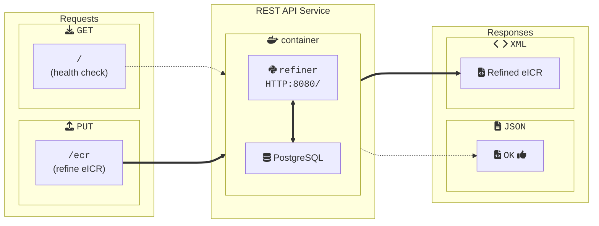

# Getting Started with the DIBBs Message Refiner Service

## Introduction

The DIBBs Message Refiner service offers a REST API to pare down an incoming message to only the user-specified elements.

## Running the Message Refiner

You can run the Message Refiner run using Docker, any other OCI container runtime (e.g., Podman), or directly from the Python source code.

### Running with Docker (Recommended)

To run the Message Refiner with Docker, follow these steps.

1. Confirm that you have Docker installed by running `docker -v`. If you don't see a response similar to what's shown below, follow [these instructions](https://docs.docker.com/get-docker/) to install Docker.

2. Download a copy of the Docker image from the repository by running `docker pull ghcr.io/cdcgov/dibbs-ecr-refiner:latest`

3. Run the service with `docker run -p 8080:8080 dibbs-ecr-refiner:latest`.

Congratulations, the Message Refiner should now be running on `localhost:8080`!

### Running from Python Source Code

We recommend running the Message Refiner from a container, but if that isn't feasible for a given use -case, you can also run the service directly from Python using the steps below.

1. Ensure that both Git and Python 3.13 or higher are installed.
2. Clone the repository with `git clone https://github.com/CDCgov/dibbs-ecr-refiner`.
3. Navigate to the top-level directory of this repository.
4. Make a fresh virtual environment with `python -m venv .venv`.
5. Activate the virtual environment with `source .venv/bin/activate` (MacOS and Linux), `venv\Scripts\activate` (Windows Command Prompt), or `.venv\Scripts\Activate.ps1` (Windows Power Shell).
6. Install all of the Python dependencies for the Message Refiner with `pip install -r requirements.txt` into your virtual environment.
7. Run the Message Refiner on `localhost:8080` with `python -m uvicorn app.main:app --host 0.0.0.0 --port 8080`.

## Building the Docker Image

To build the Docker image for the Message Refiner from source instead of downloading it from the repository follow these steps:

1. Ensure that both [Git](https://git-scm.com/book/en/v2/Getting-Started-Installing-Git) and [Docker](https://docs.docker.com/get-docker/) are installed.
2. Clone the repository with `git clone https://github.com/CDCgov/dibbs-ecr-refiner`.
3. Navigate to the top-level directory of this repository.
4. Run `docker build -t refiner .`.

## Deploying to Demo

We have a [GitHub action](https://github.com/CDCgov/dibbs-ecr-refiner/actions/workflows/trigger_demo_workflow.yaml) to deploy to our demo environment on demand whenever a new release is ready to go out. **Doing so will cause the demo site to temporarily go down / require a manual step to get it back up, so deploy using this method only when a few seconds of downtime is acceptable.**

1. Run the GitHub action with the desired branch / the "The event type to trigger the workflow." question set to `trigger-demo-plan`. This will kick off the deploy action in [the Skylight infrastructure repo](https://github.com/skylight-hq/dibbs-tf-envs/actions/workflows/deploy_dibbs_services_azure_demo.yaml) that will do the deploy.
1. Watch the action run and take note of the IP address outputted at the end of the deploy job in the Skylight repo. Save this for reference.
1. Go to the [Azure backend pool blade](https://portal.azure.com/?l=en.en-us#view/Microsoft_Azure_HybridNetworking/ApplicationGatewayBackendPoolBladeV2/backendPoolId/%2Fsubscriptions%2F6848426c-8ca8-4832-b493-fed851be1f95%2FresourceGroups%2Fdibbs-global-demo%2Fproviders%2FMicrosoft.Network%2FapplicationGateways%2Fhub-appgw%2FbackendAddressPools%2Fdibbs-global-demo-be-ecr-refiner/applicationGatewayVnetId/%2Fsubscriptions%2F6848426c-8ca8-4832-b493-fed851be1f95%2FresourceGroups%2Fdibbs-global-demo%2Fproviders%2FMicrosoft.Network%2FvirtualNetworks%2Fdibbs-global-demo-hub-network/isEdit~/true/isTlsProxyAfecFlagEnabled~/false) and update the target IP address. **The demo site will return a 502 Bad Gateway error until this is updated manually, so only run the deploy job if the downtime won't cause trouble**

The demo site should be updated from there! If you want to double check, the application commit hash is displayed at the bottom of the footer, which you can compare against the latest commit in main.

## The API

When viewing these docs from the `/redoc` endpoint on a running instance of the Message Refiner or the DIBBs website, detailed documentation on the API will be available below.

## Architecture Diagram



## Additional notes on eICR Refinement

For further details on `<section>`, `<entry>`, and `<templateId>` elements, please see [eICR-Notes.md](eICR-Notes.md) for an explanation of trigger code `<templateId>`s, which sections they're in, and the `<observation>` data that should be returned in the refined eICR output.

```

```
