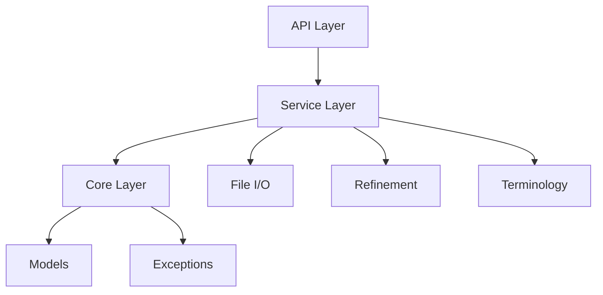

# Refiner FastAPI Application

## Architecture Overview

This application is built on FastAPI and provides a service-oriented architecture for processing and refining electronic Initial Case Reports (eICR) and Reportability Response (RR) documents.

### Core Components



### Directory Structure

```
app/
├── api/        # API endpoints and routers
├── core/       # Core application components
└── services/   # Business logic implementation
```

### XML Processing Pipeline

The refinement process follows these steps:

1. **Input Processing**

   - ZIP file extraction or direct XML parsing
   - Validation of XML structure
   - Section code verification

2. **Document Refinement**

   - Section filtering based on LOINC codes
   - Clinical service code (SNOMED) matching
   - Template ID validation
   - XML tree transformation

3. **Output Generation**

   - Updated text element creation
   - Minimal section generation for excluded content
   - Final XML document assembly

## API Documentation

Interactive API documentation is available at:
- Swagger UI: `/docs`
- ReDoc: `/redoc`

## Configuration

The application uses JSON assets for configuration:
- `refiner_details.json`: Section processing rules
- Sample request/response examples for OpenAPI documentation

## Appendix

> [!NOTE]
> `lxml` XML element types in this codebase
>
> When working with XML in Python using `lxml`, you will see both `_Element` and `etree.Element` in our code.

- **Type hints:** We use `_Element` (from `lxml.etree`) for type annotations, because it is the actual type of XML element objects. This is important for static analysis and tools.
- **Element construction:** We use `etree.Element(...)` in the code to create elements. This is a factory function that returns an `_Element` instance.

**Why?**

- `etree.Element` is *not* a class, but a function. Using it as a type hint is incorrect and may confuse type checkers.
- `_Element` is the correct type for variables that hold XML elements.

See also: [lxml _Element API docs](https://lxml.de/api/lxml.etree._Element-class.html)

This pattern will change in `lxml` 6.0; check the [PR](https://github.com/lxml/lxml/pull/405) for more information.
