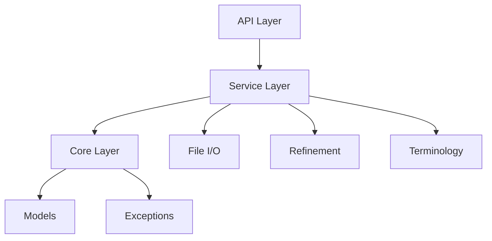

# Refiner FastAPI Application

## Architecture Overview

This application is built on FastAPI and provides a service-oriented architecture for processing and refining electronic Initial Case Reports (eICR) and Reportability Response (RR) documents.

### Core Components



### Directory Structure

```
app/
├── api/
│   └── v1/
│       ├── demo.py
│       ├── ecr.py        # ECR processing endpoints
│       ├── file_io.py    # File handling endpoints
│       └── v1_router.py  # Route aggregation
├── core/
│   ├── app/
│   │   ├── base.py      # Base service configuration
│   │   └── openapi.py   # Custom OpenAPI configuration
│   ├── models/
│   │   ├── api.py       # API models and schemas
│   │   └── types.py     # Core type definitions
│   ├── config.py        # Core configuration
│   └── exceptions.py    # Exception hierarchy
└── services/
    ├── db.py            # Database logic
    ├── file_io.py       # File processing logic
    ├── refine.py        # XML refinement logic
    └── terminology.py   # Clinical terminology services
```

## Key Features

### 1. Protocol-Based Design

The application uses Python's Protocol system for flexible interfaces:

```python
@runtime_checkable
class FileUpload(Protocol):
    async def read(self) -> bytes: ...
```

This allows for multiple implementations (FastAPI's UploadFile, S3 files, etc.)

### 2. XML Processing Pipeline

The refinement process follows these steps:

1. **Input Processing**

   - ZIP file extraction or direct XML parsing
   - Validation of XML structure
   - Section code verification

2. **Document Refinement**

   - Section filtering based on LOINC codes
   - Clinical service code matching
   - Template ID validation
   - XML tree transformation

3. **Output Generation**

   - Updated text element creation
   - Minimal section generation for excluded content
   - Final XML document assembly

### 3. Error Handling

Comprehensive exception hierarchy for specific error cases:

```
BaseApplicationException
├── ValidationError
│   ├── InputValidationError
│   ├── XMLValidationError
│   └── SectionValidationError
├── ProcessingError
│   ├── FileProcessingError
│   └── XMLProcessingError
└── ResourceError
    ├── ResourceNotFoundError
    └── ResourceAccessError
```

## API Endpoints

### ECR Processing

1. **ZIP Upload** (`POST /api/v1/ecr/zip-upload`)

   - Accepts ZIP containing eICR and RR documents
   - Processes both documents for refinement
   - Returns refined XML content

2. **Direct XML** (`POST /api/v1/ecr`)

   - Accepts raw XML eICR content
   - Supports section and condition filtering
   - Returns refined XML document

### Query Parameters

- `sections_to_include`: LOINC codes for section filtering
- `conditions_to_include`: SNOMED codes for clinical services

## Configuration

The application uses JSON assets for configuration:
- `refiner_details.json`: Section processing rules
- Sample request/response examples for OpenAPI documentation

## Error Responses

All error responses follow a consistent format:

```json
{
    "detail": {
        "message": "Error description",
        "details": {
            "specific": "error details",
            "additional": "context"
        }
    }
}
```

## Development

### Required Environment Variables
- `APP_VERSION`: Application version (default: "1.0.0")
- Additional configuration as needed

### Type Safety

The application uses:
- Pydantic models for request/response validation
- Custom types and protocols for internal interfaces
- Runtime type checking for file uploads
