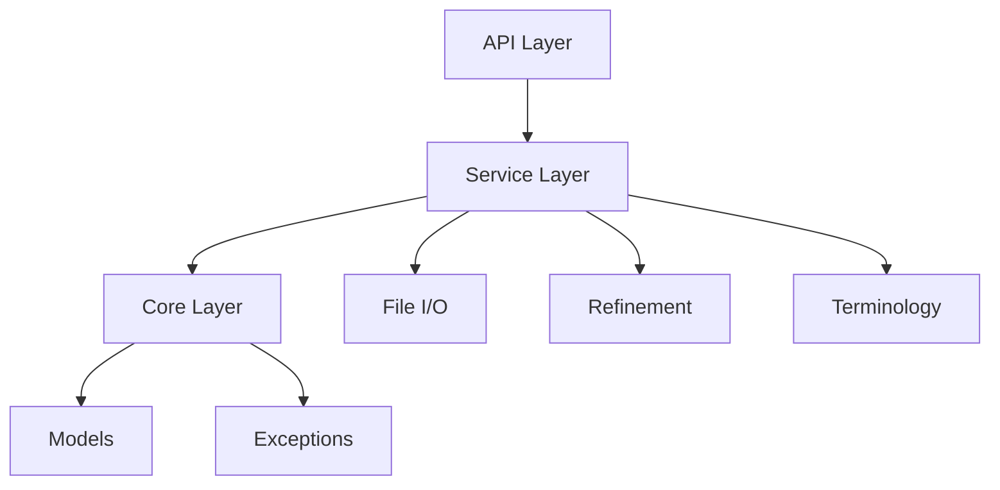

# Refiner FastAPI Application

## Architecture Overview

This application is built on FastAPI and provides a service-oriented architecture for processing and refining electronic Initial Case Reports (eICR) and Reportability Response (RR) documents.

### Core Components



### Directory Structure

```
app/
├── api/        # API endpoints and routers
├── core/       # Core application components
└── services/   # Business logic implementation
```

### XML Processing Pipeline

The refinement process follows these steps:

1. **Input Processing**

   - ZIP file extraction or direct XML parsing
   - Validation of XML structure
   - Section code verification

2. **Document Refinement**

   - Section filtering based on LOINC codes
   - Clinical service code (SNOMED) matching
   - Template ID validation
   - XML tree transformation

3. **Output Generation**

   - Updated text element creation
   - Minimal section generation for excluded content
   - Final XML document assembly

## API Documentation

Interactive API documentation is available at:
- Swagger UI: `/docs`
- ReDoc: `/redoc`

## Configuration

The application uses JSON assets for configuration:
- `refiner_details.json`: Section processing rules
- Sample request/response examples for OpenAPI documentation
