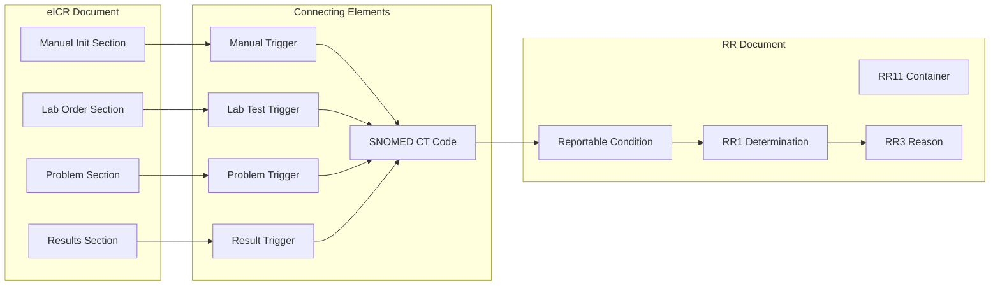
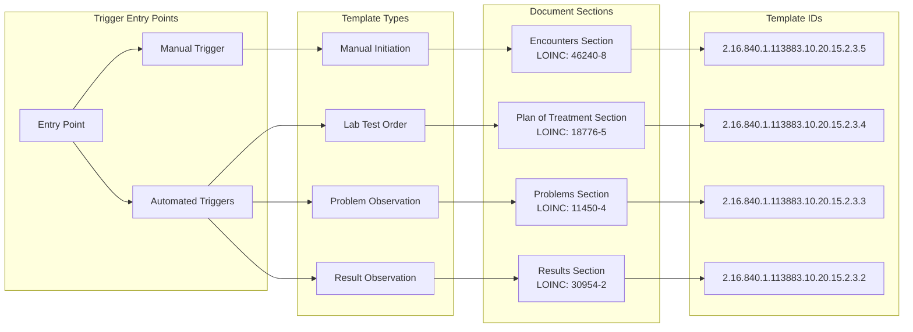
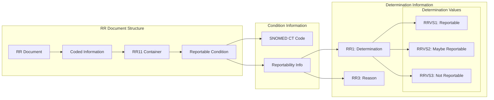
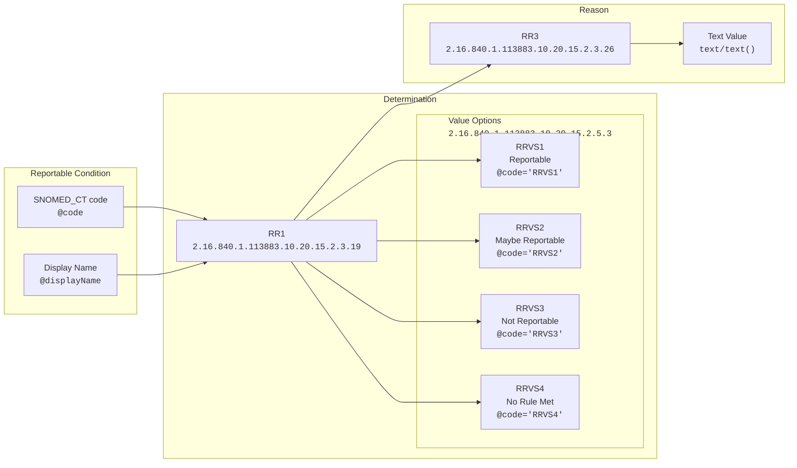
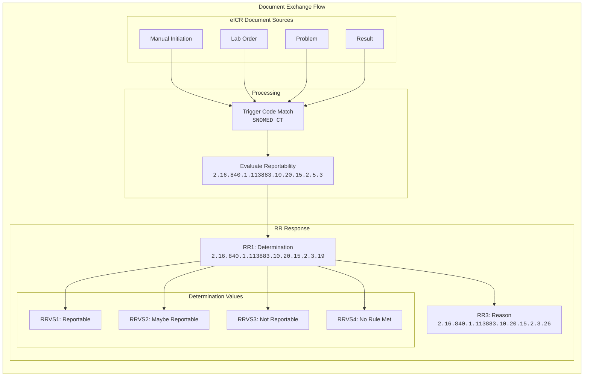

# eCR CDA Notes

> **Last Updated**: 2025-04-08
> **Author**: [`robertmitchellv`](https://github.com/robertmitchellv)

## Overview

This documentation focuses on the Clinical Document Architecture (CDA) implementation for electronic Case Reporting (eCR), specifically:

1. Electronic Initial Case Report (eICR) - [`CDA-phcaserpt-1.1.1`](https://github.com/HL7/CDA-phcaserpt-1.1.1)
2. Reportability Response (RR) - [`CDA-phcr-rr-1.1.0`](https://github.com/HL7/CDA-phcr-rr-1.1.0)

>[!NOTE]
> an analysis of the 3.1 eICR spec is forthcoming.

## Document Flow



## CDA Structure in both eICR and RR documents

### Section-level vs Entry-level Components

In volume 2 of the CDA-phcaserpt-1.1.1 and volume 2 of the CDA-phcr-rr-1.1.1 specifications there are tables that explain the hierarchical relationship that comprises an both an eICR and RR document. There are specific blocks of elements that are named and these names have associated metadata that both signal and connect them to other nested named blocks of elements. You can think of these named blocks of elements almost like classes in object oriented programming but without inheritance in a strict sense. Rather than inheritance they signal the hierarchical relationship between the named block of elements. Each named block of elements is governed by a template that describes what metadata it must, should, or may contain as well as the order of these metadata.

> [!TIP]
> The `root` value of a `templateId`, which is an Object ID (OID), is the _best_ way to find a specific named block of elements within a CDA document broadly and eICR and RR specifically. Every single named block of elements has a unique `templateId` that can be queried via XPath.

Section-level templates are higher up the hierarchy while entry-level templates are children of section-level templates. Some sections are **required** in order for an eICR or RR document to be valid based on their associated schematrons (these can be found on the spcifications' GitHub repositories that are both linked in the [overview](#overview). As discussed, every single template has a unique id (`templateId`) that is used to track and test each row of a template; these rules are called conf numbers (`CONF#`). When validating an eICR or RR document against their associated schematrons the messages coming back are based on the `CONF#` and whether or not this is a fatal error, an error, or a warning. Our goal in this work is to not introduce additional errors or warnings given that both eICR and RR documents have likely already undergone validation on the AIMS platform.

> [!NOTE]
> We have validation tools for both eICR and RR based on schematron files that can be found in each of the repositories linked above in the [overview](#overview). Our process takes the schematron files and creates an `xslt` that we can use in Python validate both eICR and RR documents. These tools will be a part of the refiner workflow in the future.

Additionally there are some section-level templates that have templates for both:

- Entries optional, and;
- Entries required

These signifiers do not necessarily mean that a section **must** be present in order for a message to be valid. For example, in an eICR the Immunizations Section can be completely removed from an eICR document without affecting the schematron validation process whereas doing the same thing to the Encounters Section in an eICR would result in an error.

This might seem confusing, but the "entries required" vs "entries optional" deal with what is required by that specific `templateId`. One template does not require an `<entry>` (optional says `<entry>` _should_ be there but required says that it _shall_ be there).

## eICR Structure

### Trigger Code Templates



#### Manually Triggered

##### Section-level and entry-level components

| Parent Section          | LOINC code |
| ----------------------- | ---------- |
| Encounters Section (V3) | 46240-8    |

- Encounters Section (V3) `<section>` ➡️ `<entry>`
  - Encounter Activity (V3) `<encounter>` ➡️ `<entryRelationship>`
    - Encounter Diagnosis (V3) `<act>` ➡️ `<entryRelationship>`
      - Problem Observation (V3) `<observation>` ➡️ `<entryRelationship>`
      - **Initial Case Report Manual Initiation Reason Observation `<observation>` ➡️ `<entryRelationship>`**

Manually triggered eICRs have the following `templateId`:

- `2.16.840.1.113883.10.20.15.2.3.5`

You can see an example of this being used below in the Problem Observation (V3). The `templateId`'s `root` attribute contains the above OID as its value.

##### Example from the sample files that ship with the spec:

```xml
<entryRelationship typeCode="COMP">
    <observation classCode="OBS" moodCode="EVN">
        <!-- [C-CDA R2.1] Problem Observation (V3) -->
        <templateId root="2.16.840.1.113883.10.20.22.4.4" extension="2015-08-01" />
        <!-- [eICR R2 STU1.1] Initial Case Report Manual Initiation Reason Observation -->
        <templateId root="2.16.840.1.113883.10.20.15.2.3.5" extension="2016-12-01" />
        <id root="ab1791b0-5c71-11db-b0de-0800200c9a65" />
        <code code="75322-8" codeSystem="2.16.840.1.113883.6.1" codeSystemName="LOINC" displayName="Complaint">
            <translation code="409586006" codeSystem="2.16.840.1.113883.6.96" codeSystemName="SNOMED CT"
                displayName="Complaint" />
        </code>
        <statusCode code="completed" />
        <effectiveTime>
            <low value="20161106000000-0500" />
        </effectiveTime>
        <value xsi:type="CD" nullFlavor="OTH">
            <originalText>Free text containing the reason for the manual eICR document</originalText>
        </value>
    </observation>
</entryRelationship>
```

##### How to return

```xml
<entry>
  <encounter>
    <entryRelationship>
      <observation>
        Data we want
      </observation>
    </entryRelationship>
  </encounter>
</entry>
```

#### Lab Test Order

| Parent Section                 | LOINC code |
| ------------------------------ | ---------- |
| Plan of Treatment Section (V2) | 18776-5    |

- Plan of Treatment Section (V2) `<section>` ➡️ `<entry>`
  - Planned Observation (V2) `<observation>` ➡️ `<entryRelationship>`
  - **Initial Case Report Trigger Code Lab Test Order `<observation>` ➡️ `<entryRelationship>`**

Lab test order triggered eICRs have the following `templateId`:

- `2.16.840.1.113883.10.20.15.2.3.4`

You can see an example of this being used below in the Planned Observation (V3). The `templateId`'s `root` attribute contains the above OID as its value.

##### Example from the sample files that ship with the spec:

```xml
<entry typeCode="DRIV">
  <!-- This is a request for a test to be performed (a lab test order) -->
  <observation classCode="OBS" moodCode="RQO">
    <!-- [C-CDA R1.1] Plan of Care Activity Observation -->
    <templateId root="2.16.840.1.113883.10.20.22.4.44" />
    <!-- [C-CDA R2.0] Planned Observation (V2) -->
    <templateId root="2.16.840.1.113883.10.20.22.4.44" extension="2014-06-09" />
    <!-- [eICR R2 STU1.1] Initial Case Report Trigger Code Lab Test Order -->
    <templateId root="2.16.840.1.113883.10.20.15.2.3.4" extension="2016-12-01" />
    <id root="b52bee94-c34b-4e2c-8c15-5ad9d6def205" />
    <!-- This code is from the trigger codes for laboratory test order
         value set (2.16.840.1.113762.1.4.1146.166) -->
    <code code="80825-3" codeSystem="2.16.840.1.113883.6.1" codeSystemName="LOINC"
      displayName="Zika virus envelope (E) gene [Presence] in Serum by Probe and target amplification method"
      sdtc:valueSet="2.16.840.1.114222.4.11.7508" sdtc:valueSetVersion="19/05/2016" />
    <statusCode code="active" />
    <!-- Date on which the lab test should take place -->
    <effectiveTime value="20161108" />
  </observation>
</entry>
```

##### How to return

```xml
<entry>
  <observation>
    Data we want
  </observation>
</entry>
```

#### Problem Observation

| Parent Section         | LOINC code |
| ---------------------- | ---------- |
| Encounter Section (V3) | 46240-8    |
| Problem Section (V3)   | 11450-4    |

- Encounters Section (V3) `<section>` ➡️ `<entry>`
  - Encounter Activity (V3) `<encounter>` ➡️ `<entryRelationship>`
    - Encounter Diagnosis (V3) `<act>` ➡️ `<entryRelationship>`
      - Problem Observation (V3) `<observation>` ➡️ `<entryRelationship>`
      - **Initial Case Report Trigger Code Problem Observation `<observation>` ➡️ `<entryRelationship>`**

**Or:**

- Problem Section (V3) `<section>` ➡️ `<entry>`
  - Problem Concern Act (V3) `<act>` ➡️ `<entryRelationship>`
    - Problem Observation (V3) `<observation>` ➡️ `<entryRelationship>`
    - **Initial Case Report Trigger Code Problem Observation `<observation>` ➡️ `<entryRelationship>`**

Problem observation triggered eICRs have the following `templateId`:

- `2.16.840.1.113883.10.20.15.2.3.3`

You can see an example of this being used below in the Problem Observation (V3). The `templateId`'s `root` attribute contains the above OID as its value.

##### Example from the sample files that ship with the spec:

```xml
<entryRelationship typeCode="SUBJ">
  <observation classCode="OBS" moodCode="EVN" negationInd="false">
    <!-- [C-CDA R1.1] Problem Observation -->
    <templateId root="2.16.840.1.113883.10.20.22.4.4" />
      <!-- [C-CDA R2.1] Problem Observation (V3) -->
      <templateId root="2.16.840.1.113883.10.20.22.4.4" extension="2015-08-01" />
      <!-- [eICR R2 STU1.1] Initial Case Report Trigger Code Problem Observation -->
      <templateId root="2.16.840.1.113883.10.20.15.2.3.3" extension="2016-12-01" />
      <id root="db734647-fc99-424c-a864-7e3cda82e705" />
      <code code="29308-4" codeSystem="2.16.840.1.113883.6.1" codeSystemName="LOINC" displayName="Diagnosis">
        <translation code="282291009" codeSystem="2.16.840.1.113883.6.96" codeSystemName="SNOMED CT"
          displayName="Diagnosis" />
      </code>
      <statusCode code="completed" />
      <effectiveTime>
        <low value="20161107" />
      </effectiveTime>
      <!-- Trigger code -->
      <value xsi:type="CD" code="27836007" codeSystem="2.16.840.1.113883.6.96" codeSystemName="SNOMED CT"
        displayName="Pertussis (disorder)" sdtc:valueSet="2.16.840.1.114222.4.11.7508"
        sdtc:valueSetVersion="19/05/2016" />
  </observation>
</entryRelationship>
```

##### How to return

This will depend on the `typeCode` of the `<entryRelationship>` element. In the example above we have nested `<entryRelationship>` tags with a `typeCode="SUBJ"`, which means that as you continue to navigate towards the last child `<entryRelationship>` tag you end up with the subject (`SUBJ`) of the `<entry>`. This means that there may need to be either some cleaning out of additional `<entryRelationship>` blocks that are merely referenced (`typeCode="REFE"`) or a part of/component of (`typeCode="COMP"`) an `<entry>` rather than the main reason for the observation.

```xml
<entry>
  <encounter>
    <entryRelationship>
      <act>
        <entryRelationship>
          <observation>
            Data we want
          </observation>
        </entryRelationship>
      </act>
    </entryRelationship>
  </encounter>
</entry>
```

#### Result Observation

| Parent Section       | LOINC code |
| -------------------- | ---------- |
| Results Section (V3) | 30954-2    |

- Results Section (V3) `<section>` ➡️ `<entry>`
  - Result Organizer (V3) `<organizer>` ➡️ `<component>`
    - Result Observation (V3) `<observation>`
    - **Initial Case Report Trigger Code Result Observation `<observation>`**

Result observation triggered eICRs have the following `templateId`:

- `2.16.840.1.113883.10.20.15.2.3.2`

You can see an example of this being used below in the Result Observation (V3). The `templateId`'s `root` attribute contains the above OID as its value.

##### Example from the sample files that ship with the spec:

```xml
<component>
  <!-- This observation is a trigger code preliminary result observation -
        both the code and value are trigger codes and thus
        both the code and the value must contain @sdtc:valueSet and @sdtc:valueSetVersion.
        Preliminary result is indicated by statusCode="active" -->
  <observation classCode="OBS" moodCode="EVN">
    <!-- [C-CDA R1.1] Result Observation -->
    <templateId root="2.16.840.1.113883.10.20.22.4.2" />
    <!-- [C-CDA R2.1] Result Observation (V3) -->
    <templateId root="2.16.840.1.113883.10.20.22.4.2" extension="2015-08-01" />
    <!-- [eICR R2 STU1.1] Initial Case Report Trigger Code Result Observation -->
    <templateId root="2.16.840.1.113883.10.20.15.2.3.2" extension="2016-12-01" />
    <id root="bf9c0a26-4524-4395-b3ce-100450b9c9ac" />
    <!-- This code is a trigger code from RCTC subset: "Trigger code for laboratory test names"
          @sdtc:valueSet and @sdtc:valueSetVersion shall be present -->
    <code code="548-8" codeSystem="2.16.840.1.113883.6.1" codeSystemName="LOINC"
      displayName="Bordetella pertussis [Presence] in Throat by Organism specific culture"
      sdtc:valueSet="2.16.840.1.114222.4.11.7508" sdtc:valueSetVersion="19/05/2016" />
    <!-- statusCode is set to active indicating that this is a preliminary result -->
    <statusCode code="active" />
    <effectiveTime value="20161107" />
    <!-- This value is a trigger code from RCTC subset: "Trigger code for organism or substance"
          @sdtc:valueSet and @sdtc:valueSetVersion shall be present -->
    <value xsi:type="CD" code="5247005" displayName="Bordetella pertussis (organism)"
      codeSystem="2.16.840.1.113883.6.96" codeSystemName="SNOMED CT" sdtc:valueSet="2.16.840.1.114222.4.11.7508"
      sdtc:valueSetVersion="19/05/2016" />
    <!-- This interpretation code denotes that this patient value is abnormal
         (bordetella pertussis (organism) was present in the culture) -->
    <interpretationCode code="A" displayName="Abnormal" codeSystem="2.16.840.1.113883.5.83"
      codeSystemName="ObservationInterpretation" />
  </observation>
</component>
```

##### How to return

This `<entry>` **must** contain what is called a "results organizer", which is the `<organizer>` child immediately after the `<entry>`. The trigger code `<observation>` is then wrapped in a `<component>` as a child of `<organizer>`.

```xml
<entry>
  <organizer>
    <component>
      <observation>
        Data we want
      </observation>
    </component>
  </organizer>
</entry>
```

## RR Structure

### Reportability

**Reportability** is:

> "the quality or state of being reportable or not".

Reportability **does not equate to the patient having a condition or meeting a case definition** (definitively being “a case”).

For each condition included in the eICR and the relevant public health agency(s), this element indicates the determination of whether the condition is reportable to public health. The values that can be used for the Determination of Reportability are described below.

- **Reportable**: The information provided meets reporting criteria for an associated PHA.
- **May be Reportable**: The information provided may meet reporting criteria if additional information is provided. The Reportability Response will also be able to share the information needed to definitively determine reportability.
- **Not Reportable**: The information provided conclusively does not meet reporting criteria. Some decision support systems may not be able to fully differentiate between possible conditions that are Not Reportable and those that May be Reportable if additional information is provided. In these circumstances there may only be a reportability determination of:
- **No Reporting Rule Met**: The information provided does not meet reporting criteria or may meet reporting criteria if additional information is provided. The determination of No Reporting Rule Met may be provided for a possible condition or for all conditions in the eICR.

For the refiner we will focus mainly on what is **Reportable** until user feedback tells us otherwise.

### Document Components



### Code System Relationships



### Key Components

#### 1. Reportability Response Coded Information Container

This is the main container that holds all coded information about reportability. It uses the template OID `2.16.840.1.113883.10.20.15.2.3.34` and is identified by the `RR11` code.

```xml
<organizer classCode="CLUSTER" moodCode="EVN">
  <templateId extension="2017-04-01" root="2.16.840.1.113883.10.20.15.2.3.34"/>
  <code code="RR11"
        codeSystem="2.16.840.1.114222.4.5.232"
        codeSystemName="PHIN Questions"
        displayName="Reportability Response Coded Information"/>
```


#### 2. Relevant Reportable Condition Observation

This section contains the actual condition that was evaluated. The condition **MUST** be coded in SNOMED CT (OID: `2.16.840.1.113883.6.96`).

```xml
<observation classCode="OBS" moodCode="EVN">
  <templateId extension="2017-04-01" root="2.16.840.1.113883.10.20.15.2.3.12"/>
  <code code="64572001" codeSystem="2.16.840.1.113883.6.96"
        codeSystemName="SNOMED" displayName="Condition">
    <translation code="75323-6" codeSystem="2.16.840.1.113883.6.1"
                codeSystemName="LOINC" displayName="Condition"/>
  </code>
  <!-- the actual condition - MUST be SNOMED CT -->
  <value xsi:type="CD" code="840539006"
         codeSystem="2.16.840.1.113883.6.96"
         codeSystemName="SNOMED CT"
         displayName="Disease caused by severe acute respiratory syndrome coronavirus 2 (disorder)"/>
```

#### 3. Reportability Determination

Within the condition observation, we find the actual determination of reportability (`RR1`) and its value (`RRVS1`):

```xml
<observation classCode="OBS" moodCode="EVN">
  <templateId extension="2017-04-01" root="2.16.840.1.113883.10.20.15.2.3.19"/>
  <code code="RR1" codeSystem="2.16.840.1.114222.4.5.232"
        codeSystemName="PHIN Questions"
        displayName="Determination of reportability"/>
  <value code="RRVS1" codeSystem="2.16.840.1.114222.4.5.274"
         codeSystemName="PHIN VS (CDC Local Coding System)"
         displayName="Reportable" xsi:type="CD"/>
```

#### 4. Reportability Reason

The reason for the determination is provided in `RR3`:

```xml
<entryRelationship typeCode="RSON">
  <observation classCode="OBS" moodCode="EVN">
    <templateId extension="2017-04-01" root="2.16.840.1.113883.10.20.15.2.3.27"/>
    <code code="RR3" codeSystem="2.16.840.1.114222.4.5.232"
          codeSystemName="PHIN Questions"
          displayName="Determination of reportability rule"/>
    <value xsi:type="ST">All results of tests for detection of SARS-CoV-2 nucleic acid
          in a clinical specimen by any method</value>
  </observation>
</entryRelationship>
```

## Relationships Between Documents

### Trigger Code to RR Flow



### SNOMED CT Usage

Both documents rely on SNOMED CT for condition codes:

1. eICR Trigger Codes:
   - Used in problem observations
   - Used in result observations
   - OID: `2.16.840.1.113883.6.96`

2. RR Condition Codes:
   - Must use SNOMED CT (`CONF:3315-552`)
   - Same OID ensures consistency
   - Links trigger to determination

### Example Flow

Using COVID-19 example:

1. eICR Trigger:
```xml
<observation classCode="OBS" moodCode="EVN">
    <templateId root="2.16.840.1.113883.10.20.15.2.3.3"/>
    <value xsi:type="CD" code="840539006"
           codeSystem="2.16.840.1.113883.6.96"
           displayName="Disease caused by SARS-CoV-2"/>
</observation>
```

2. RR Determination:

```xml
<observation classCode="OBS" moodCode="EVN">
    <templateId root="2.16.840.1.113883.10.20.15.2.3.12"/>
    <value xsi:type="CD" code="840539006"
           codeSystem="2.16.840.1.113883.6.96"
           displayName="Disease caused by SARS-CoV-2"/>
</observation>
<observation classCode="OBS" moodCode="EVN">
    <code code="RR1"/>
    <value code="RRVS1" displayName="Reportable"/>
</observation>
```

This maintains consistency through the entire eCR process while ensuring standardized terminology and proper determination of reportability.

## Refiner Processing Logic

### How the Refiner Works

The refiner processes eICR documents by:

1. **Condition Code Input**: Takes SNOMED condition codes from RR reportable conditions
2. **Clinical Code Lookup**: Uses the terminology database to find related clinical codes via ProcessedGrouper
3. **XPath Generation**: Builds XPath expressions to locate matching clinical elements
4. **Section Processing**: For each section, preserves only entries that contain matching codes
5. **Minimal Sections**: Sections with no matches get replaced with minimal content and `nullFlavor="NI"`

### ProcessedGrouper Integration

The `ProcessedGrouper` class bridges condition codes to clinical codes:

```python
# Example: COVID-19 condition code
condition_code = "840539006"  # SARS-CoV-2 disease

# ProcessedGrouper finds related clinical codes from terminology database
processed = ProcessedGrouper.from_grouper_row(grouper_row)
xpath = processed.build_xpath("any")  # Generates XPath for all element types
```

### Section Filtering Rules

* **Sections to Include**: If specified, these sections are preserved completely unmodified
* **Other Sections**: Filtered to keep only entries with matching clinical codes
* **No Matches**: Section becomes minimal with `nullFlavor="NI"`
* **Entry Preservation**: Complete `<entry>` elements are kept (not individual codes)

### XPath Strategy

The refiner uses union XPath expressions to find clinical elements:

```xpath
.//hl7:*[hl7:code[@code='123456' or @code='789012']] |
.//hl7:code[@code='123456' or @code='789012'] |
.//hl7:translation[@code='123456' or @code='789012']
```

Element Types Searched:

* **Observations**: Lab results, vital signs, clinical findings
* **Organizers**: Result batteries, procedure groups
* **Acts**: Procedures, encounters, administrative acts
* **Manufactured Products**: Medications, vaccines, medical devices
* **Substance Administrations**: Medication administrations, immunizations

How does it do this?

**Search Patterns:**
- **`hl7:*[hl7:code[...]]`**: Any HL7 element that has a `<code>` child with matching codes
  - Captures `<observation>`, `<act>`, `<organizer>`, `<procedure>`, `<substanceAdministration>`, etc.
- **`hl7:code[...]`**: Direct `<code>` element matches
  - Captures standalone code elements
- **`hl7:translation[...]`**: Code translation elements
  - Captures alternative code representations

**Why This Works:**
- **Flexible**: Automatically finds codes in any CDA element type without hardcoding
- **Comprehensive**: Catches direct codes, child codes, and translations
- **Future-proof**: Will work with new CDA element types as they're added

The `ProcessedGrouper` uses `search_in="any"` for comprehensive matching, ensuring all condition-related clinical data is captured regardless of which CDA element contains it.

**Backward Compatibility:**
The system maintains `search_in="observation"` for legacy behavior that only searches observation elements.

This ensures all relevant clinical data related to the condition is preserved while removing unrelated entries.
