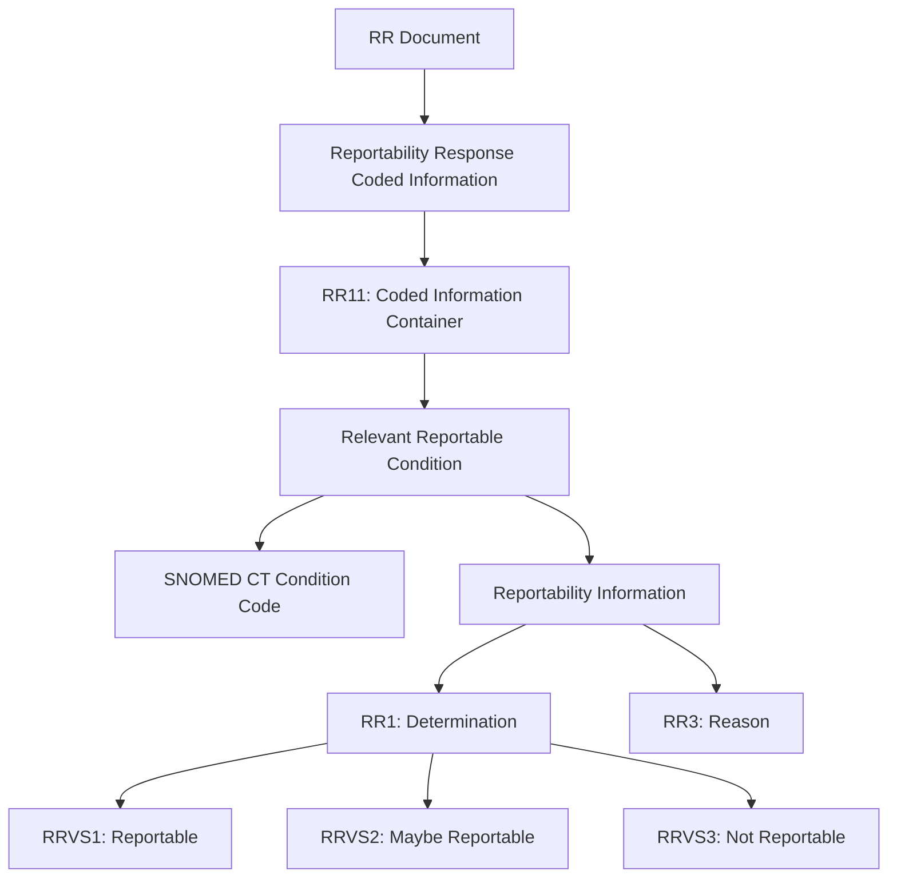
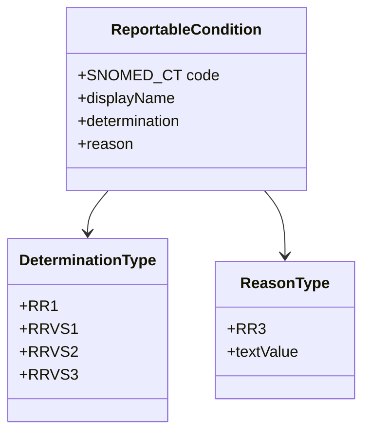

# Reportability Response (RR) Document Notes (CDA-PHCR-R2-RR-STU1.1)

## Overview

The Reportability Response (RR) document contains structured information about condition reportability. This document outlines the key components and their relationships, using a concrete example from an example RR document.

## Document Structure and Relationships



## Code System Relationships



## Key Components and Relationships

### 1. Reportability Response Coded Information Container

This is the main container that holds all coded information about reportability. It uses the template OID `2.16.840.1.113883.10.20.15.2.3.34` and is identified by the `RR11` code.

```xml
<organizer classCode="CLUSTER" moodCode="EVN">
  <templateId extension="2017-04-01" root="2.16.840.1.113883.10.20.15.2.3.34"/>
  <code code="RR11" 
        codeSystem="2.16.840.1.114222.4.5.232"
        codeSystemName="PHIN Questions"
        displayName="Reportability Response Coded Information"/>
```

### 2. Relevant Reportable Condition Observation

This section contains the actual condition that was evaluated. The condition MUST be coded in SNOMED CT (OID: `2.16.840.1.113883.6.96`).

```xml
<observation classCode="OBS" moodCode="EVN">
  <templateId extension="2017-04-01" root="2.16.840.1.113883.10.20.15.2.3.12"/>
  <code code="64572001" codeSystem="2.16.840.1.113883.6.96"
        codeSystemName="SNOMED" displayName="Condition">
    <translation code="75323-6" codeSystem="2.16.840.1.113883.6.1"
                codeSystemName="LOINC" displayName="Condition"/>
  </code>
  <!-- the actual condition - MUST be SNOMED CT -->
  <value xsi:type="CD" code="840539006"
         codeSystem="2.16.840.1.113883.6.96"
         codeSystemName="SNOMED CT"
         displayName="Disease caused by severe acute respiratory syndrome coronavirus 2 (disorder)"/>
```

### 3. Reportability Determination

Within the condition observation, we find the actual determination of reportability (`RR1`) and its value (`RRVS1`):

```xml
<observation classCode="OBS" moodCode="EVN">
  <templateId extension="2017-04-01" root="2.16.840.1.113883.10.20.15.2.3.19"/>
  <code code="RR1" codeSystem="2.16.840.1.114222.4.5.232"
        codeSystemName="PHIN Questions"
        displayName="Determination of reportability"/>
  <value code="RRVS1" codeSystem="2.16.840.1.114222.4.5.274"
         codeSystemName="PHIN VS (CDC Local Coding System)"
         displayName="Reportable" xsi:type="CD"/>
```

### 4. Reportability Reason

The reason for the determination is provided in `RR3`:

```xml
<entryRelationship typeCode="RSON">
  <observation classCode="OBS" moodCode="EVN">
    <templateId extension="2017-04-01" root="2.16.840.1.113883.10.20.15.2.3.27"/>
    <code code="RR3" codeSystem="2.16.840.1.114222.4.5.232"
          codeSystemName="PHIN Questions"
          displayName="Determination of reportability rule"/>
    <value xsi:type="ST">All results of tests for detection of SARS-CoV-2 nucleic acid 
          in a clinical specimen by any method</value>
  </observation>
</entryRelationship>
```

## Important Notes for Implementation

### SNOMED CT Requirement

The condition code MUST be from SNOMED CT:

- OID: `2.16.840.1.113883.6.96`
- Must be used in the `<value>` element of the condition observation
- This is enforced by `CONF:3315-552` in the specification and schematron

### Code Relationships

- `RR11`: Container for all coded information
- `RR1`: Determination of reportability
  - `RRVS1`: Reportable
  - `RRVS2`: Maybe reportable
  - `RRVS3`: Not reportable
- `RR3`: Reason for determination

## Example Use Case

Using our example RR document:

1. Condition: COVID-19 (SNOMED CT: `840539006`)
2. Determination: Reportable (`RRVS1`)
3. Reason: "All results of tests for detection of SARS-CoV-2 nucleic acid in a clinical specimen by any method"

This structure ensures consistent representation of reportable conditions while maintaining standardized medical terminology through SNOMED CT.
