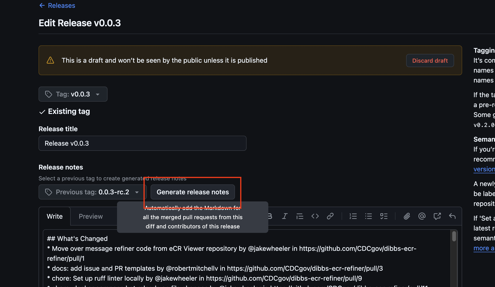
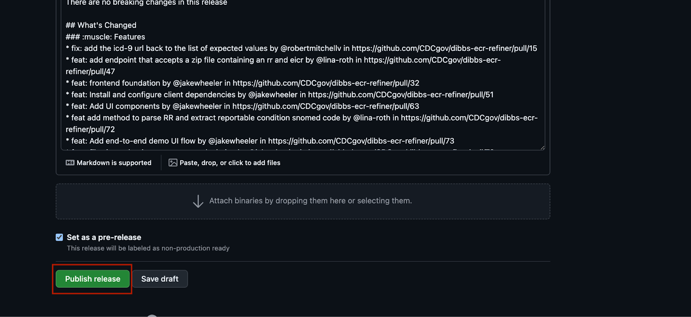
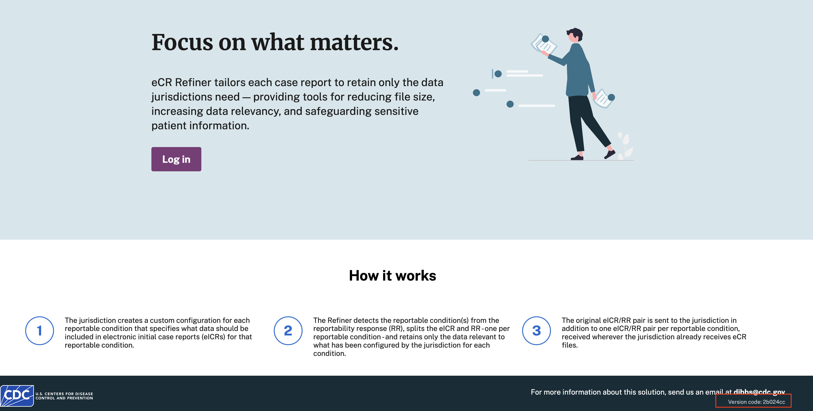

# eCR Refiner Release Process

_Updated 4/1/26_

This document will outline the process for releasing a new version of the eCR Refiner web application and AWS Lambda function, along with roles and responsibilites of those involved in the release process.

**Prerequisites:**

- Write access to the Refiner Github repo
- Access to the proj-cdc-dibbs-ecr-refiner-eng channel (for comms)
- Access to the APHL teams (for comms)

## Create a pre-release version with preliminary notes

**STEPS 3 AND 4 CAN BE DONE ASYNC TO THE TESTING STEPS, BUT MUST BE COMPLETED BEFORE PROMOTION**

1. Run the [release candidate builder job](https://github.com/CDCgov/dibbs-ecr-refiner/actions/workflows/build-release-candidate.yml) using the following inputs:
   1. `ref` = `main`
   2. `version` = Semantic version to use (example: `1.4.0`)
   3. `rc` = the RC number (example: `rc.1`, note the `.` between `rc` and the number)
   4. `dry_run` = `false` (feel free to try using `true` first if you'd like to run a test without creating anything)
2. The job will push the new RC images to ECR and GHCR, which are ready to be deployed and tested. These images can be found at:
   - [refiner](https://github.com/CDCgov/dibbs-ecr-refiner/pkgs/container/dibbs-ecr-refiner%2Frefiner)
   - [lambda](https://github.com/CDCgov/dibbs-ecr-refiner/pkgs/container/dibbs-ecr-refiner%2Flambda)
   - [ops](https://github.com/CDCgov/dibbs-ecr-refiner/pkgs/container/dibbs-ecr-refiner%2Fops)

3. Once the release candidate job runs, navigate to the [release page](https://github.com/CDCgov/dibbs-ecr-refiner/releases) and find the corresponding release notes for the created release.
   1. Specify the previous tag using the dropdown and hit _generate release notes_.
      
   1. Copy this list of commit names and edit it down, removing all entries unimportant to the end user, e.g., test updates, refactors, dependency bumps, chores, etc.

      > [!TIP]
      > We have a template in `.github/release.yml` that auto-strips out any PR's labeled with the `tech debt` or `chore` labels. If you label any relevant PR's accordingly, it'll save the release captain's time!

   1. Add the template release notes linked [in the release note template](./RELEASE_NOTE_TEMPLATE.MD) to the notes. **Make sure you copy this directly, as otherwise, the app updates page might not render correctly**
      - Product will own the first and second sections summarizing the release / major features
      - Engineering will own the content in the third and forth sections. The edited commit list will go in the fourth section.
   1. Before publishing, **ensure that the “Set as a pre-release” checkbox is marked.** The release should not be marked as the latest release until deployment and testing have been performed. Then click “publish release”!
      

4. Once the pre-release is published, a message should get sent in the `#proj-cdc-dibbs-ecr-refiner-internal` Slack channel. Tag product that the notes are available for editing, and have them fill in the relevant portions.
   - Once they're done, they should ping you that the notes are ready

## Test release image in APHL

1. Ping APHL in Teams that there are new release candidates to deploy in lower environments The relevant security scans will run on their end.
   - Check the deploy: Once the deployments to lower environments gets kicked off, check that deployed image makes it to [the APHL dev environment](https://refiner.dev.sandbox2.aimsplatform.org/) with the correct version number and the packages have the correct image tagged latest.
     

   - If needed, address the scanned vulnerabilities and create follow-up release candidates with fixes.

## Promote the final image APHL

**MAKE SURE STEPS 3 AND 4 IN THE FIRST SECTION ARE COMPLETED BEFORE PROMOTION**

1. Build and push the images to GHCR and ECR using the [release candidate promotion job](https://github.com/CDCgov/dibbs-ecr-refiner/actions/workflows/promote-release-candidate.yml)
   1. Make sure the `rc_version` is the release candidate tag (e.g., `1.4.0-rc.1`)
   2. Make sure the `version` is the same as the release candidate tag without `-rc.x` at the end (e.g., `1.4.0`)
   3. Leave `dry_run` unchecked
   4. After completion, check that the images were successfully pushed to both GHCR and ECR (see job logs)
2. Communicate to APHL that the final release is ready for them to promote up to prod, along with the version number. They should be able to pull the newly tagged image and promote it up to the prod environment.

:tada: You have just released the newest version of the DIBBs eCR Refiner! :tada:
